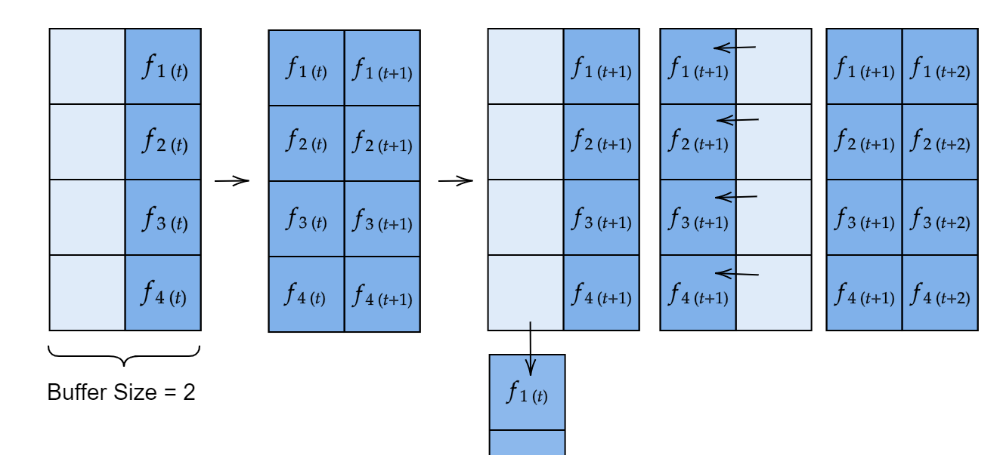
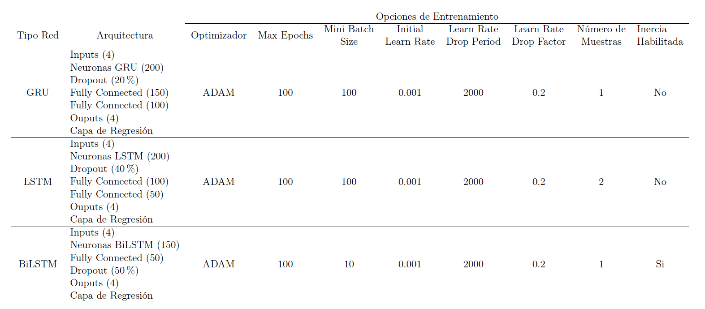
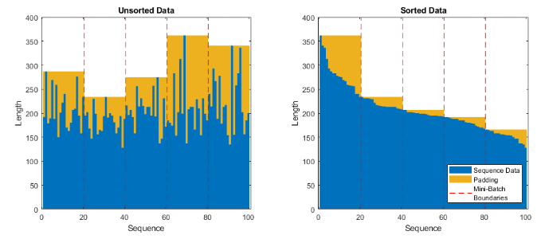

# Pruebas PSO Tuner

<p align="center">
   
   
</p>

El script de `Pruebas_PSOTuner.mlx` consiste de una copia modificada del script `SR_Toolbox.mlx`, por lo tanto, en esta documentación no se le pone mucha importancia a explicar elementos ya presentes en la documentación del <a href="./SR_Toolbox.md">SR Toolbox</a>. Aquí solo se detallarán las partes que son distintas a este. También se incluye una breve explicación del script `Generar_Dataset.m` en la sección [Dataset de Entrenamiento](#dataset-de-entrenamiento).

## Índice

- [Parámetros y Settings](#parámetros-y-settings)
- [Reglas de Método a Usar](#reglas-de-método-a-usar)
- [Setup PSO](#setup-pso)
- [Setup: Gráficas](#setup-gráficas)
- [Setup: Output Media](#setup-output-media)
- [Main Loop](#main-loop)
- [Gráfica: Dispersión de Partículas](#gráfica-dispersión-de-partículas)
- [Gráfica: Parámetros Generados por la Red Neuronal](#gráfica-parámetros-generados-por-la-red-neuronal)
- [Comparación entre Métodos](#comparación-entre-métodos)
- [Guardando las Figuras Generadas](#guardando-las-figuras-generadas)
- [Dataset de Entrenamiento](#dataset-de-entrenamiento)
- [Entrenamiento de Redes](#entrenamiento-de-redes)
## Estructura de Programa

A continuación se describen todas las secciones que han sido cambiadas con respecto al `SR_Toolbox.mlx`. Si alguna sección no se incluye, se debe a uno de dos factores: La misma permaneció inalterada con respecto a su contraparte en la SR Toolbox o ésta se retiró completamente del script. Para el primer caso, consultar la documentación para la <a href="./SR_Toolbox.md">Toolbox</a> para obtener más información al respecto.

### Parámetros y Settings

Esta sección permite controlar diferentes elementos de la simulación. A continuación se presentan algunas aclaraciones y una breve explicación de los parámetros únicos para `Pruebas_PSOTuner`. **Hacer click en el nombre de cada parámetro para desplegar más información**.

<ins>*Función de Costo*</ins>

Aquí el `Metodo` pasa a llamarse `CostFunc`. Las opciones son casi las mismas. Están disponibles todas las funciones Benchmark y el método APF. Los métodos restantes (Jabandzic, Dynamic Programming, etc.) son descartados.

<ins>*Settings de Partículas PSO*</ins>

Se elimina el parámetro `IteracionesMaxPSO` ya que aquí el algoritmo PSO utiliza `EndTime` y `dt` para calcular el número de iteraciones máximas. En otras palabras, el main loop está encargado solo de correr el PSO, entonces el número de iteraciones máximas del main loop, es el número de iteraciones máximas del PSO.

<ins>*Settings de E-Pucks*</ins>

En este script no se simulan robots diferenciales en ninguna medida. Por esto, todos los settings y setup relacionados a E-Pucks desaparecen.

<ins>*Estadísticas Comparativas*</ins>

<details>
<summary> <tt>StatsComparación</tt> </summary>
<sub> Si se habilita esta opción, luego de que la simulación finalice, el script correrá una cierta cantidad de corridas de la minimización de la función de costo elegida empleando los diferentes tipos de PSO Tuner (PSO Tuner: GRU, PSO Tuner: LSTM, PSO Tuner: BiLSTM y PSO Tuner: Off). Al finalizar el número de corridas especificado para cada tipo de red, el script promedia los resultados y los presenta en tres tipos de gráfica distintos: </sub>

<p><ul><li><sub>
Comparación de Dispersión y Media: El mismo tipo de gráfica que genera la SR Toolbox para analizar la dispersión de las partículas. En este caso se promedia la posición X, Y y la dispersión de cada eje. La idea es comparar la capacidad de exploración de las partículas (dispersión / las líneas traslúcidas) y si las mismas convergen en el punto que debería de ser (media / la línea de color sólido).
</sub></li></ul></p>

<p align="center">
   
</p>

<p><ul><li><sub>
Comparación de Iteraciones: Se presenta el número de iteraciones que le toma a cada tipo de PSO Tuner converger (graficado en la forma de un diagrama de caja y bigotes). A su vez, también se muestra cuantas de estas "convergencias" lograron alcanzar el mínimo global de la función o en otras palabras, cuantas corridas fueron exitosas (gráfica de barras de la derecha). Utilizada para presentar la rapidez y precisión de convergencia de cada tipo de PSO Tuner.
</sub></li></ul></p>

<p align="center">
   
</p>

<p><ul><li><sub>
Comparación de Tiempo de Cálculo: Se presenta el tiempo que le toma a cada tipo de PSO Tuner (en este caso no se incluye la opción sin el PSO Tuner) calcular la predicción de los parámetros de constricción. El tiempo se presenta en milisegundos y la gráfica empleada es un diagrama de caja y bigotes para poder identificar el promedio, cuartiles y valores atípicos de tiempo.
</sub></li></ul></p>

<p align="center">
   
</p>

</details>

<details>
<summary> <tt>StatsComparacion_Muestras</tt> </summary>
<sub> Cantidad de corridas que se promediarán para cada tipo de PSO Tuner al momento de generar estadísticas comparativas para el PSO Tuner (<tt>StatsComparacion = 1</tt>).</sub>
</details><br/>

<ins>*Settings de PSO Tuner*</ins>

<details>
<summary> <tt>PSOTuner</tt> </summary>
<sub>Variable que permite activar / desactivar el uso del PSO Tuner en conjunto con el algoritmo PSO.</sub>
</details>

<details>
<summary> <tt>NoMuestras</tt> </summary>

<sub>Número de feature vectors pasados simultáneamente a la red neuronal.</sub>

<sub> El script usa la función <tt>predictAndUpdateState()</tt> para obtener predicciones de las redes neuronales entrenadas. Esta función permite que la red recurrente (que está entrenada para producir secuencias a partir de secuencias) pueda generar sus valores de salida un time step a la vez. No obstante, a veces las predicciones producidas de esta forma pueden llegar a ser ruidosas o inestables.</sub>

<sub> Investigando este problema, se llegó a la conclusión que las redes neuronales recurrentes podían llegar a requerir de una mayor cantidad de información simultánea para realizar sus estimados. Una potencial solución es alimentarle la secuencia completa de inputs a la red neuronal. No obstante, esto causaría que la red estime los parámetros de salida cuando el algoritmo ha finalizado su ejecución. Lo que se desea es controlar el algoritmo en tiempo real.</sub>

<sub> Entonces se decidió implementar un intermedio entre la predicción de una secuencia completa y una predicción un time step a la vez: El sistema de muestras. A medida que se generan métricas (un time step a la vez), el script llena un buffer de feature vectors concatenados horizontalmente. Cuando el buffer alcanza el tamaño especificado por el usuario, este se introduce a la red neuronal, produciendo tantas estimaciones de salida como muestras se le alimentaron.</sub>

<sub> El programa toma la última columna de la predicción (correspondiente al último time step) y la utiliza como el estimado de los parámetros del algoritmo PSO. En iteraciones posteriores, el buffer elimina su muestra más antigua, desplaza todas sus muestras una columna hacia la izquierda y concatena el siguiente feature vector en su última columna.</sub>

<p align="center">
   
</p>

</details>

<details>
<summary> <tt>ControlarParams</tt> </summary>
<sub> Variable que activa / desactiva el uso de los parámetros producidos por la red neuronal en el algoritmo PSO simulado. Por ejemplo, si <tt>ControlarParams = 0</tt> las variables ,  y  utilizadas por el algoritmo PSO no se igualarán a las salidas generadas por las redes neuronales recurrentes.</sub>
</details>

<details>
<summary> <tt>DesactivarInercia</tt> </summary>
<sub> Variable que activa / desactiva el uso del valor de inercia generado por la red neuronal en el algoritmo PSO simulado. Se implementó esta opción porque, luego de algunas pruebas con las redes neuronales LSTM y GRU, se observó que el desactivar el control sobre la inercia del PSO mejoraba significativamente los resultados. Si no se hacía esto, las partículas tendían a explotar hacia las esquinas de la región de búsqueda (como se puede observar a continuación).</sub>

<p align="center">
   
</p>

</details>

<details>
<summary> <tt>ModeloNN</tt> </summary>
<sub> Tipo de red neuronal a utilizar como parte del PSO Tuner. Todas las redes tienen la misma estructura de inputs y outputs, pero su arquitectura interna y método de entrenamiento es distinto. Luego de todas las pruebas realizadas se definieron tres modelos diferentes: GRU, LSTM y BiLSTM. </sub>

<p align="center">
   
</p>

</details>

### Reglas de Método a Usar

Debido a que en `Pruebas_PSOTuner` no se utilizan otros métodos más que las funciones de costo Benchmark y APF, la única regla que se revisa en esta sección es si la `CostFunc` elegida es una función benchmark (en otras palabras, si la función no es "APF").

### Setup PSO

La sección antes llamada "Setup: Métodos PSO" ahora se pasa a llamar "Setup PSO", porque el main loop siempre correrá el algoritmo PSO. El contenido de la sección es casi el mismo, el único cambio es que en este script se eliminó el caso que manejaba la selección de los `EnvironmentParams` para el método de "Jabandzic".

### Setup: Gráficas

Se eliminó todo el código dedicado a la graficación de los E-Pucks y en la descripción de la simulación (`DetallesPlot`) se incluyen nuevos elementos como si el PSO Tuner está activado, el tipo de red neuronal empleada y los valores iniciales de ,  y .

### Setup: Output Media

El nombre de los medios de salida cambia. En el SR Toolbox el nombre de los medios consiste del `método empleado + modo de visualización`. En las Pruebas del PSO Tuner se decidió colocar más énfasis en el tipo de red neuronal utilizada, por lo que el nombre de los medios consiste del `modelo de red neuronal + función de costo a optimizar + restricción empleada + número de muestras`.

### Main Loop

Desaparecen las secciones encargadas de los métodos PSO, el seguimiento de trayectorias y la dinámica de los E-Pucks. En lugar de esto se colocan todos los elementos relacionados al funcionamiento del PSO Tuner. Los pasos seguidos son los siguientes:

- Extracción de Métricas: Se obtienen las métricas del enjambre en la iteración actual. Estas incluyen: La dispersión normalizada del swarm, la coherencia del swarm, la distancia del global best a la meta y el promedio de la distancia promedio de cada partícula a todo el resto del swarm. La ventaja de extraer métricas es que no importando el número de partículas, la red neuronal será capaz de generar estimaciones para los parámetros ,  y .

```Matlab
% Medida de dispersión normalizada para la swarm
DesvEstPosX = std(Part.Posicion_Actual(:,1)) / (AnchoMesa/2);
DesvEstPosY = std(Part.Posicion_Actual(:,2)) / (AltoMesa/2);
DesvEstPosMedia = mean([DesvEstPosX DesvEstPosY]);

% Coherencia de la Swarm
VelCentroSwarm = norm(mean(Part.Velocidad));                                % Velocidad del centro del swarm (Vs)
VelPromedioParts = mean(vecnorm(Part.Velocidad,2,2));                       % Velocidad promedio de las partículas (V^linita)
CoherenciaSwarm = (VelCentroSwarm + 0.01)/ (VelPromedioParts + 0.01);

% Medida de la distancia del global best del swarm a la meta
% (Normalizado)
IndDistMin = dsearchn(Meta, Part.Posicion_GlobalBest);                                          % Indice de la meta más cercana al global best
ComponenteXDist = Meta(IndDistMin,1) - Part.Posicion_GlobalBest(1);                             % Componente X de la distancia entre meta y global best
ComponenteYDist = Meta(IndDistMin,2) - Part.Posicion_GlobalBest(2);                             % Componente Y de la distancia entre meta y global best
DistMasLejana = hypot(LimsX(2) - abs(Meta(IndDistMin,1)), LimsY(2) - abs(Meta(IndDistMin,2)));  % Distancia más lejana que pueden tomar las partículas a la meta dada la dimensión de la mesa
DistAMeta_Norm = hypot(ComponenteXDist, ComponenteYDist) / DistMasLejana;                       % Normalización de componentes y cálculo de distancia entre meta y global best

% Promedio de la distancia Promedio de cada Partícula a todo el resto del
% Swarm (D_all)
MediaSwarm = mean(Part.Posicion_Actual);
DistsEntrePartsSwarm = getDistsBetweenParticles(Part.Posicion_Actual,"Full");
DistMasLejana = hypot(LimsX(2) - abs(MediaSwarm(1)), LimsY(2) - abs(MediaSwarm(2)));
PromDistPromPartASwarm = mean(DistsEntrePartsSwarm,'all') / DistMasLejana;
```

- Creación de Feature Vector: Cada métrica consiste de un escalar (un numerito). La red neuronal, por la forma en la que se entrenó, necesita recibir como input las 4 métricas colocadas en la forma de un vector columna. A este vector columna se le denomina feature vector. Entonces no solo se ensambla el feature vector, sino que también se acotan sus valores entre 0 y 1 (porque en RNNs es una buena práctica que los valores de entrada estén normalizados).

```Matlab
% Creación de Feature vector
FeatureVector = [DesvEstPosMedia;
                 CoherenciaSwarm;
                 DistAMeta_Norm;
                 PromDistPromPartASwarm];

% Se acotan los valores del feature vector entre 0 y 1
FeatureVector = min(FeatureVector,1);
```

- Sistema de Muestras: Las muestras a alimentar a la red neuronal consisten de una concatenación horizontal de los feature vectors creados. Antes de iniciar el main loop, se crea `Muestras`, un array de NaNs con dimensiones `4 x NoMuestras`. Cada feature vector creado en el paso previo se agregará como una nueva columna (sustituyendo los NaNs existentes). Cuando `Muestras` ya se haya llenado completamente de feature vectors, en la siguiente iteración, el array descarta su primera columna, corre el resto de columnas un espacio a la izquierda y agrega el nuevo feature vector en la última columna.

<p align="center">
   
</p>

```Matlab
% Si aún no se ha llenado el vector de muestras o en otras palabras
% existen "NaNs" en el array de muestra.
if sum(isnan(Muestras),'all') > 0
   Muestras(:,MuestraActual) = FeatureVector;
   MuestraActual = MuestraActual + 1;

% Si ya se llenó la matriz de muestras  
else
   Muestras = circshift(Muestras,-1,2);        % Se corren las columnas 1 espacio a la izquierda
   Muestras(:,NoMuestras) = FeatureVector;     % Se adjunta el feature vector en la última columna

   ...
end
```

- Predicción: Según el `ModeloNN` elegido (LSTM, GRU o BiLSTM), se pasa el vector de muestras a la red neuronal y se obtiene la predicción para los valores de , ,  y el número de iteraciones para converger. Se emplea la función `predictAndUpdateState()` para que la red neuronal considere a los inputs como parte de una secuencia más larga. Si únicamente se emplea `predict()` la red estimará su salida como si los inputs consistieran de la secuencia completa.

```Matlab
switch ModeloNN
      case "BiLSTM"
         [BiLSTM,Params] = predictAndUpdateState(BiLSTM,Muestras,'MiniBatchSize',1);

      case "LSTM"
         [LSTM,Params] = predictAndUpdateState(LSTM,Muestras,'MiniBatchSize',1);

      case "GRU"
         [GRU,Params] = predictAndUpdateState(GRU,Muestras,'MiniBatchSize',1);

end
```

- Uso de Predicción en PSO: Según las condiciones especificadas por el usuario (valor de `ControlarParams` y `DesactivarInercia`) se igualan las predicciones generadas por la red neuronal a los parámetros `Phi1`, `Phi2` y `W` del algoritmo PSO (`Part`). Si el número de muestras que se le alimentó a la red es mayor a 1, la salida de la red contará con tantas predicciones como muestras se le alimentaron. En estos casos, se toma la predicción presente en la última columna, ya que esta consiste de la predicción más avanzada en el tiempo.

```Matlab
if ControlarParams

   if ~DesactivarInercia
      Part.W = Params(1,end);
   end

   Part.Phi1 = Params(2,end);
   Part.Phi2 = Params(3,end);

end
```

El resto del código del main loop es exactamente igual al encontrado en la SR Toolbox.

### Gráfica: Dispersión de Partículas

Al finalizar la simulación, el script grafica la evolución de la posición media y dispersión del enjambre PSO sobre cada eje de movimiento (X,Y). La gráfica es idéntica a la presentada en la sección "Análisis de Dispersión de Partículas" de la SR Toolbox.

<p align="center">
   
</p>

### Gráfica: Parámetros Generados por la Red Neuronal

Se grafica la evolución temporal de los valores de entrada y salida de las redes neuronales. Esto podría incluirse en dos subplots: Uno para la evolución de las métricas (entradas) y otro para los 4 estimados de la salida. No obstante, las salidas consisten de 3 parámetros escalares (,  y ) y un estimado para el número de iteraciones para converger. Debido a la distinta naturaleza de este último parámetro (no es un simple escalar), este se grafica en un tercer subplot.

<p align="center">
   
</p>

Cabe mencionar que en el tercer subplot (iteraciones para converger) se incluye una línea recta naranja, la cual consiste del valor real de iteraciones que le tomó al algoritmo converger. La idea es que el estimado (línea azul) converga a este valor.

### Comparación entre Métodos

Sección que se encarga de generar las estadísticas de comparación entre el PSO sin el PSO Tuner y con el PSO Tuner (utilizando cada una de las tres arquitecturas de red neuronal recurrente: LSTM, GRU y BiLSTM). Esta sección consiste de una versión simplificada de todas las secciones previas a esta. Lo que se hace es que se corre el PSO una cierta cantidad de veces para cada método listado en `NombrePruebas`. Según la prueba a realizar (el método a probar) las condiciones iniciales de ejecución cambian.

```Matlab
% Cambios según número de prueba
switch i

   % Prueba 1: Sin PSO Tuner
   case 1
         PSOTuner = 0;
         NoFeatureVectors = 1;
         DesactivarInercia = 0;

   % Prueba 2: BiLSTM
   case 2
         PSOTuner = 1;
         ModeloNN = "BiLSTM";
         NoFeatureVectors = 1;
         DesactivarInercia = 0;

   % Prueba 3: LSTM
   case 3
         PSOTuner = 1;
         ModeloNN = "LSTM";
         NoFeatureVectors = 2;
         DesactivarInercia = 1;

   % Prueba 4: GRU
   case 4
         PSOTuner = 1;
         ModeloNN = "GRU";
         NoFeatureVectors = 2;
         DesactivarInercia = 1;

end
```

Luego de esto se resetea el estado interno de las redes neuronales recurrentes (por ser recurrentes, estas cuentan con memorias internas que deben ser reseteadas en cada prueba), se reinicia el algoritmo PSO y se procede a repetir el proceso descrito en [main loop](#main-loop): Se obtienen las métricas, se colocan en un feature vector, el feature vector llena un buffer, el buffer se pasa a la red neuronal y las predicciones de la red se igualan a los parámetros del algoritmo PSO. Cuando el algoritmo PSO converge, se repite todo el proceso. Esto se hace tantas veces como esté especificado por `StatsComparacion_Muestras`.

Durante cada repetición se toma nota del tiempo para generar la predicción (`TiemposRNN`), la posición de todas las partículas (`Part.Posicion_History`), el número de veces que se alcanzó la meta (`NoVeces_MetaAlcanzada`) y el número de iteraciones que le tomó al algoritmo converger (`Iteraciones`). Al finalizar el número de corridas especificadas por `StatsComparacion_Muestras`, para cada prueba a realizar (dado por `NoPruebas`), se grafican los resultados en tres plots diferentes:

- Comparación de la media y dispersión del enjambre:

<p align="center">
   
</p>

- Comparación de la velocidad y precisión de convergencia (en cuantas iteraciones convergió el algoritmo y cuantas de estas convergencias fueron exitosas o permitieron que el enjambre llegara al mínimo global):

<p align="center">
   
</p>

- Comparación del tiempo que le toma a cada tipo de red neuronal producir sus predicciones (medido en milisegundos):

<p align="center">
   
</p>

### Guardando las Figuras Generadas

Se emplea la función `saveWorkspaceFigures()` para guardar todas las figuras generadas por el script, como imágenes `.png` dentro de la carpeta `./Media/Figuras`. En caso se tengan dudas sobre el funcionamiento de `saveWorkspaceFigures()` consultar la documentación de la Toolbox.

### Dataset de Entrenamiento

Las 4 secciones restantes del script están dedicadas al entrenamiento de las redes neuronales utilizadas en secciones previas. La primera sección, denominada "Cargar los Datasets a Utilizar", limpia la workspace de Matlab y luego carga los datos de entrenamiento generados por medio del script `Generar_Dataset.m`.

Este script puede parecer complejo al apenas abrirlo, pero únicamente consiste de una versión modificada de `Pruebas_PSOTuner.mlx`, el cual carece de opciones gráficas y realiza una serie de simulaciones del algoritmo PSO para cada combinación posible de función de costo, restricción (inercia, constricción y mixto) y tipo de inercia. Durante cada ejecución del algoritmo PSO, se guarda el feature vector para cada iteración del algoritmo (`NetInput`) y el valor de los parámetros (,  y ) utilizados en el PSO (`NetOutput`).

`NetInput` y `NetOutput` consisten de *cell arrays* columna (con dimensiones `NoMuestras x 1`) que guardan en cada elemento una secuencia completa de entradas / salidas. En otras palabras, si se llama a `NetInput{1}` y `NetOuput{1}`, las salidas obtenidas tendrán la siguiente forma:

```Matlab
% Nota: Los valores de los arrays son placeholders. No tienen relevancia.
NetInput{1} = [1 2 3 4 5 6 7 8 ... n      % Feature 1: Desviación estándar promedio
               1 2 3 4 5 6 7 8 ... n      % Feature 2: Coherencia
               1 2 3 4 5 6 7 8 ... n      % Feature 3: Distancia a meta
               1 2 3 4 5 6 7 8 ... n];    % Feature 4: Promedio del promedio de la distancia entre partículas

NetOutput{1} = [1 2 3 4 5 6 7 8 ... n      % Param 1: Phi1
                1 2 3 4 5 6 7 8 ... n      % Param 2: Phi 2
                1 2 3 4 5 6 7 8 ... n      % Param 3: Inercia (W)
                1 2 3 4 5 6 7 8 ... n];    % Param 4: Iteraciones para converger

% n = Número de time steps que le tomó al algoritmo PSO converger.
```

Como se puede observar en estas secuencias de datos, cada columna representa un timestep diferente y cada fila un parámetro de entrada o salida diferente. Dado que el tiempo de convergencia es variable entre corridas del algoritmo PSO, el número de columnas (n) entre secuencias puede variar. Es recomendable agrupar secuencias de largos similares, porque al pasar los datos a la red neuronal para su entrenamiento, si dos secuencias tienen largos diferentes, Matlab automáticamente realiza un padding de los datos, posiblemente afectando la efectividad del entrenamiento.

Debido a esto, luego de guardar las variables `NetInput` y `NetOutput` (se puede elegir el dataset se guardará como un dataset de entrenamiento o de validación. Los datasets de validación tienden a ser más pequeños) y de normalizar los datos de entrada (utilizado para acelerar el entrenamiento), se ofrece la opción de visualizar la cantidad de padding que Matlab le colocará a cada conjunto de secuencias según el `MiniBatchSize` elegido.

<details>
<summary> <tt>MiniBatchSize</tt> </summary>
<sub> Cantidad de secuencias que se le pasan simultáneamente a la red neuronal para entrenar. Por ejemplo: Si en los datos de entrenamiento hay 10 secuencias y el <tt>MiniBatchSize = 2</tt> las secuencias se dividirán en 5 grupos de 2. En cada iteración del proceso de entrenamiento Matlab le pasará 2 secuencias a la red neuronal.</sub>
</details><br/>

En el gráfico generado, el alto de cada barra azul representa el largo de una secuencia, y el área amarilla detrás de las barras representa la cantidad de padding que se le agregaría a la secuencia si se le agrupa junto con todas las demás secuencias del grupo delimitado por las líneas discontinuas rojas. El ancho de las regiones delimitadas por las líneas rojas consiste del `MiniBatchSize`.

<p align="center">
   
</p>

Como se puede observar, el padding se agrega tomando la secuencia más larga como referencia y haciendo que todas las demás secuencias en el "Mini Batch" tengan el mismo largo por medio de padding. Cuando las secuencias están desordenadas, la cantidad de padding es significativa. Entonces la idea es ordenar las secuencias según su largo y luego seleccionar un `MiniBatchSize` adecuado. Cuando se hace esto, la cantidad de padding se reduce significativamente (figura de la derecha). En la sección final de `Generar_Dataset.m` se le da la opción al usuario para que juegue con un `MiniBatchSize` hipotético, y así determine  la cantidad de padding que se le colocará a sus datos.

### Entrenamiento de Redes

Las últimas tres secciones ("Entrenamiento de Red: GRU, LSTM y BiLSTM") tienen la misma estructura, lo único que cambia entre cada sección es el tipo de red que entrenan. Primero se define la estructura de la red a entrenar al definir la variable `layers`.

```Matlab
layers = [sequenceInputLayer(size(NetInput{1},1))       % Dims entrada: 4
          gruLayer(200,'OutputMode',"sequence")         % Neuronas GRU
          dropoutLayer(0.2)                             % Neuronas que deshabilitan las salidas de neuronas previas con cierta probabilidad para evitar overfitting
          fullyConnectedLayer(150)                      % Neuronas comunes
          fullyConnectedLayer(100)
          fullyConnectedLayer(size(NetOutput{1},1))     % Dims salida: 4
          regressionLayer];
```

Luego se definen las opciones de entrenamiento.

```Matlab
options = trainingOptions('adam','MaxEpoch',100,'GradientThreshold',1,...
                          'ExecutionEnvironment','gpu', ...
                          'MiniBatchSize',100, ...
                          'ValidationData',{TestInput, TestOutput}, ...
                          'ValidationFrequency', 500, ...
                          'Shuffle','every-epoch', ...
                          'InitialLearnRate',0.001,'LearnRateSchedule',"piecewise",...
                          "LearnRateDropPeriod",2000,'LearnRateDropFactor',0.2, ...
                          'Plots',"training-progress",'Verbose',0);
```

<details>
<summary> <tt>Explicación de Settings</tt> </summary>
<ul>
   <li><sub> <tt>Solver</tt>: Adam. Se recomienda porque este optimizador es capaz de capturar de mejor manera la dinámica de entrenamiento de redes neuronales recurrentes o con memoria como las LSTMs.
   </sub></li>
   <li><sub> <tt>MaxEpoch</tt>: Cantidad de "iteraciones" o pasadas que hace sobre la data.
   </sub></li>
   <li><sub> <tt>MiniBatchSize</tt>: Cuantas muestras simultáneas se le pueden llegar a pasar a la red a la vez.
   </sub></li>
   <li><sub> <tt>Shuffle</tt>: Never. Se evita que el entrenador re-ordene los inputs y outputs que previamente fueron ordenados en el script <tt>Generar_Dataset.m</tt>.
   </sub></li>
   <li><sub> <tt>InitialLearnRate</tt>: Valor inicial para el learning rate.
   </sub></li>
   <li><sub> <tt>LearnRateSchedule</tt>: El learn rate baja de forma periódica a lo largo del entrenamiento. <tt>LearnRateDropPeriod</tt> consiste de cada cuantas "Epochs" el algoritmo disminuye el learning rate. <tt>LearnRateDropFactor</tt> es el porcentaje que se le multiplica al learning rate para reducirlo.
   </sub></li>
</ul>
</details><br/>

Después se entrena la red elegida (GRU, LSTM o BiLSTM) utilizando las entradas, salidas, estructura y parámetros de entrenamiento especificados. Además, para que sea más fácil replicar el proceso de entrenamiento realizado en el futuro, se guarda la estructura (`layers`) y las opciones de entrenamiento (`options`) en un archivo `.mat`. 

```Matlab
% Se entrena la red neuronal
BiLSTM = trainNetwork(NetInput,NetOutput,layers,options);
save("Deep PSO Tuner\Modelos\BiLSTM - Modelo",'BiLSTM');

% Path para guardar el training progress y settings
PathResultTrain = ".\Deep PSO Tuner\Settings y Training Progress\" + TipoRed;

% Se guardan las layers y opciones utilizadas
Fecha = replace(datestr(datetime),":","-");
save(PathResultTrain + " - Settings (" + Fecha + ").mat", 'options', 'layers');

```

Finalmente, se guarda un screenshot del proceso de entrenamiento en caso el usuario desee documentar el mismo.

<p align="center">
   
</p>