# Reinforcement y Deep Learning en Aplicaciones de Robótica de Enjambre

<div style="text-align:center">
   
    
</div>

## Índice

1. [Estructura General de Carpetas](#estructura-general-de-carpetas)
2. [Estructura de Carpeta "Eduardo Santizo"](#estructura-de-carpeta-"eduardo-santizo")
3. [Antecedentes](#antecedentes)
   - [Aldo Aguilar (2019)](#aldo-aguilar-(2019))
   - [Juan Pablo Cahueque (2019)](#juan-pablo-cahueque-(2019))
   - [Eduardo Santizo (2020)](#eduardo-santizo-(2020))
4. [Guía de Uso](#guia-de-uso)
5. [Hardware y Software](#hardware-y-software)
6. [Swarm Robotics Toolbox](#swarm-robotics-toolbox-(sr-toolbox))
   - [Estructura de Programa](#estructura-de-programa)
   - [Funciones](#funciones)
     - [Evolución del Global Best](#evolución-del-global-best)
     - [Análisis de Dispersión de Partículas](#análisis-de-dispersión-de-partículas)
     - [Velocidad de Motores](#velocidad-de-motores)
     - [Suavidad de Velocidades](#suavidad-de-velocidades)
   - [Grabación de Videos / Frames](#grabación-de-videos--frames)
7. [Demostración](#demostración)
   - [Partículas Esquivando Obstáculo](#partículas-esquivando-obstáculo)
   - [Polígono Personalizado](#polígono-personalizado)

## Estructura General de Carpetas

Estructura general de las carpetas existentes en el repositorio.

```json
Reinforcement y Deep Learning
│
└─── Código
│   │
│   └─── Matlab
|   |   |
│   |   └─── Aldo Aguilar:
|   |   |    Pruebas parámetros PSO
|   |   |
│   |   └─── Juan Cahueque:
|   |   |    Pruebas APF
|   |   |
│   |   └─── Eduardo Santizo:
|   |        PSO Toolbox y PSO Tuner
|   |
│   └─── Webots
|       |
│       └─── Aldo Aguilar:
|       |    Simulación controladores E-Pucks y scripts de análisis de resultados.
|       |
│       └─── Juan Cahueque:
|            Simulación caso A, B y C.
|
|
└─── Literatura
│   │
│   └─── Lectures: 
|   |    Clases, presentaciones o lecciones
|   |
│   └─── Libros
|   |
│   └─── Papers
│   |   │
│   |   └─── Artificial Potential Fields
|   |   |
│   |   └─── Interpolaciones
|   |   |
│   |   └─── Machine Learning
|   |   |
│   |   └─── Robótica
|   |   |
│   |   └─── Swarm Intelligence
|   |
|   |
│   └─── Tesis Previas:
|   |    PDFs de trabajos de graduación y protocolos previos.
|   |
│   └─── Referencias Bibtex:
|        Archivo .bib con las referencias a toda la literatura.
|
|
└─── Notas:
|    Imágenes y documentos varios con notas sobre el proyecto.
|
|
└─── Reporte:
|    Documentos asociados con la redacción del reporte final de tesis y el protocolo.
|
|
└─── Media:
     Imágenes y GIFs utilizados en el Readme.
```

## Estructura de Carpeta "*Eduardo Santizo*"

Estructura para la carpeta que contiene el código de Matlab de la tesis "*Reinforcement y Deep Learning en Aplicaciones de Robótica de Enjambre*" realizada por Eduardo Santizo.

```json
Eduardo Santizo
│
└─── Deep PSO Tuner
│   │
│   └─── Datasets:
|   |    Datos de entrenamiento y validación para las RNNs
│   │
│   └─── Modelos:
|   |    Modelos finales para las redes entrenadas
│   │
│   └─── Settings y Training Progress:
|        Modelos, estructuras de red e imágenes de progreso de entrenamiento.
|        Excel con registro del proceso de hyperparameter tuning para cada RNN.
|
|
└─── Ejemplos y Scripts Auxiliares
│   │
│   └─── Reinforcement Learning Coursera - Ejercicios:
|   |    Ejercicios (Matlab) para el curso de Reinforcement Learning impartido por la Universidad de Alberta.
|   |
│   └─── Sequence to Sequence Regression Using Deep Learning:
|   |    Ejemplo de Matlab para entrenar una RNN para predecir una secuencia.
|   |
│   └─── Importador_Mapas.mlx:
|   |    Versión mejor explicada de la función interna "ImportarMapa()".
|   |
│   └─── Train_Shallow&DeepNN_DatosSecuenciales:
|        Predicción de un sistema de ecuaciones diferenciales usando una Shallow NN.
|        Predicción de casos de gripe aviaria en los Estados Unidos usando RNN.
|
|
└─── Funciones
│   │
│   └─── Externas:
|   |    Funciones y métodos obtenidos en internet.
|   |
│   └─── Internas:
|        Funciones escritas específicamente para el SR Toolbox.
|
|
└─── Mapas
│   │
│   └─── Imágenes:
|   |    Imágenes en blanco y negro de los mapas a usar en la mesa de trabajo.
|   |
│   └─── Vertices:
|        Vértices para los polígonos que conforman los obstáculos de la mesa de trabajo.
|
|
└─── Media
│   │
│   └─── Figuras:
|   |    Figuras generadas durante la ejecución de los scripts de la SR Toolbox.
|   |    Una carpeta por simulación.
|   |
│   └─── Frames:
|   |    Cada una de las frames generadas durante la animación de la SR Toolbox.
|   |    Una carpeta por simulación.
|   |
│   └─── GIFs:
|   |    GIFs de la animación generada por la SR Toolbox.
|   |
│   └─── Frames:
|        Videos de la animación generada por la SR Toolbox.
|
|
└─── functionsSignatures.json:
|    Empleado para las sugerencias de autocompletado en funciones internas.
|
|
└─── Generar_Dataset.m:
|    Genera las entradas y salidas requeridas para el entrenamientos de las RNNs.
|
|
└─── Pruebas_PSOTuner.mlx:
|    Script para probar y generar estadísticas sobre el PSO Tuner.
|
|
└─── SR_Toolbox:
     Script principal del SR Toolbox.
```

## Antecedentes

### Aldo Aguilar (2019)

<center>
   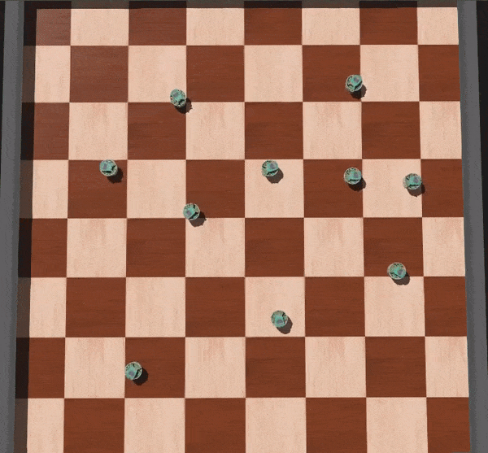
</center>

Tomó como base el algoritmo PSO y lo utilizó como un método de planificación de movimiento para robots diferenciales. Realizó  pruebas con 8 controladores diferentes y encontró que aquellos con mejor rendimiento eran el LQR y LQI. La única desventaja que notó era que los robots describían trayectorias muy rectas, lo cual evitaba que los robots esquivaran obstáculos.

### Juan Pablo Cahueque (2019)


Tomó los avances de Aldo y los utilizó en conjunto con "*Artificial Potential Fields*" para permitir que los robots esquivaran obstáculos presentes en el camino hacia la meta. En este caso, el controlador LQR resultó efectivo para esquivar obstáculos grandes, mientras que el PID con un filtro de "*Hard-Stops*" resultó efectivo para esquivar obstáculos pequeños y numerosos.

### Eduardo Santizo (2020)

<center>
   
    
</center>

Las dos investigaciones previas fueron exitosas, pero requerían de la selección manual de los parámetros ,  y  propios del algoritmo PSO. Para automatizar su selección se diseñó una red neuronal recurrente (RNN) capaz de tomar diferentes métricas del PSO y en base a estas generar valores para los parámetros del algoritmo. A la red neuronal se le denominó  *PSO Tuner* y permitió mejorar la velocidad y precisión del algoritmo estándar PSO significativamente (figura de la derecha).

Además, también se propuso una alternativa al método de esquivado de obstáculos de Juan Pablo, el cual emplea aprendizaje reforzado para generar trayectorias alrededor de una variedad de escenarios (figura de la izquierda).

## Guía de Uso

Como se mencionó [previamente](#eduardo-santizo-(2020)), se desarrollaron dos proyectos como parte de la tesis: El *PSO Tuner* y el planificador de trayectorias basado en Reinforcement Learning. Estos pueden probarse abriendo los livescripts `Pruebas_PSOTuner.mlx` y `SR_Toolbox.mlx` presentes en el path `.../Código/Matlab/Eduardo Santizo`.

Los pasos para la ejecución de ambos scripts son los siguientes:

- Bajar a la primera sección: "*Setup: Path*".

<center>
   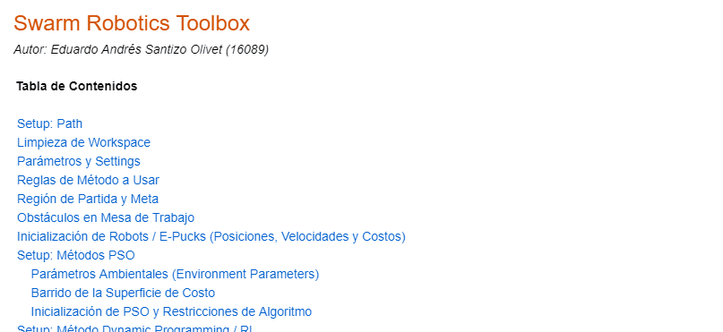
</center>

- De ser necesario, cambiar la raíz del path donde se encuentra actualmente el repositorio.

<center>
   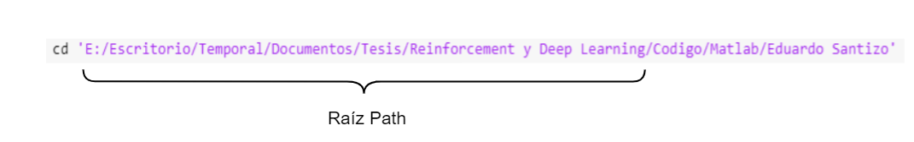
</center>

- Hacer click en la sección y presionar el botón `Run Section` de Matlab. Esto cambiará automáticamente el directorio actual de Matlab, incluirá todas las subcarpetas necesarias para la operación de los scripts y comprobará que el archivo `functionSignatures.json` no contenga errores.

<center>
   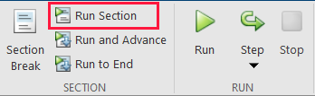
</center>

- Bajar a la sección "*Parámetros y Settings*". 
- Algunas propiedades en esta sección se cambian por medio de *dropdown menus*. Si es la primera vez que se utiliza alguno de los livescripts, Matlab ejecutará el script cada vez que se intente cambiar una opción en los menús. Para evitar esto, el usuario debe deshabilitar manualmente esta opción para cada *dropdown menu* de la siguiente forma:

<center>
   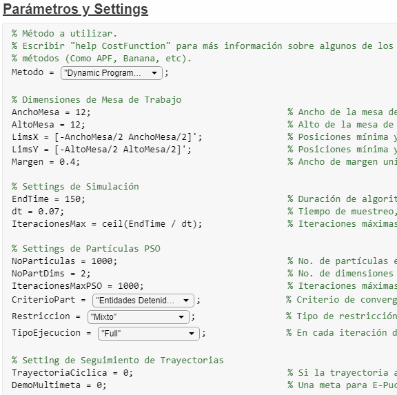
</center>

&nbsp;&nbsp;&nbsp;&nbsp;&nbsp;&nbsp; <span style="font-size:9pt;"> Nota: Una vez cambiado, no es necesario volver a repetir este proceso.</span>

- El usuario puede alterar las diferentes propiedades de la simulación. Se provee una breve descripción de cada parámetro al lado de cada variable. La propiedad principal a alterar es la de `Metodo` (*SR Toolbox*) o `CostFunc` (*Pruebas PSO Tuner*). Para observar el generador de trayectorias, elegir la opción `Dynamic Programming` como método en `SR_Toolbox.mlx`.
- Presionar `Run Section`. El programa debería de desplegar una figura de simulación acorde al `Metodo` / `CostFunc` elegido. Si se desea generar una nueva simulación, presionar nuevamente `Run Section`.

<div style="text-align:center">
   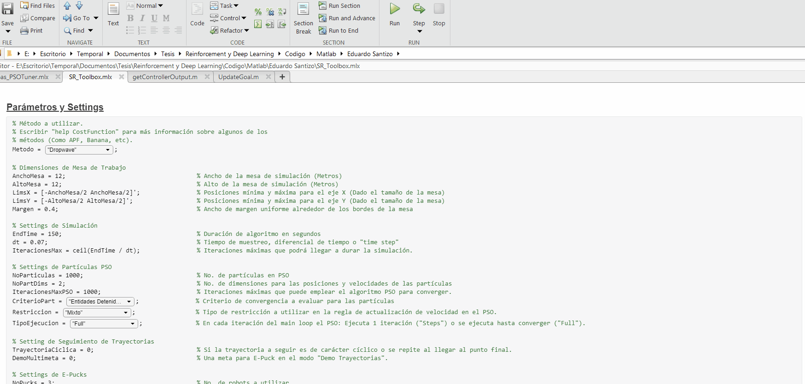
</div>

&nbsp;&nbsp;&nbsp;&nbsp;&nbsp;&nbsp; <span style="font-size:9pt;">Nota: El GIF fue acelerado artificialmente. La inicialización del script toma más tiempo del mostrado. </span>

## Hardware y Software

Los diferentes scripts del *SR Toolbox* se probaron en dos sistemas diferentes, cada uno con diferentes especificaciones de hardware y software.

| <center>Desktop PC</center> | <center>Laptop</center> |
|---------------------|--------------------------------|
| - CPU: i7-4790K (4.4GHz) <br/>- GPU: Nvidia GTX 780 <br/>- RAM: 16 GB DDR3 <br/> - Matlab: 2020a | - CPU: i7-5700HQ (2.70GHz) <br/>- GPU: Nvidia GTX 960M <br/>- RAM: 16 GB DDR3 <br/> - Matlab: 2018b |

En ambos sistemas los scripts corrían sin problemas, aunque en la laptop se observaba una ligera pérdida en desempeño (las animaciones corrían más lento y los tiempos de inicialización eran mayores).

## Swarm Robotics Toolbox (SR Toolbox)

El *Swarm Robotics Toolbox* consiste de un script "maestro" que agrupa múltiples funcionalidades en un solo programa. Esto significa que el usuario no debe abrir 20 scripts diferentes para cada prueba a realizar. Todo está contenido en el mismo livescript, acelerando significativamente el tiempo de realización de pruebas.

Además, para facilitar la comprensión del código, casi todas las líneas de código están comentadas y las funciones creadas poseen documentación propia (escribir en la ventana de comandos `help nombreFuncion`).

Cabe mencionar que el script "maestro" (`SR_Toolbox.mlx`) puede ser fácilmente modificado para acomodar nuevas funcionalidades. Debido a esto, scripts como `Pruebas_PSOTuner.mlx`, se pueden considerar copias modificadas de `SR_Toolbox.mlx`. Por lo tanto, a continuación únicamente se explica la estructura y funciones del *SR Toolbox*, ya que con comprender las mismas, es posible entender casi el 80% de todos los demás scripts asociados. Para los mismos se presentan secciones mucho más cortas que explican las características particulares que difieren con respecto al *SR Toolbox*.

### Estructura de Programa

A continuación se describen todas las secciones que conforman al script `SR_Toolbox.mlx`. Se explican las diferentes características y elementos que pueden llegar a ser cambiados.

#### Limpieza de Workspace

<center>
   
</center>

Esta sección se encarga de limpiar todas las variables del *Workspace* en caso existieran variables pre-existentes propias de otros scripts o de ejecuciones previas del *Toolbox*. Además de esto, también se limpian las **variables persistentes** empleadas dentro de diferentes funciones del *Toolbox*.

<details>
<summary> <span style="font-size:10pt;"><strong>Variables Persistentes</strong> (Hacer click para más información)</span> </summary>
<span style="font-size:10pt;"> En Matlab, los valores de las variables dentro de una función desaparecen luego de que la misma finaliza su ejecución. Para poder mantener el valor de una variable entre diferentes llamadas a la función, se declara a la variable como <tt>persistent</tt>. La desventaja de declarar variables de este tipo, es que su valor se restablece hasta que el usuario reinicia Matlab. Para limpiar estas variables de forma programática, se debe escribir <tt>clear</tt> seguido del nombre de la función que contiene variables persistentes.
</span> </details> <br/>

#### Parámetros y Settings

Esta sección permite controlar una gran variedad de elementos propios de la simulación, desde parámetros dimensionales y visuales, hasta el generador de números aleatorios a emplear por el programa (la *seed*). A continuación se presenta una breve explicación de cada uno de los parámetros que pueden llegar a ser cambiados. Hacer click en cada parámetro para desplegar más información.

##### Método

<details>
<summary> <span style="font-size:10pt;"><tt>Metodo</tt></span> </summary>
<span style="font-size:10pt;"> Tipo de método que se simulará. Se incluye un *dropdown menu* que permite elegir entre las opciones disponibles. El usuario puede elegir tres tipos de método: Métodos dependientes de PSO, métodos basados en el seguimiento de una trayectoria y métodos mixtos (mezcla PSO y seguimiento de trayectorias). En el caso de los métodos PSO, escribir en consola `help CostFunction`, para más información. Si se elige un método PSO, el método corresponde a una función de costo. En la sección [funciones de costo](#funciones-de-costo), se provee la visualización y ecuaciones para algunas de las funciones de costo disponibles como parte de la *Toolbox*</span> </details>

- `Metodo`: Tipo de método que se simulará. Se incluye un *dropdown menu* que permite elegir entre las opciones disponibles. El usuario puede elegir tres tipos de método: Métodos dependientes de PSO, métodos basados en el seguimiento de una trayectoria y métodos mixtos (mezcla PSO y seguimiento de trayectorias). En el caso de los métodos PSO, escribir en consola `help CostFunction`, para más información. Si se elige un método PSO, el método corresponde a una función de costo. En la sección [funciones de costo](#funciones-de-costo), se provee la visualización y ecuaciones para algunas de las funciones de costo disponibles como parte de la *Toolbox*.

- `NoParticulas`: Cantidad de robots a simular 
- CostFunc: Función de costo a minimizar por las partículas. Puede seleccionarse por medio de un dropdown menu o escribirse manualmente. Se ofrecen 10 funciones de costo distintas: 9 funciones "Benchmark" y 1 función dependiente de los obstáculos colocados en el escenario denominada "APF". Para más información sobre las opciones disponibles escribir en consola: *`help CostFunction`*
- DimsMesa: Dimensiones de la mesa sobre la que se moverán los robots
- EndTime: Tiempo que durará la simulación
- EnablePucks: Booleano. Habilita o deshabilita la animación de los robots.

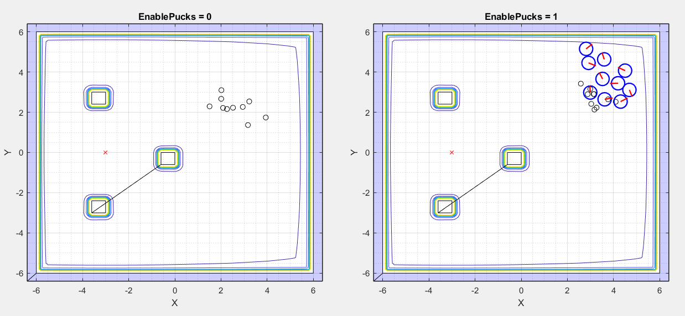

- RadioLlantasPuck: Radio de las ruedas que emplea el robot diferencial
- RadioCuerpoPuck: Distancia del centro del robot a sus ruedas.
- PuckVelMax: Velocidad máxima del puck en función de sus actuadores
- ModoVisualización: 2D, 3D o None. El 3D se recomienda para observar más fácilmente la forma de la función de costo. El 2D es más útil para observar el movimiento de los marcadores y/o robots.  

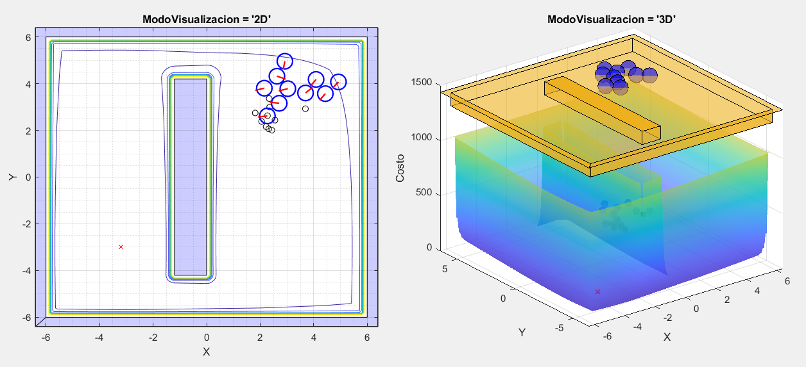
  
### Obstáculos

Basado en la implementación de "Artificial Potential Fields" de Juan Pablo Cahueque. Si se seleccionó "APF" como función de costo, esta funcionalidad permite que el usuario diseñe los obstáculos a posicionar en la mesa de trabajo. Se ofrecen 5 opciones diferentes.

- Polígono: El usuario puede dibujar el polígono que desee. Para colocar un vértice hacer click. Para finalizar, cerrar el polígono regresando al primer vértice colocado y haciendo click en este punto.

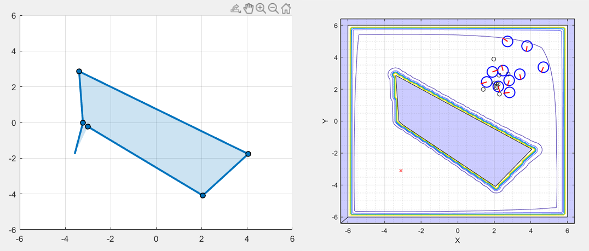

- Cilindro: Coloca un cilindro de radio 2 en el centro de la mesa de trabajo.
- Caso A: Réplica del escenario A utilizado en la tesis de Juan Pablo. 

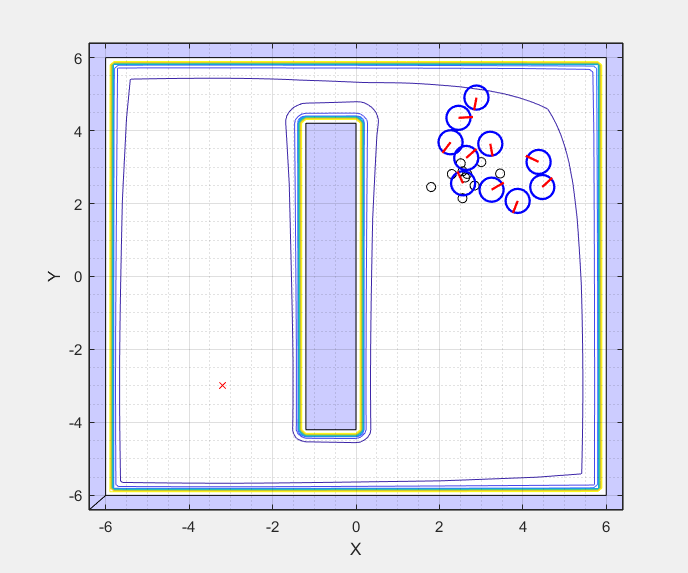

- Caso B: Réplica del escenario B utilizado en la tesis de Juan Pablo.
- Caso C: Réplica del escenario C utilizado en la tesis de Juan Pablo. Debido a que consiste de múltiples obstáculos, aún existe un error en su renderización. De aquí viene el artefacto de la línea negra observada entre obstáculos y su falta de coloración.

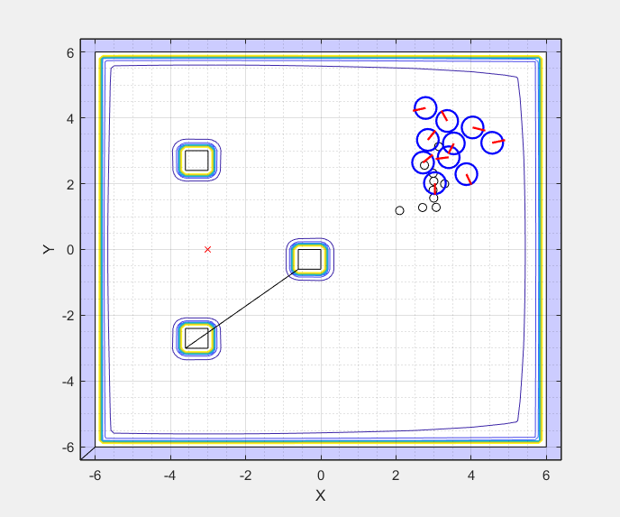

### Tipo de Restricción

Como se mencionó previamente, el algoritmo canónico de PSO es dependiente de los parámetros ,  y . Existen múltiples maneras de elegir estos parámetros, pero en el toolbox se ofrecen tres opciones:

- Inercia: Si se desea abandonar el esquema que asegura la convergencia propuesto por Clerc (1999), el usuario puede obviar la ecuación  y utilizar el valor de , o inercia, que desee. Se ofrecen 5 tipos diferentes de inercia. Para más información escribir en consola: *`help ComputeInertia`* 
- Constricción: Se siguen las ideas propuestas por Clerc (1999) que aseguran la convergencia del algoritmo PSO. Se pueden elegir los parámetros
,  y . Por defecto se utilizan los valores recomendados en el artículo científico.

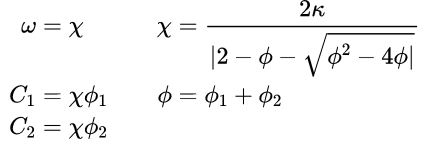

- Mixto: Uso simultáneo de un tipo de inercia (Por defecto exponencialmente decreciente), en conjunto con los parámetros de constricción propuestos por Clerc. Utilizado por Aldo en su tesis.  

### Colisiones

Un entorno de simulación realista es necesario para obtener resultados útiles al momento de realizar pruebas. Debido a esto, se implementó "Collision Detection" entre los robots. Durante cada iteración, los robots revisan la distancia entre ellos (Para más información escribir en consola: *`help getDistsBetweenParticles`*) y si esta es menor a 2 radios de E-Puck, los robots se clasifican como "en colisión". Seguido de esto se procede resolver las colisiones, alejando a los robots el uno del otro hasta eventualmente resolver todas las colisiones existentes.

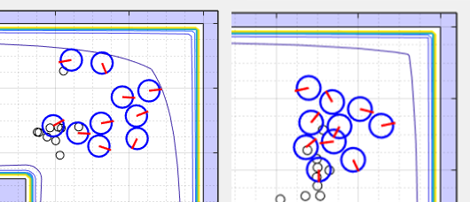

Desgraciadamente, debido a que al alejar un robot del otro se pueden llegar a crear más colisiones, en algunas ocasiones el algoritmo puede no converger en una solución. Por lo tanto, **el algoritmo implementado es inestable y si no se restringe puede llegar a trabar Matlab.** Para controlar esto se le colocó un número máximo de iteraciones en las que puede llegar a producir una solución válida. Con esta "solución", el algoritmo funciona relativamente bien aunque puede producir errores frecuentemente. 

Si se desea, el usuario puede acceder a la función *`SolveCollisions.m`* y cambiar el parámetro IteracionesMax. Los errores disminuyen al incrementar el número de iteraciones, pero el tiempo computacional requerido incrementa. En futuras versiones del Toolbox se desea implementar un algoritmo de "Collision Detection" mucho más robusto como "Speculative Collisions" que también incluya elementos como las paredes o los obstáculos como tal.

### Controladores

Como es explicado por Aldo en su tesis, el acoplar el movimiento de un robot diferencial directamente al desplazamiento de una partícula PSO no es recomendable. Las partículas se desplazan de manera muy agresiva, por lo que los robots podrían quemar sus motores en el proceso de intentar seguir su paso. Entonces, los E-Pucks no siguen directamente las posiciones de las partículas PSO, sino que utilizan su dirección como una sugerencia de hacia donde ir. Debido a esta diferencia, a las partículas del algoritmo PSO se les pasa a denominar "Marcadores PSO" en el Toolbox.

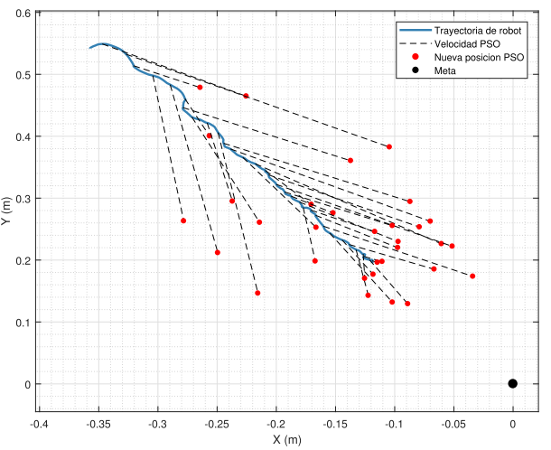

Los controladores son los encargados de seguir estas sugerencias hasta llegar a la meta. En la Toolbox se ofrecen dos opciones: Un controlador LQR y un LQI (Ya que estos fueron los que obtuvieron los mejores resultados en la tesis de Aldo). La salida de estos controladores es la velocidad lineal y angular de los E-Pucks. Normalmente estas cantidades deben ser mapeadas por medio de estas ecuaciones

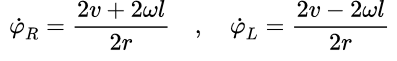

a las velocidades angulares de las ruedas del robot. No obstante, en el caso de la Toolbox, las velocidades se utilizan directamente para guiar el movimiento de los robots. Para más información escribir en consola *`help getControllerOutput`*

### Criterios de Convergencia

La función *`EvalCriteriosConvergencia.m`* permite que el usuario diseñe sus propios criterios de convergencia y los agregue a una lista de condiciones que se evalúan durante cada iteración. La salida de la función es una lista de cuales son los criterios cumplidos, en conjunto con su nombre. Por defecto la Toolbox ofrece 4 opciones

1. "Mínimo Alcanzado": Cierto porcentaje de partículas llega a alguno de los mínimos de la función.
2. "Mínimo Alcanzado (80%)": Criterio 1 cumplido y ha transcurrido el 80% de las iteraciones máx.
3. "Posición Convergió": Todas las partículas se han quedado "quietas" o se han movido poco desde la última iteración
4. "Iter. Máx Alcanzadas": Se ha alcanzado el número máximo de iteraciones.

Para más información escribir en consola *`help EvalCriteriosConvergencia`*

### Análisis de Resultados

Al finalizar la simulación, el usuario puede analizar los resultados obtenidos haciendo uso de 4 gráficas distintas

#### Evolución del Global Best

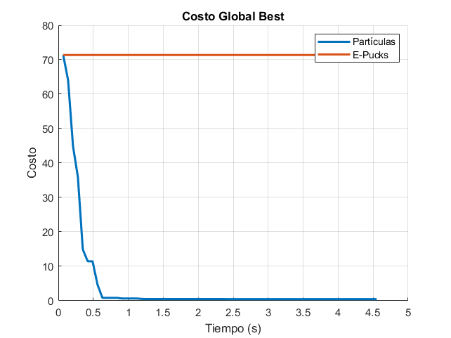

Utilizada para determinar si los robots y las partículas efectivamente minimizan la función de costo que se eligió. Dada la naturaleza del movimiento de los robots, muy comúnmente la curva de los robots parece estar "atrasada" con respecto a la de las partículas o marcadores PSO.

#### Análisis de Dispersión de Partículas

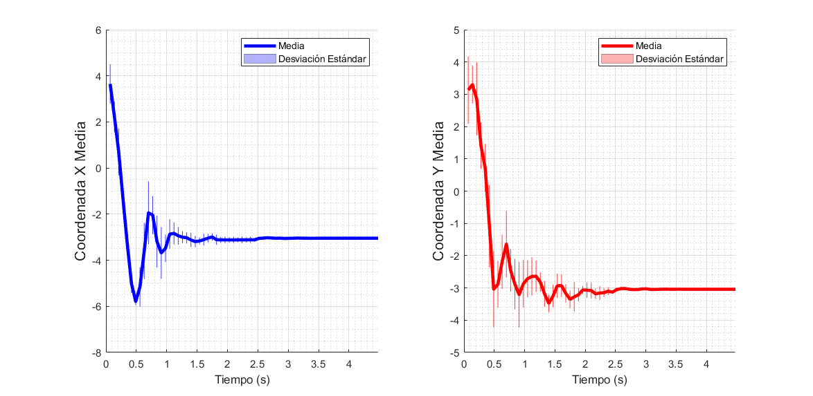

Dos cualidades importantes de las partículas del PSO es su capacidad de exploración y la precisión de su minimización. Con estas gráficas, la precisión se puede evaluar viendo la línea gruesa coloreada y la exploración utilizando las líneas correspondientes a la desviación estándar.  Si las líneas gruesas se estabilizan en las coordenadas de la meta, las partículas son precisas. Si la desviación estándar es muy pronunciada, las partículas exploran minuciosamente el área de trabajo antes de converger.

En el caso presentado, por ejemplo, las partículas son precisas y convergen con rapidez, aunque exploran poco.

#### Velocidad de Motores

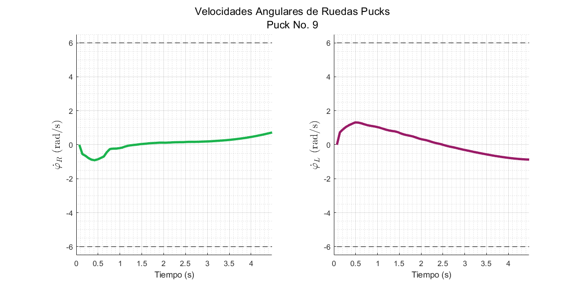

Utilizando la cinemática inversa de un robot diferencial se calculan las velocidades angulares de las ruedas de todos los robots.


La Toolbox obtiene las velocidades angulares medias de todas las ruedas y determina cual fue el robot con las velocidades más altas. Toma este robot como selección y grafica la evolución de las velocidades angulares de sus dos ruedas. Útil para analizar si los actuadores del robot crítico presentan saturación. Como ayuda se incluyen líneas punteadas, las cuales consisten de los límites de velocidad con los que cuenta el robot (Basado en *`PuckVelMax`*). 

#### Suavidad de Velocidades

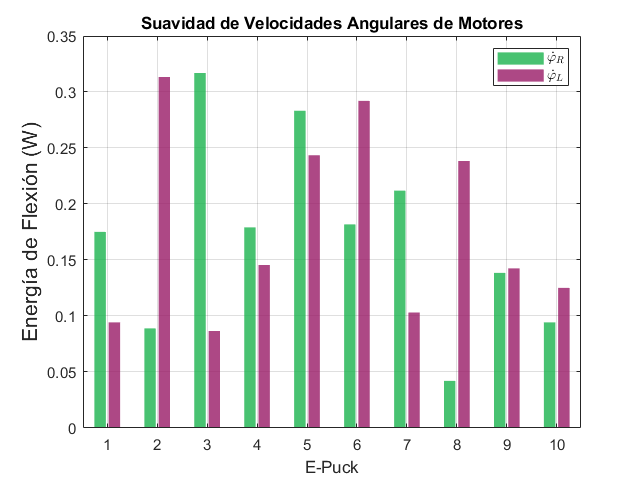

Basado en el criterio de evaluación empleado por Aldo en su tesis. Se realiza una interpolación de los puntos que conforman la curva de velocidades angulares de las ruedas, y luego se calcula la energía de flexión de la curva. Si la energía de flexión es baja, la suavidad de operación es mucho mayor. Prueba ideal para diagnosticar cuantitativamente la suavidad de operación.

### Grabación de Videos / Frames

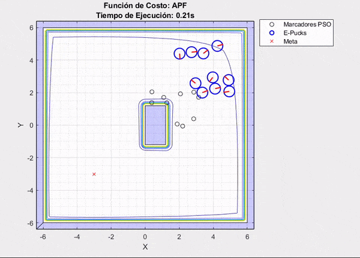

Para facilitar la presentación de resultados, la Toolbox cuenta con dos opciones de exportación de gráficas: *`SaveVideo`* y *`SaveFrames`*.

- SaveFrames: Guarda cada una de las frames generadas durante el proceso de animación en el directorio raíz.  
- SaveVideo: Crea un video a partir de las frames generadas durante el proceso de animación. Por defecto el framerate es de 30 y el formato es mp4.

**Advertencia**: Durante el proceso de creación de videos, la animación corre más lento.

## Demostración

### Partículas Esquivando Obstáculo

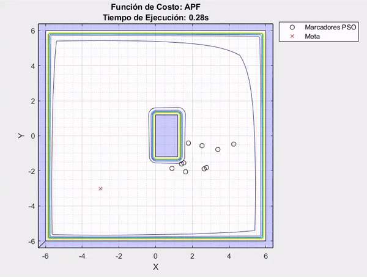
  
### Polígono Personalizado


