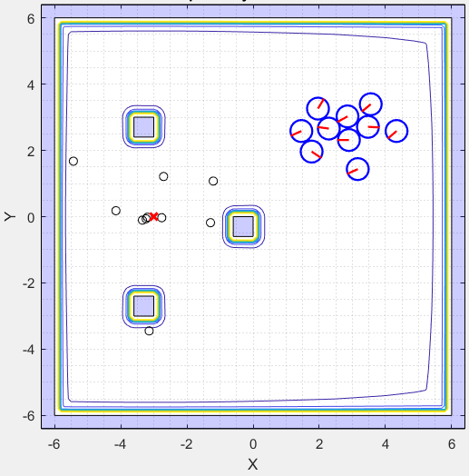

# Reinforcement y Deep Learning en Aplicaciones de Robótica de Enjambre

<p align="center">
   
    
</p>

## Índice

1. [Estructura de Carpetas](#estructura-de-carpetas)
   - [Repositorio](#repositorio)
   - [Tesis Eduardo Santizo](#tesis-eduardo-santizo)
2. [Antecedentes](#antecedentes)
   - [Aldo Aguilar (2019)](#aldo-aguilar-(2019))
   - [Juan Pablo Cahueque (2019)](#juan-pablo-cahueque-(2019))
   - [Eduardo Santizo (2020)](#eduardo-santizo-(2020))
3. [Guía de Uso](#guia-de-uso)
4. [Hardware y Software](#hardware-y-software)
5. [Swarm Robotics Toolbox](#swarm-robotics-toolbox-(sr-toolbox))
   - [Estructura de Programa](#estructura-de-programa)
   - [Funciones](#funciones)
     - [Evolución del Global Best](#evolución-del-global-best)
     - [Análisis de Dispersión de Partículas](#análisis-de-dispersión-de-partículas)
     - [Velocidad de Motores](#velocidad-de-motores)
     - [Suavidad de Velocidades](#suavidad-de-velocidades)
   - [Grabación de Videos / Frames](#grabación-de-videos--frames)
6. [Demostración](#demostración)
   - [Partículas Esquivando Obstáculo](#partículas-esquivando-obstáculo)
   - [Polígono Personalizado](#polígono-personalizado)

## Estructura de Carpetas

### Repositorio

Estructura general de las carpetas existentes en el repositorio.

```json
Reinforcement y Deep Learning
│
└─── Código
│   │
│   └─── Matlab
|   |   |
│   |   └─── Aldo Aguilar:
|   |   |    Pruebas parámetros PSO
|   |   |
│   |   └─── Juan Cahueque:
|   |   |    Pruebas APF
|   |   |
│   |   └─── Eduardo Santizo:
|   |        PSO Toolbox y PSO Tuner
|   |
│   └─── Webots
|       |
│       └─── Aldo Aguilar:
|       |    Simulación controladores E-Pucks y scripts de análisis de resultados.
|       |
│       └─── Juan Cahueque:
|            Simulación caso A, B y C.
|
|
└─── Literatura
│   │
│   └─── Lectures:
|   |    Clases, presentaciones o lecciones
|   |
│   └─── Libros
|   |
│   └─── Papers
│   |   │
│   |   └─── Artificial Potential Fields
|   |   |
│   |   └─── Interpolaciones
|   |   |
│   |   └─── Machine Learning
|   |   |
│   |   └─── Robótica
|   |   |
│   |   └─── Swarm Intelligence
|   |
|   |
│   └─── Tesis Previas:
|   |    PDFs de trabajos de graduación y protocolos previos.
|   |
│   └─── Referencias Bibtex:
|        Archivo .bib con las referencias a toda la literatura.
|
|
└─── Notas:
|    Imágenes y documentos varios con notas sobre el proyecto.
|
|
└─── Reporte:
|    Documentos asociados con la redacción del reporte final de tesis y el protocolo.
|
|
└─── Media:
     Imágenes y GIFs utilizados en el Readme.
```

### Tesis Eduardo Santizo

Estructura para la carpeta que contiene el código de Matlab de la tesis "*Reinforcement y Deep Learning en Aplicaciones de Robótica de Enjambre*" realizada por Eduardo Santizo.

```json
Eduardo Santizo
│
└─── Deep PSO Tuner
│   │
│   └─── Datasets:
|   |    Datos de entrenamiento y validación para las RNNs
│   │
│   └─── Modelos:
|   |    Modelos finales para las redes entrenadas
│   │
│   └─── Settings y Training Progress:
|        Modelos, estructuras de red e imágenes de progreso de entrenamiento.
|        Excel con registro del proceso de hyperparameter tuning para cada RNN.
|
|
└─── Ejemplos y Scripts Auxiliares
│   │
│   └─── Reinforcement Learning Coursera - Ejercicios:
|   |    Ejercicios (Matlab) para el curso de Reinforcement Learning impartido por la Universidad de Alberta.
|   |
│   └─── Sequence to Sequence Regression Using Deep Learning:
|   |    Ejemplo de Matlab para entrenar una RNN para predecir una secuencia.
|   |
│   └─── Importador_Mapas.mlx:
|   |    Versión mejor explicada de la función interna "ImportarMapa()".
|   |
│   └─── Train_Shallow&DeepNN_DatosSecuenciales:
|        Predicción de un sistema de ecuaciones diferenciales usando una Shallow NN.
|        Predicción de casos de gripe aviaria en los Estados Unidos usando RNN.
|
|
└─── Funciones
│   │
│   └─── Externas:
|   |    Funciones y métodos obtenidos en internet.
|   |
│   └─── Internas:
|        Funciones escritas específicamente para el SR Toolbox.
|
|
└─── Mapas
│   │
│   └─── Imágenes:
|   |    Imágenes en blanco y negro de los mapas a usar en la mesa de trabajo.
|   |
│   └─── Vertices:
|        Vértices para los polígonos que conforman los obstáculos de la mesa de trabajo.
|
|
└─── Media
│   │
│   └─── Figuras:
|   |    Figuras generadas durante la ejecución de los scripts de la SR Toolbox.
|   |    Una carpeta por simulación.
|   |
│   └─── Frames:
|   |    Cada una de las frames generadas durante la animación de la SR Toolbox.
|   |    Una carpeta por simulación.
|   |
│   └─── GIFs:
|   |    GIFs de la animación generada por la SR Toolbox.
|   |
│   └─── Frames:
|        Videos de la animación generada por la SR Toolbox.
|
|
└─── functionsSignatures.json:
|    Empleado para las sugerencias de autocompletado en funciones internas.
|
|
└─── Generar_Dataset.m:
|    Genera las entradas y salidas requeridas para el entrenamientos de las RNNs.
|
|
└─── Pruebas_PSOTuner.mlx:
|    Script para probar y generar estadísticas sobre el PSO Tuner.
|
|
└─── SR_Toolbox:
     Script principal del SR Toolbox.
```

## Antecedentes

### Aldo Aguilar (2019)

<p align="center">
   
</p>

Tomó como base el algoritmo PSO y lo utilizó como un método de planificación de movimiento para robots diferenciales. Realizó  pruebas con 8 controladores diferentes y encontró que aquellos con mejor rendimiento eran el LQR y LQI. La única desventaja que notó era que los robots describían trayectorias muy rectas, lo cual evitaba que los robots esquivaran obstáculos.

### Juan Pablo Cahueque (2019)

<p align="center">
   
</p>

Tomó los avances de Aldo y los utilizó en conjunto con "*Artificial Potential Fields*" para permitir que los robots esquivaran obstáculos presentes en el camino hacia la meta. En este caso, el controlador LQR resultó efectivo para esquivar obstáculos grandes, mientras que el PID con un filtro de "*Hard-Stops*" resultó efectivo para esquivar obstáculos pequeños y numerosos.

### Eduardo Santizo (2020)

<p align="center">
   
    
</p>

Las dos investigaciones previas fueron exitosas, pero requerían de la selección manual de los parámetros ,  y  propios del algoritmo PSO. Para automatizar su selección se diseñó una red neuronal recurrente (RNN) capaz de tomar diferentes métricas del PSO y en base a estas generar valores para los parámetros del algoritmo. A la red neuronal se le denominó  *PSO Tuner* y permitió mejorar la velocidad y precisión del algoritmo estándar PSO significativamente (figura de la derecha).

Además, también se propuso una alternativa al método de esquivado de obstáculos de Juan Pablo, el cual emplea aprendizaje reforzado para generar trayectorias alrededor de una variedad de escenarios (figura de la izquierda).

## Guía de Uso

Como se mencionó [previamente](#eduardo-santizo-(2020)), se desarrollaron dos proyectos como parte de la tesis: El *PSO Tuner* y el planificador de trayectorias basado en Reinforcement Learning. Estos pueden probarse abriendo los livescripts `Pruebas_PSOTuner.mlx` y `SR_Toolbox.mlx` presentes en el path `.../Código/Matlab/Eduardo Santizo`.

Los pasos para la ejecución de ambos scripts son los siguientes:

- Bajar a la primera sección: "*Setup: Path*".

<p align="center">
   
</p>

- De ser necesario, cambiar la raíz del path donde se encuentra actualmente el repositorio.

<p align="center">
   
</p>

- Hacer click en la sección y presionar el botón `Run Section` de Matlab. Esto cambiará automáticamente el directorio actual de Matlab, incluirá todas las subcarpetas necesarias para la operación de los scripts y comprobará que el archivo `functionSignatures.json` no contenga errores.

<p align="center">
   
</p>

- Bajar a la sección "*Parámetros y Settings*". 
- Algunas propiedades en esta sección se cambian por medio de *dropdown menus*. Si es la primera vez que se utiliza alguno de los livescripts, Matlab ejecutará el script cada vez que se intente cambiar una opción en los menús. Para evitar esto, el usuario debe deshabilitar manualmente esta opción para cada *dropdown menu* de la siguiente forma:

<p align="center">
   
</p>

&nbsp;&nbsp;&nbsp;&nbsp;&nbsp;&nbsp; <sub> Nota: Una vez cambiado, no es necesario volver a repetir este proceso. </sub>

- El usuario puede alterar las diferentes propiedades de la simulación. Se provee una breve descripción de cada parámetro al lado de cada variable. La propiedad principal a alterar es la de `Metodo` (*SR Toolbox*) o `CostFunc` (*Pruebas PSO Tuner*). Para observar el generador de trayectorias, elegir la opción `Dynamic Programming` como método en `SR_Toolbox.mlx`.
- Presionar `Run Section`. El programa debería de desplegar una figura de simulación acorde al `Metodo` / `CostFunc` elegido. Si se desea generar una nueva simulación, presionar nuevamente `Run Section`.

<p align="center">
   
</p>

&nbsp;&nbsp;&nbsp;&nbsp;&nbsp;&nbsp; <sub>Nota: El GIF fue acelerado artificialmente. La inicialización del script toma más tiempo del mostrado.</sub>

## Hardware y Software

Los diferentes scripts del *SR Toolbox* se probaron en dos sistemas diferentes, cada uno con diferentes especificaciones de hardware y software.

| <center>Desktop PC</center> | <center>Laptop</center> |
|---------------------|--------------------------------|
| - CPU: i7-4790K (4.4GHz) <br/>- GPU: Nvidia GTX 780 <br/>- RAM: 16 GB DDR3 <br/> - Matlab: 2020a | - CPU: i7-5700HQ (2.70GHz) <br/>- GPU: Nvidia GTX 960M <br/>- RAM: 16 GB DDR3 <br/> - Matlab: 2018b |

En ambos sistemas los scripts corrían sin problemas, aunque en la laptop se observaba una ligera pérdida en desempeño (las animaciones corrían más lento y los tiempos de inicialización eran mayores).

## Swarm Robotics Toolbox (SR Toolbox)

El *Swarm Robotics Toolbox* consiste de un script "maestro" que agrupa múltiples funcionalidades en un solo programa. Esto significa que el usuario no debe abrir 20 scripts diferentes para cada prueba a realizar. Todo está contenido en el mismo livescript, acelerando significativamente el tiempo de realización de pruebas.

Además, para facilitar la comprensión del código, casi todas las líneas de código están comentadas y las funciones creadas poseen documentación propia (escribir en la ventana de comandos `help nombreFuncion`).

Cabe mencionar que el script "maestro" (`SR_Toolbox.mlx`) puede ser fácilmente modificado para acomodar nuevas funcionalidades. Debido a esto, scripts como `Pruebas_PSOTuner.mlx`, se pueden considerar copias modificadas de `SR_Toolbox.mlx`. Por lo tanto, a continuación únicamente se explica la estructura y funciones del *SR Toolbox*, ya que con comprender las mismas, es posible entender casi el 80% de todos los demás scripts asociados. Para los mismos se presentan secciones mucho más cortas que explican las características particulares que difieren con respecto al *SR Toolbox*.

### Estructura de Programa

A continuación se describen todas las secciones que conforman al script `SR_Toolbox.mlx`. Se explican las diferentes características y elementos que pueden llegar a ser cambiados.

#### Limpieza de Workspace

<p align="center">
   
</p>

Esta sección se encarga de limpiar todas las variables del *Workspace* en caso existieran variables pre-existentes propias de otros scripts o de ejecuciones previas del *Toolbox*. También se limpian las **variables persistentes** empleadas dentro de diferentes funciones del *Toolbox*.

<details>
<summary> <sub><strong>Variables Persistentes</strong> (Hacer click para más información)</sub> </summary>
<sub> En Matlab, los valores de las variables dentro de una función desaparecen luego de que la misma finaliza su ejecución. Para poder mantener el valor de una variable entre diferentes llamadas a la función, se declara a la variable como <tt>persistent</tt>. La desventaja de declarar variables de este tipo, es que su valor se restablece hasta que el usuario reinicia Matlab. Para limpiar estas variables de forma programática, se debe escribir <tt>clear</tt> seguido del nombre de la función que contiene variables persistentes.
</sub> </details> <br/>

#### Parámetros y Settings

Esta sección permite controlar una gran variedad de elementos propios de la simulación, desde parámetros dimensionales y visuales, hasta la *seed* a utilizar. A continuación se presenta una breve explicación de cada uno de los parámetros que pueden llegar a ser cambiados. **Hacer click en el nombre de cada parámetro para desplegar más información**.

<ins>*Método a Utilizar*</ins>

<details>
<summary> <tt>Metodo</tt> </summary>
<sub>Tipo de método que se simulará. Se incluye un dropdown menu que permite elegir entre las opciones disponibles. El usuario puede elegir tres tipos de método: Métodos dependientes de PSO (APF, Jabandzic y funciones de costo benchmark como Dropwave, Banana, Levy, etc.), métodos basados en el seguimiento de una trayectoria (Dynamic programming y Demo Trayectorias) y métodos dinámicos (que no requieren de planeación previa para explorar la mesa de trabajo). En el caso de los métodos PSO, la propiedad de <tt>Metodo</tt> pasa a llamarse función de costo o <tt>CostFunc</tt>. En la sección de "Funciones de Costo", se provee la visualización y ecuaciones para algunas de las funciones de costo disponibles como parte de la Toolbox. </sub>
</details> <br/>

<ins>*Dimensiones de Mesa de Trabajo*</ins>

<details>
<summary> <tt>AnchoMesa</tt> </summary>
<sub>Ancho de la mesa de trabajo. Unidades en metros.</sub>
<p align="center">
   
</p>
</details>

<details>
<summary> <tt>AltoMesa</tt> </summary>
<sub>Alto de la mesa de trabajo. Unidades en metros.</sub>
<p align="center">
   
</p>
</details>

<details>
<summary> <tt>Margen</tt> </summary>
<sub>Ancho del margen uniforme que existirá alrededor de los bordes de la mesa de trabajo. Unidades en metros.</sub>
<p align="center">
   
</p>
</details><br/>

<ins>*Settings de Simulación*</ins>

<details>
<summary> <tt>EndTime</tt> </summary>
<sub>Duración total de la simulación en segundos.</sub>
</details>

<details>
<summary> <tt>dt</tt> </summary>
<sub>Delta de tiempo, tiempo de muestreo o cantidad de segundos que transcurrirán entre cada una de las iteraciones del main loop del algoritmo.</sub>
</details><br/>

<ins>*Settings de Partículas PSO*</ins>

<details>
<summary> <tt>NoParticulas</tt> </summary>
<sub>Cantidad de partículas a utilizar dentro del algoritmo de PSO. En los métodos dependientes de PSO, el número de partículas tiende a sobre-escribir el número de E-Pucks a utilizar también.</sub>
</details>

<details>
<summary> <tt>PartPosDims</tt> </summary>
<sub>Cantidad de dimensiones que tendrán las posiciones de las partículas PSO. El objeto <tt>PSO.m</tt> tiene la capacidad de manejar tantas dimensiones como se le soliciten, no obstante, se recomienda mantener su valor en 2 dimensiones para no interferir con el funcionamiento de la mayor parte de métodos.</sub>
</details>

<details>
<summary> <tt>IteracionesMaxPSO</tt> </summary>
<sub>Número de iteraciones máximas a utilizar por el algoritmo PSO. Este parámetro existe porque no en todos los métodos se desea que el tiempo de simulación coincida con el tiempo que le toma al PSO correr por completo.</sub>
</details>

<details>
<summary> <tt>CriterioPart</tt> </summary>
<sub> Criterio de convergencia que utilizará el algoritmo PSO para evaluar el momento en el que debe dar fin al algoritmo. Se ofrecen tres opciones: Meta Alcanzada, Entidades Detenidas e Iteraciones Max. Para más información escribir <tt>help getCriteriosConvergencia</tt>.</sub>
<p align="center">
   
</p>
</details>

<details>
<summary> <tt>Restriccion</tt> </summary>
<sub>Tipo de restricción a utilizar en la regla de actualización de velocidad en el PSO.</sub>

<p align="center">
   
</p>

<sub>Se ofrecen tres opciones:</sub>

<p><ul><li><sub>
Inercia: Se multiplica a la velocidad previa por una constante denominada inercia (). Se ofrecen 5 tipos de inercia: Constante, Linealmente Decreciente, Decreciente Caótica, Aleatoria y Exponencial Natural. Para más información escribir en la ventana de comandos <tt>help ComputeInertia</tt>. La constante  se iguala a 1 para impedir la intervención de la restricción por constricción.
</sub></li></ul></p>

<p><ul><li><sub>
Constricción: Criterio de convergencia propuesto por Clerc (1999). Este criterio asegura la convergencia del algoritmo siempre y cuando  4"/>. La constante  se iguala a 1 para impedir la intervención de la restricción por inercia.
</sub></li></ul></p>

<p align="center">
   
</p>

<p><ul><li><sub>
Mixto: Uso de inercia "Exponencial Natural" junto con los parámetros de constricción propuestos por Clerc (1999). Propuesto por Aldo en su tesis.
</sub></li></ul></p>

</details><br/>

<ins>*Settings de E-Pucks*</ins>

<details>
<summary> <tt>NoPucks</tt> </summary>
<sub> Cantidad de robots diferenciales a simular. No, no dice NoFucks.</sub>
</details>

<details>
<summary> <tt>EnablePucks</tt> </summary>
<sub> Si únicamente se desea visualizar el movimiento de las partículas en un método dependiente de PSO, se permite que el usuario desactive la simulación de los robots E-Puck.</sub>
<p align="center">
   
</p>
</details>

<details>
<summary> <tt>RadioLlantasPuck</tt> </summary>
<sub> Radio de las ruedas que emplea el robot diferencial. Unidades en metros. </sub>
</details>

<details>
<summary> <tt>RadioCuerpoPuck</tt> </summary>
<sub> Distancia del centro del robot a sus ruedas. Unidades en metros. </sub>
</details>

<details>
<summary> <tt>RadioDifeomorfismo</tt> </summary>
<sub> Al sacar la cinemática directa de un robot diferencial, el modelo derivado es altamente no lineal. Para poder aplicar control a dicho robot, entonces se supone que no se controlará la posición y velocidad del centro del robot como tal, sino de un punto delante de él (comúnmente ubicado en los extremos de su radio en caso se trate de un robot circular). La distancia que existe entre el centro del robot y este punto a controlar se le denomina radio de difeomorfismo. Unidades en metros. </sub>
</details>

<details>
<summary> <tt>PuckVelMax</tt> </summary>
<sub> Velocidad angular máxima que pueden alcanzar las ruedas del robot. Unidades en rad/s. </sub>
</details>

<details>
<summary> <tt>ControladorPucks</tt> </summary>
<sub> Controlador para el movimiento punto a punto de los E-Pucks. Existen 5 opciones. Basados en los controladores implementados por Aldo:</sub>

<p align="center">
   
</p>

<p><ul><li><sub>
Linear Quadratic Regulator (LQR): Movimiento rápido que desacelera conforme el robot se acerca a la meta. Para cambiar de dirección el robot se detiene completamente, gira y luego se mueve.
</sub></li></ul></p>

<p align="center">
   
</p>

<p><ul><li><sub>
Linear Quadratic Integral Control (LQI): Movimiento parecido al LQR, pero con una desaceleración menos pronunciada y sin giros agudos en el cambio de meta a meta. El robot no se detiene completamente para girar.
</sub></li></ul></p>

<p align="center">
   
</p>

<p><ul><li><sub>
Controlador de Pose Simple: Movimiento con velocidad menor a aquella observada en los controladores LQR y LQI. Debido a su aceleración angular menor, las trayectorias generadas son más suaves y largas.
</sub></li></ul></p>

<p align="center">
   
</p>

<p><ul><li><sub>
Controlador de Pose con Criterio de Estabilidad de Lyapunov: Misma velocidad que en el controlador de pose simple. Giros agudos, pero aceleraciones angulares bajas al momento de girar e iniciar el movimiento lineal.
</sub></li></ul></p>

<p align="center">
   
</p>

<p><ul><li><sub>
Controlador de Direccionamiento de Lazo Cerrado: Controlador con la menor velocidad de entre los 5 presentados. El robot busca alinear su dirección con la meta, pero no su sentido. Por lo tanto, no importando si su eje +X (línea rojo vivo del robot) o -X apunta en la dirección de la meta, este se moverá hacia la misma. Esto implica que según le sea conveniente, el robot se desplazará hacia adelante o en reversa hacia la meta. La aceleración angular es baja, produciendo giros sumamente suaves; no obstante, debido a la alta velocidad lineal asociada al movimiento, el robot tiende a desviarse ligeramente del punto hacia el que desea orientarse, causando que las trayectorias tengan una mayor longitud.
</sub></li></ul></p>

<sub> Entre estos, los dos mejores se consideran el LQI y LQR, con el peor siendo el de Closed-Loop Steering. Para más información escribir en consola <tt>help getControllerOutput</tt>. </sub>
</details>

<details>
<summary> <tt>CriterioPuck</tt> </summary>
<sub> Similar al parámetro <tt>CriterioPart</tt>. Determina el criterio de convergencia que utilizará el ciclo principal para determinar el momento en el que debe finalizar su ejecución según la posición de los robots diferenciales. Existen tres opciones: Meta Alcanzada, Entidades Detenidas e Iteraciones Max.</sub>
<p align="center">
   
</p>
</details><br/>

<ins>*Settings de Seguimiento de Trayectorias*</ins>

<details>
<summary> <tt>TrayectoriaCiclica</tt> </summary>
<sub> En métodos de seguimiento de trayectorias, el robot está activamente siguiendo un conjunto de puntos en orden secuencial. Si se establece que se desea una trayectoria cíclica, cuando el robot alcance el último punto de su trayectoria, este tomará como siguiente punto a seguir el primer punto en la trayectoria. Si la trayectoria no es cíclica, el último punto de la misma no cambia aunque se llegue a ella. </sub>
</details>

<details>
<summary> <tt>DemoMultimeta</tt> </summary>
<sub> El método "Demo Trayectorias" consiste de un método en el que un cierto número de robots (dado por la variable <tt>NoPucks</tt>) siguen una trayectoria común predeterminada por el usuario. Si <tt>DemoMultimeta = 1</tt>, entonces el número de robots se limitará a tres y cada uno de estos seguirá una meta distinta. </sub>
<p align="center">
   
    
</p>
</details><br/>

<ins>*Animación*</ins>

<details>
<summary> <tt>ModoVisualizacion</tt> </summary>
<sub> 2D, 3D o None. El modo 3D se recomienda para observar más fácilmente la forma de la función de costo en métodos dependientes de PSO. El 2D es más útil para observar el movimiento de las partículas y/o robots.</sub>
<p align="center">
   
</p>
</details>

<details>
<summary> <tt>EnableRotacionCamara</tt> </summary>
<sub>Cuando Matlab grafica en 3D, este elige un ángulo óptimo para posicionar la cámara que enfoca el plot. Al habilitar esta opción, Matlab gira la cámara alrededor del plot a una velocidad constante. Únicamente válido para el modo de visualización 3D. </sub>
<p align="center">
   
   
</p>
</details>

<details>
<summary> <tt>VelocidadRotacion</tt> </summary>
<sub>Cantidad de grados que rota la cámara alrededor del plot en cada iteración del main loop. Mientras más bajo el valor absoluto de esta cantidad más lenta será la rotación. Si la velocidad es positiva, la cámara rota a favor de las manecillas del reloj. Si la velocidad es negativa, la cámara rota en contra de las manecillas. </sub>
</details>

<details>
<summary> <tt>OverwriteTitle</tt> </summary>
<sub>Por defecto, la simulación utiliza el título como un cronómetro o contador para el tiempo de simulación. Si <tt>OverwriteTitle = 1</tt> se reemplaza este contador por un string dado por el usuario. </sub>
</details>

<details>
<summary> <tt>OverwriteTitle_String</tt> </summary>
<sub> String que reemplaza el título por defecto de la simulación si <tt>OverwriteTitle = 1</tt>. </sub>
</details><br/>

<ins>*Obstáculos*</ins>

<details>
<summary> <tt>TipoObstaculo</tt> </summary>
<sub>Tipo de obstáculo a colocar en la mesa de trabajo. Existen 5 opciones:</sub>

<p><ul><li><sub>
Polígono: El usuario puede dibujar el polígono que desee. La interfaz de creación incluye la región de partida y el/los puntos meta para que el usuario evite colocar el obstáculo sobre estos (aunque aún puede hacerlo). Para cerrar el polígono y finalizar la creación del obstáculo, se puede dar doble click en cualquier parte del plot o se puede hacer click sobre el primer vértice colocado. Una vez creado el polígono, este no puede moverse. Esta herramienta solo es capaz de crear un solo polígono (no importando su complejidad). Si se desean crear múltiples polígonos, se recomienda utilizar la herramienta de Imagen.
</sub></li></ul></p>

<p align="center">
   
</p>

<p><ul><li><sub>
Cilindro: Coloca un cilindro en el centro de la mesa de trabajo. El radio puede cambiarse manualmente alterando el parámetro <tt>RadioObstaculo</tt>.
</sub></li></ul></p>

<p align="center">
   
</p>

<p><ul><li><sub>
Imagen: El usuario puede tomar una imagen en blanco y negro de un mapa (con los obstáculos en negro y el espacio vacío en blanco), colocarla en el directorio base del script principal (o dentro de la carpeta <tt>.../Mapas/Imágenes</tt>) y luego procesarla para convertirla en un obstáculo utilizable dentro del Toolbox.
  
Para su funcionamiento, esta herramienta hace uso de la función <tt>ImportarMapa.m</tt>. Dicha función toma como entrada una imagen y extrae los vértices de los obstáculos presentes en la imagen. Este proceso puede llegar a tomar mucho tiempo según la complejidad del obstáculo, entonces la función puede revisar si ya existen datos previamente procesados de la imagen elegida por el usuario. Si este es el caso, el usuario puede elegir reutilizar los datos guardados para así evitar la carga computacional asociada. También se incluyen medidas para revisar el nivel de similitud de la imagen elegida con el de las imágenes guardadas. Si es lo suficientemente parecido, el programa nuevamente pregunta si el usuario desea reutilizar datos previos.
  
Si se desea comprender más a profundidad la forma en la que funciona dicha función (o refinar el montón de parámetros de los que depende la función), existe una versión alternativa (<tt>.../Ejemplos y Scripts Auxiliares/Importador_Mapas.mlx</tt>) con figuras y métodos alternativos para realizar el mismo proceso de extracción de vértices.
</sub></li></ul></p>

<p align="center">
   <center>
   
   </center>
</p>

<p><ul><li><sub>
Caso A: Réplica del escenario A utilizado en la tesis de Juan Pablo.
</sub></li></ul></p>

<p align="center">
   <center>
   
   </center>
</p>

<p><ul><li><sub>
Caso B: Réplica del escenario B utilizado en la tesis de Juan Pablo.
</sub></li></ul></p>

<p align="center">
   <center>
   
   </center>
</p>

<p><ul><li><sub>
Caso C: Réplica del escenario C utilizado en la tesis de Juan Pablo.
</sub></li></ul></p>

<p align="center">
   <center>
   
   </center>
</p>

</details>

<details>
<summary> <tt>RadioObstaculo</tt> </summary>
<sub> Radio de obstáculo "Cilindro". </sub>
<p align="center">
   <center>
   
   </center>
</p>
</details>

<details>
<summary> <tt>AlturaObstaculo</tt> </summary>
<sub> Altura de los obstáculos en el modo de visualización 3D. </sub>
<p align="center">
   <center>
   
   </center>
</p>
</details>

<details>
<summary> <tt>OffsetObstaculo</tt> </summary>
<sub> Altura por encima del "suelo de la mesa" donde se colocará la base de los obstáculos en el modo de visualización 3D. </sub>
<p align="center">
   <center>
   
   </center>
</p>
</details>

<details>
<summary> <tt>NombreImagenMapa</tt> </summary>
<sub> Nombre de la imagen en blanco y negro que buscará la función <tt>ImportarMapa.m</tt> al momento de generar/cargar los vértices de los obstáculos en la mesa de trabajo. </sub>
</details><br/>

<ins>*Meta y Región de Partida*</ins>

<details>
<summary> <tt>Meta</tt> </summary>
<sub> Coordenadas (X,Y) para el punto meta que buscarán alcanzar los robots diferenciales. </sub>
</details>

<details>
<summary> <tt>RegionPartida_Centro</tt> </summary>
<sub> Coordenadas (X,Y) para el centro del rectángulo que define la región de partida o la región dentro de la cual saldrán los robots y/o partículas PSO. </sub>
</details>

<details>
<summary> <tt>RegionPartida_Ancho</tt> </summary>
<sub> Ancho del rectángulo que define la región de partida o la región de la cual saldrán los robots y/o partículas PSO. </sub>
</details>

<details>
<summary> <tt>RegionPartida_Alto</tt> </summary>
<sub> Alto del rectángulo que define la región de partida o la región de la cual saldrán los robots y/o partículas PSO. </sub>
</details>

### Colisiones

Un entorno de simulación realista es necesario para obtener resultados útiles al momento de realizar pruebas. Debido a esto, se implementó "Collision Detection" entre los robots. Durante cada iteración, los robots revisan la distancia entre ellos (Para más información escribir en consola: *`help getDistsBetweenParticles`*) y si esta es menor a 2 radios de E-Puck, los robots se clasifican como "en colisión". Seguido de esto se procede resolver las colisiones, alejando a los robots el uno del otro hasta eventualmente resolver todas las colisiones existentes.


Desgraciadamente, debido a que al alejar un robot del otro se pueden llegar a crear más colisiones, en algunas ocasiones el algoritmo puede no converger en una solución. Por lo tanto, **el algoritmo implementado es inestable y si no se restringe puede llegar a trabar Matlab.** Para controlar esto se le colocó un número máximo de iteraciones en las que puede llegar a producir una solución válida. Con esta "solución", el algoritmo funciona relativamente bien aunque puede producir errores frecuentemente. 

Si se desea, el usuario puede acceder a la función *`SolveCollisions.m`* y cambiar el parámetro IteracionesMax. Los errores disminuyen al incrementar el número de iteraciones, pero el tiempo computacional requerido incrementa. En futuras versiones del Toolbox se desea implementar un algoritmo de "Collision Detection" mucho más robusto como "Speculative Collisions" que también incluya elementos como las paredes o los obstáculos como tal.

### Controladores

Como es explicado por Aldo en su tesis, el acoplar el movimiento de un robot diferencial directamente al desplazamiento de una partícula PSO no es recomendable. Las partículas se desplazan de manera muy agresiva, por lo que los robots podrían quemar sus motores en el proceso de intentar seguir su paso. Entonces, los E-Pucks no siguen directamente las posiciones de las partículas PSO, sino que utilizan su dirección como una sugerencia de hacia donde ir. Debido a esta diferencia, a las partículas del algoritmo PSO se les pasa a denominar "Marcadores PSO" en el Toolbox.


Los controladores son los encargados de seguir estas sugerencias hasta llegar a la meta. En la Toolbox se ofrecen dos opciones: Un controlador LQR y un LQI (Ya que estos fueron los que obtuvieron los mejores resultados en la tesis de Aldo). La salida de estos controladores es la velocidad lineal y angular de los E-Pucks. Normalmente estas cantidades deben ser mapeadas por medio de estas ecuaciones


a las velocidades angulares de las ruedas del robot. No obstante, en el caso de la Toolbox, las velocidades se utilizan directamente para guiar el movimiento de los robots. Para más información escribir en consola *`help getControllerOutput`*

### Análisis de Resultados

Al finalizar la simulación, el usuario puede analizar los resultados obtenidos haciendo uso de 4 gráficas distintas

#### Evolución del Global Best


Utilizada para determinar si los robots y las partículas efectivamente minimizan la función de costo que se eligió. Dada la naturaleza del movimiento de los robots, muy comúnmente la curva de los robots parece estar "atrasada" con respecto a la de las partículas o marcadores PSO.

#### Análisis de Dispersión de Partículas


Dos cualidades importantes de las partículas del PSO es su capacidad de exploración y la precisión de su minimización. Con estas gráficas, la precisión se puede evaluar viendo la línea gruesa coloreada y la exploración utilizando las líneas correspondientes a la desviación estándar.  Si las líneas gruesas se estabilizan en las coordenadas de la meta, las partículas son precisas. Si la desviación estándar es muy pronunciada, las partículas exploran minuciosamente el área de trabajo antes de converger.

En el caso presentado, por ejemplo, las partículas son precisas y convergen con rapidez, aunque exploran poco.

#### Velocidad de Motores


Utilizando la cinemática inversa de un robot diferencial se calculan las velocidades angulares de las ruedas de todos los robots.


La Toolbox obtiene las velocidades angulares medias de todas las ruedas y determina cual fue el robot con las velocidades más altas. Toma este robot como selección y grafica la evolución de las velocidades angulares de sus dos ruedas. Útil para analizar si los actuadores del robot crítico presentan saturación. Como ayuda se incluyen líneas punteadas, las cuales consisten de los límites de velocidad con los que cuenta el robot (Basado en *`PuckVelMax`*). 

#### Suavidad de Velocidades


Basado en el criterio de evaluación empleado por Aldo en su tesis. Se realiza una interpolación de los puntos que conforman la curva de velocidades angulares de las ruedas, y luego se calcula la energía de flexión de la curva. Si la energía de flexión es baja, la suavidad de operación es mucho mayor. Prueba ideal para diagnosticar cuantitativamente la suavidad de operación.

### Grabación de Videos / Frames


Para facilitar la presentación de resultados, la Toolbox cuenta con dos opciones de exportación de gráficas: *`SaveVideo`* y *`SaveFrames`*.

- SaveFrames: Guarda cada una de las frames generadas durante el proceso de animación en el directorio raíz.  
- SaveVideo: Crea un video a partir de las frames generadas durante el proceso de animación. Por defecto el framerate es de 30 y el formato es mp4.

**Advertencia**: Durante el proceso de creación de videos, la animación corre más lento.

## Demostración

### Partículas Esquivando Obstáculo


  
### Polígono Personalizado


