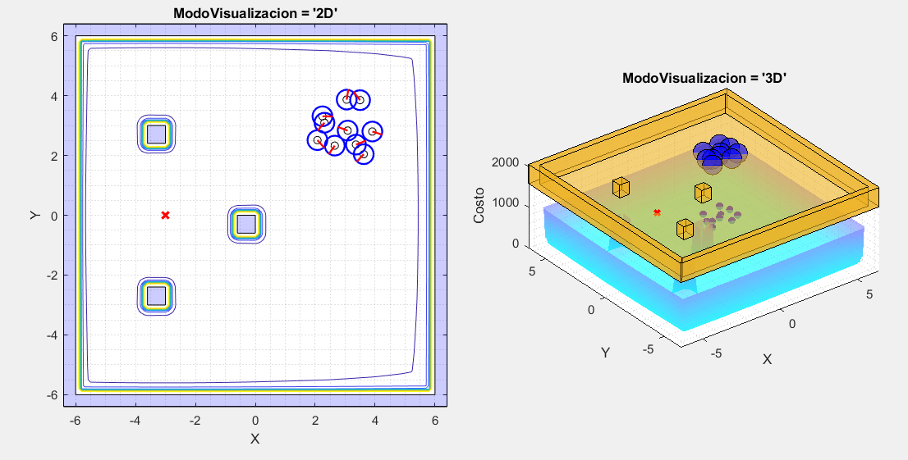

# Reinforcement y Deep Learning en Aplicaciones de Robótica de Enjambre
  
Creación de un controlador inteligente, que permita la correcta navegación de un robot hacia una meta sin mayor intervención por parte del usuario. Para conseguir esto, se utilizarán herramientas propias del Deep y Reinforcement Learning.

## Índice

1. [Reinforcement y Deep Learning en Aplicaciones de Robótica de Enjambre](#reinforcement-y-deep-learning-en-aplicaciones-de-robótica-de-enjambre)
2. [Estructura de Carpetas](#estructura-de-carpetas)
3. [Justificación](#justificación)
   - [Aldo](#aldo)
   - [Juan Pablo](#juan-pablo)
4. [PSO Toolbox](#pso-toolbox)
   - [Parámetros Generales](#parámetros-generales)
   - [Obstáculos](#obstáculos)
   - [Tipo de Restricción](#tipo-de-restricción)
   - [Colisiones](#colisiones)
   - [Controladores](#controladores)
   - [Criterios de Convergencia](#criterios-de-convergencia)
   - [Análisis de Resultados](#análisis-de-resultados)
     - [Evolución del Global Best](#evolución-del-global-best)
     - [Análisis de Dispersión de Partículas](#análisis-de-dispersión-de-partículas)
     - [Velocidad de Motores](#velocidad-de-motores)
     - [Suavidad de Velocidades](#suavidad-de-velocidades)
   - [Grabación de Videos / Frames](#grabación-de-videos--frames)
5. [Demostración](#demostración)
   - [Partículas Esquivando Obstáculo](#partículas-esquivando-obstáculo)
   - [Polígono Personalizado](#polígono-personalizado)

## Estructura de Carpetas

```
Reinforcement y Deep Learning
│
└─── Código
│   │
│   └─── C
│   │
│   └─── Matlab
|   |   |
│   |   └─── Aldo Aguilar: Pruebas parámetros PSO
|   |   |
│   |   └─── Juan Cahueque: Pruebas APF
|   |   |
│   |   └─── Eduardo Santizo: Tesis actual / PSO Toolbox
│   │
│   └─── Webots
|       |
│       └─── Aldo Aguilar: Simulación controladores E-Pucks. Script procesamiento de resultados
|       |
│       └─── Juan Cahueque: Simulación caso A, B y C
|
|
└─── Literatura
│   │
│   └─── Lectures: Clases, Presentaciones o Lecciones
|   |
│   └─── Libros
|   |
│   └─── Papers
│   |   │
│   |   └─── Artificial Potential Fields
|   |   |
│   |   └─── Control de Robots Diferenciales
|   |   |
│   |   └─── Machine Learning
|   |   | ...
|   |
|   |
│   └─── Tesis Previas: Trabajos de graduación y protocolos
|   |
│   └─── Referencias Bibtex: Archivos .bib de todas las carpetas de arriba
|
|
└─── Notas: Imágenes y documentos varios con notas sobre el proyecto
|
|
└─── Reporte: Documentos asociados con el reporte final de tesis y el protocolo
|
|
└─── Media: Imágenes y medios utilizados en el Readme.
```


## Justificación

En la actualidad, el modelo canónico de PSO es el siguiente


Las constantes ,  y  consisten de variables de restricción y están dadas por las siguientes ecuaciones


Como se puede observar, las variables de restricción dependen de tres parámetros:   ,  y . Los autores de esta versión del PSO (Clerc,1999), sugieren que  y , aunque como regla general, para asegurar la convergencia del algoritmo se debe cumplir con que:


Entonces, tenemos tres parámetros que debemos elegir. ¿Cómo los obtenemos? Prueba y error. Se hacen varias pruebas y según los resultados obtenidos elegimos valores aproximados. Este fue el caso de los dos predecesores de este proyecto: Aldo Aguilar y Juan Pablo Cahueque.

Ellos tomaron el algoritmo base de Particle Swarm Optimization (PSO) y lo utilizaron como un método planificación de movimiento para robots diferenciales. Cada uno hizo algo distinto:

## Aldo


Realizó  pruebas con 8 controladores diferentes. Encontró que aquellos con mejor rendimiento eran el LQR y LQI. La única desventaja que notó era que los robots describían trayectorias muy rectas, algo poco conveniente en caso se desearan esquivar obstáculos.

## Juan Pablo


Tomó los avances de Aldo y los utilizó en conjunto con los denominados "Artificial Potential Fields" para permitir que los robots esquivaran obstáculos presentes en el camino hacia la meta. En este caso, el controlador LQR resultó efectivo para esquivar obstáculos grandes, mientras que el PID con un filtro de "Hard-Stops" resultó efectivo para esquivar obstáculos pequeños y numerosos.

Ambas investigaciones fueron exitosas, no obstante, de nuevo, las dos presentan algo en común: Se requirieron de múltiples pruebas manualmente realizadas por el usuario para que los controladores consiguieran resultados aceptables.

Entonces, si pudiéramos automatizar estos dos aspectos (La selección de los parámetros del PSO y el diseño de los controladores para los robots) no solo se ahorraría mucho esfuerzo, sino que el enfoque del megaproyecto Robotat se podría mover hacia otros aspectos que acelerarían el alcance del objetivo final de este proyecto: El ser empleado en operaciones de búsqueda y rescate.

# PSO Toolbox

Para facilitar el proceso de diseño de estos controladores automático, se implementó una serie de herramientas diseñadas específicamente para agilizar el proceso de realización de pruebas, validación de los datos, etc. A esta se le denominó *`PSO Toolbox`*. En su versión actual (v1.0), esta aún no tiene la estructura de una Toolbox tradicional de Matlab.

Para correrla, abrir el archivo *`PSO_Toolbox.mlx`* Para asegurar compatibilidad utilizar Matlab 2018b o posteriores. Dado que se trata de un livescript, es recomendable utilizar versiones más recientes, ya que el rendimiento del script mejora sustancialmente. La versión más reciente de Matlab en la que se pudo probar el archivo fue Matlab 2020a.

Casi todas las líneas en el script están documentadas, sin embargo, a continuación se presenta una breve guía del Toolbox.

## Parámetros Generales

El script ofrece múltiples parámetros para que el usuario ajuste la situación según lo desea.

- NoParticulas: Cantidad de robots a simular 
- CostFunc: Función de costo a minimizar por las partículas. Puede seleccionarse por medio de un dropdown menu o escribirse manualmente. Se ofrecen 10 funciones de costo distintas: 9 funciones "Benchmark" y 1 función dependiente de los obstáculos colocados en el escenario denominada "APF". Para más información sobre las opciones disponibles escribir en consola: *`help CostFunction`* 
- DimsMesa: Dimensiones de la mesa sobre la que se moverán los robots 
- EndTime: Tiempo que durará la simulación 
- EnablePucks: Booleano. Habilita o deshabilita la animación de los robots. 


- RadioLlantasPuck: Radio de las ruedas que emplea el robot diferencial 
- RadioCuerpoPuck: Distancia del centro del robot a sus ruedas. 
- PuckVelMax: Velocidad máxima del puck en función de sus actuadores 
- ModoVisualización: 2D, 3D o None. El 3D se recomienda para observar más fácilmente la forma de la función de costo. El 2D es más útil para observar el movimiento de los marcadores y/o robots.  


  
## Obstáculos

Basado en la implementación de "Artificial Potential Fields" de Juan Pablo Cahueque. Si se seleccionó "APF" como función de costo, esta funcionalidad permite que el usuario diseñe los obstáculos a posicionar en la mesa de trabajo. Se ofrecen 5 opciones diferentes.

- Polígono: El usuario puede dibujar el polígono que desee. Para colocar un vértice hacer click. Para finalizar, cerrar el polígono regresando al primer vértice colocado y haciendo click en este punto.


- Cilindro: Coloca un cilindro de radio 2 en el centro de la mesa de trabajo.
- Caso A: Réplica del escenario A utilizado en la tesis de Juan Pablo. 


- Caso B: Réplica del escenario B utilizado en la tesis de Juan Pablo.
- Caso C: Réplica del escenario C utilizado en la tesis de Juan Pablo. Debido a que consiste de múltiples obstáculos, aún existe un error en su renderización. De aquí viene el artefacto de la línea negra observada entre obstáculos y su falta de coloración.


## Tipo de Restricción

Como se mencionó previamente, el algoritmo canónico de PSO es dependiente de los parámetros ,  y . Existen múltiples maneras de elegir estos parámetros, pero en el toolbox se ofrecen tres opciones:

- Inercia: Si se desea abandonar el esquema que asegura la convergencia propuesto por Clerc (1999), el usuario puede obviar la ecuación  y utilizar el valor de , o inercia, que desee. Se ofrecen 5 tipos diferentes de inercia. Para más información escribir en consola: *`help ComputeInertia`* 
- Constricción: Se siguen las ideas propuestas por Clerc (1999) que aseguran la convergencia del algoritmo PSO. Se pueden elegir los parámetros
,  y . Por defecto se utilizan los valores recomendados en el artículo científico.


- Mixto: Uso simultáneo de un tipo de inercia (Por defecto exponencialmente decreciente), en conjunto con los parámetros de constricción propuestos por Clerc. Utilizado por Aldo en su tesis.  

## Colisiones

Un entorno de simulación realista es necesario para obtener resultados útiles al momento de realizar pruebas. Debido a esto, se implementó "Collision Detection" entre los robots. Durante cada iteración, los robots revisan la distancia entre ellos (Para más información escribir en consola: *`help getDistsBetweenParticles`*) y si esta es menor a 2 radios de E-Puck, los robots se clasifican como "en colisión". Seguido de esto se procede resolver las colisiones, alejando a los robots el uno del otro hasta eventualmente resolver todas las colisiones existentes.


Desgraciadamente, debido a que al alejar un robot del otro se pueden llegar a crear más colisiones, en algunas ocasiones el algoritmo puede no converger en una solución. Por lo tanto, **el algoritmo implementado es inestable y si no se restringe puede llegar a trabar Matlab.** Para controlar esto se le colocó un número máximo de iteraciones en las que puede llegar a producir una solución válida. Con esta "solución", el algoritmo funciona relativamente bien aunque puede producir errores frecuentemente. 

Si se desea, el usuario puede acceder a la función *`SolveCollisions.m`* y cambiar el parámetro IteracionesMax. Los errores disminuyen al incrementar el número de iteraciones, pero el tiempo computacional requerido incrementa. En futuras versiones del Toolbox se desea implementar un algoritmo de "Collision Detection" mucho más robusto como "Speculative Collisions" que también incluya elementos como las paredes o los obstáculos como tal.

## Controladores

Como es explicado por Aldo en su tesis, el acoplar el movimiento de un robot diferencial directamente al desplazamiento de una partícula PSO no es recomendable. Las partículas se desplazan de manera muy agresiva, por lo que los robots podrían quemar sus motores en el proceso de intentar seguir su paso. Entonces, los E-Pucks no siguen directamente las posiciones de las partículas PSO, sino que utilizan su dirección como una sugerencia de hacia donde ir. Debido a esta diferencia, a las partículas del algoritmo PSO se les pasa a denominar "Marcadores PSO" en el Toolbox.


Los controladores son los encargados de seguir estas sugerencias hasta llegar a la meta. En la Toolbox se ofrecen dos opciones: Un controlador LQR y un LQI (Ya que estos fueron los que obtuvieron los mejores resultados en la tesis de Aldo). La salida de estos controladores es la velocidad lineal y angular de los E-Pucks. Normalmente estas cantidades deben ser mapeadas por medio de estas ecuaciones


a las velocidades angulares de las ruedas del robot. No obstante, en el caso de la Toolbox, las velocidades se utilizan directamente para guiar el movimiento de los robots. Para más información escribir en consola *`help getControllerOutput`*

## Criterios de Convergencia

La función *`EvalCriteriosConvergencia.m`* permite que el usuario diseñe sus propios criterios de convergencia y los agregue a una lista de condiciones que se evalúan durante cada iteración. La salida de la función es una lista de cuales son los criterios cumplidos, en conjunto con su nombre. Por defecto la Toolbox ofrece 4 opciones

1. "Mínimo Alcanzado": Cierto porcentaje de partículas llega a alguno de los mínimos de la función.
2. "Mínimo Alcanzado (80%)": Criterio 1 cumplido y ha transcurrido el 80% de las iteraciones máx.
3. "Posición Convergió": Todas las partículas se han quedado "quietas" o se han movido poco desde la última iteración
4. "Iter. Máx Alcanzadas": Se ha alcanzado el número máximo de iteraciones.

Para más información escribir en consola *`help EvalCriteriosConvergencia`*

## Análisis de Resultados

Al finalizar la simulación, el usuario puede analizar los resultados obtenidos haciendo uso de 4 gráficas distintas

### Evolución del Global Best


Utilizada para determinar si los robots y las partículas efectivamente minimizan la función de costo que se eligió. Dada la naturaleza del movimiento de los robots, muy comúnmente la curva de los robots parece estar "atrasada" con respecto a la de las partículas o marcadores PSO.

### Análisis de Dispersión de Partículas


Dos cualidades importantes de las partículas del PSO es su capacidad de exploración y la precisión de su minimización. Con estas gráficas, la precisión se puede evaluar viendo la línea gruesa coloreada y la exploración utilizando las líneas correspondientes a la desviación estándar.  Si las líneas gruesas se estabilizan en las coordenadas de la meta, las partículas son precisas. Si la desviación estándar es muy pronunciada, las partículas exploran minuciosamente el área de trabajo antes de converger.

En el caso presentado, por ejemplo, las partículas son precisas y convergen con rapidez, aunque exploran poco.

### Velocidad de Motores


Utilizando la cinemática inversa de un robot diferencial se calculan las velocidades angulares de las ruedas de todos los robots.


La Toolbox obtiene las velocidades angulares medias de todas las ruedas y determina cual fue el robot con las velocidades más altas. Toma este robot como selección y grafica la evolución de las velocidades angulares de sus dos ruedas. Útil para analizar si los actuadores del robot crítico presentan saturación. Como ayuda se incluyen líneas punteadas, las cuales consisten de los límites de velocidad con los que cuenta el robot (Basado en *`PuckVelMax`*). 

### Suavidad de Velocidades


Basado en el criterio de evaluación empleado por Aldo en su tesis. Se realiza una interpolación de los puntos que conforman la curva de velocidades angulares de las ruedas, y luego se calcula la energía de flexión de la curva. Si la energía de flexión es baja, la suavidad de operación es mucho mayor. Prueba ideal para diagnosticar cuantitativamente la suavidad de operación.

## Grabación de Videos / Frames

Para facilitar la presentación de resultados, la Toolbox cuenta con dos opciones de exportación de gráficas: *`SaveVideo`* y *`SaveFrames`*.

- SaveFrames: Guarda cada una de las frames generadas durante el proceso de animación en el directorio raíz.  
- SaveVideo: Crea un video a partir de las frames generadas durante el proceso de animación. Por defecto el framerate es de 30 y el formato es mp4.

**Advertencia**: Durante el proceso de creación de videos, la animación corre más lento.

## Demostración

### Partículas Esquivando Obstáculo


  
### Polígono Personalizado


