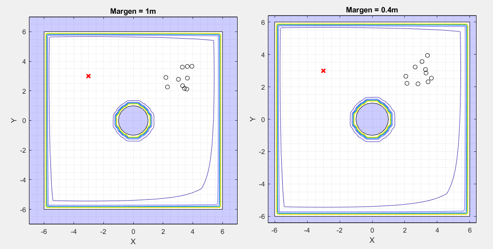
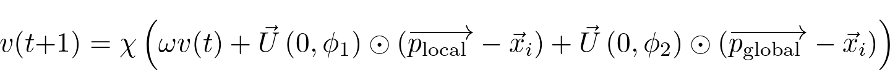
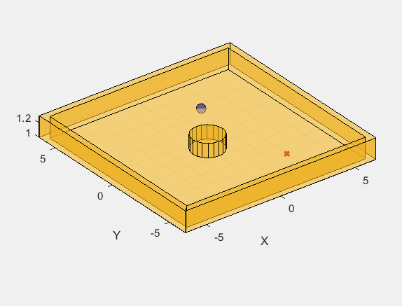
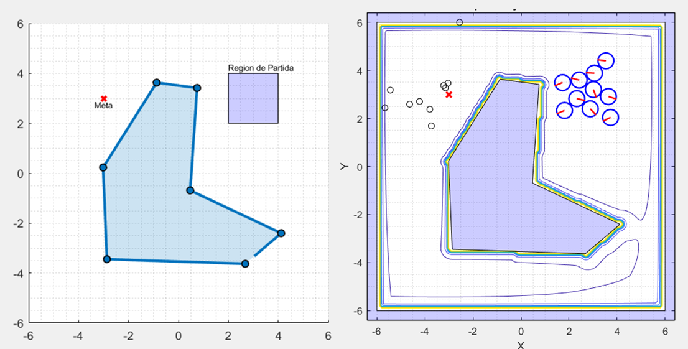
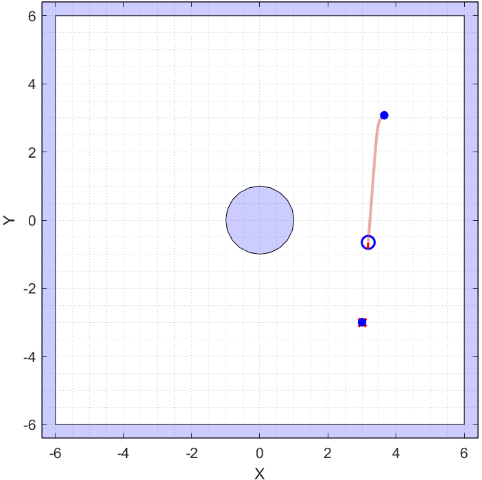
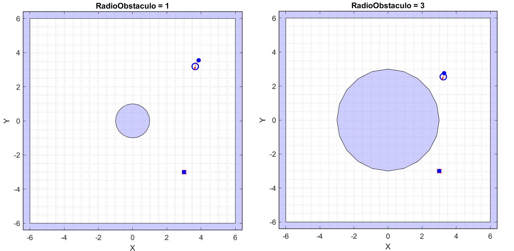
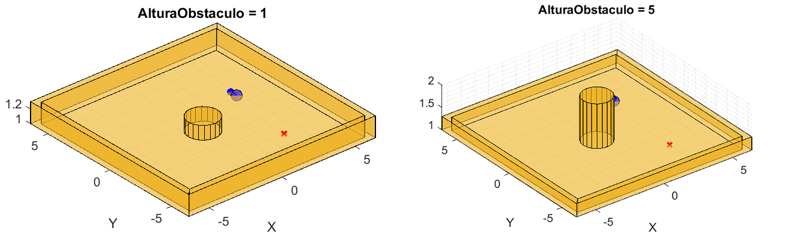
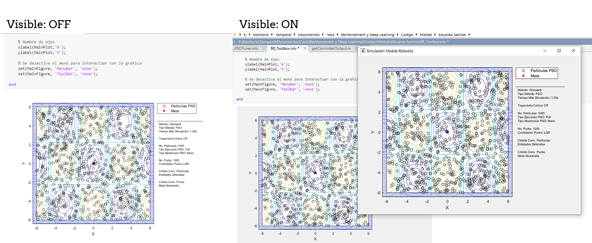

# Swarm Robotics Toolbox (SR Toolbox)

<p align="center">
   
   
   
   
</p>

El *Swarm Robotics Toolbox* consiste de un script "maestro" que agrupa múltiples funcionalidades en un solo programa. Esto significa que el usuario no debe abrir 20 scripts diferentes para cada prueba a realizar. Todo está contenido en el mismo livescript, acelerando significativamente el tiempo de realización de pruebas.

Además, para facilitar la comprensión del código, casi todas las líneas de código están comentadas y las funciones creadas poseen documentación propia (escribir en la ventana de comandos `help nombreFuncion`).

Cabe mencionar que el script "maestro" (`SR_Toolbox.mlx`) puede ser fácilmente modificado para acomodar nuevas funcionalidades. Debido a esto, scripts como `Pruebas_PSOTuner.mlx`, se pueden considerar copias modificadas de `SR_Toolbox.mlx`. Por lo tanto, a continuación únicamente se explica la estructura y funciones del *SR Toolbox*, ya que con comprender las mismas, es posible entender casi el 80% de todos los demás scripts asociados. Para los mismos se presentan secciones mucho más cortas que explican las características particulares que difieren con respecto al *SR Toolbox*.

## Índice

0. [Estructura de Carpetas](#estructura-de-carpetas)
1. [Estructura de Programa](#estructura-de-programa)
    - [Limpieza de Workspace](#limpieza-de-workspace)
    - [Parámetros y Settings](#parámetros-y-settings)
    - [Reglas de Método a Usar](#reglas-de-método-a-usar)
    - [Región de Partida y Obstáculos de Mesa](#región-de-partida-y-obstáculos-de-mesa)
    - [Inicialización de Robots](#inicialización-de-robots)
    - [Setup: Métodos PSO](#setup-métodos-pso)
        - [Parámetros Ambientales](#parámetros-ambientales)
        - [Barrido de Superficie de Costo](#barrido-de-la-superficie-de-costo)
        - [Inicialización PSO y Restricciones del Algoritmo](#inicialización-del-pso-y-restricciones-del-algoritmo)
    - [Setup: Dynamic Programming](#setup-dynamic-programming)
        - [Creación de Cuadrícula](#creación-de-cuadrícula)
        - [Escaneo de Mesa de Trabajo](#escaneo-de-mesa-de-trabajo)
        - [Policy Iteration](#policy-iteration)
        - [Generación de Trayectorias](#generación-de-trayectorias)
    - [Setup: Gráficas](#setup-gráficas)
        - [Sistema de Leyendas](#sistema-de-leyendas)
        - [Visualización 2D](#visualización-2d)
        - [Visualización 3D](#visualización-3d)
        - [Radio de Pucks](#radio-de-pucks)
        - [Descripción](#descripción)
    - [Setup: Output Media](#setup-output-media)
    - [Main Loop](#main-loop)
    - [Reporte de Resultados](#reporte-de-resultados)
        - [Evolución del Global Best](#evolución-del-global-best)
        - [Análisis de Dispersión de Partículas](#análisis-de-dispersión-de-partículas)
        - [Velocidad de Motores](#velocidad-de-motores)
        - [Suavidad de Velocidades](#suavidad-de-velocidades)
2. [Funciones Internas](#funciones-internas)
3. [Demostración](#demostración)
   - [Partículas Esquivando Obstáculo](#partículas-esquivando-obstáculo)
   - [Polígono Personalizado](#polígono-personalizado)

## Estructura de Carpetas

Estructura para la carpeta que contiene el código de Matlab de la tesis "Reinforcement y Deep Learning en Aplicaciones de Robótica de Enjambre" realizada por Eduardo Santizo.

```json
Eduardo Santizo
│
└─── Deep PSO Tuner
│   │
│   └─── Datasets:
|   |    Datos de entrenamiento y validación para las RNNs
│   │
│   └─── Modelos:
|   |    Modelos finales para las redes entrenadas
│   │
│   └─── Settings y Training Progress:
|        Modelos, estructuras de red e imágenes de progreso de entrenamiento.
|        Excel con registro del proceso de hyperparameter tuning para cada RNN.
|
|
└─── Ejemplos y Scripts Auxiliares
│   │
│   └─── Reinforcement Learning Coursera - Ejercicios:
|   |    Ejercicios (Matlab) para el curso de Reinforcement Learning impartido por la Universidad de Alberta.
|   |
│   └─── Sequence to Sequence Regression Using Deep Learning:
|   |    Ejemplo de Matlab para entrenar una RNN para predecir una secuencia.
|   |
│   └─── Importador_Mapas.mlx:
|   |    Versión mejor explicada de la función interna "ImportarMapa()".
|   |
│   └─── Train_Shallow&DeepNN_DatosSecuenciales:
|        Predicción de un sistema de ecuaciones diferenciales usando una Shallow NN.
|        Predicción de casos de gripe aviaria en los Estados Unidos usando RNN.
|
|
└─── Funciones
│   │
│   └─── Externas:
|   |    Funciones y métodos obtenidos en internet.
|   |
│   └─── Internas:
|        Funciones escritas específicamente para el SR Toolbox.
|
|
└─── Mapas
│   │
│   └─── Imágenes:
|   |    Imágenes en blanco y negro de los mapas a usar en la mesa de trabajo.
|   |
│   └─── Vertices:
|        Vértices para los polígonos que conforman los obstáculos de la mesa de trabajo.
|
|
└─── Media
│   │
│   └─── Figuras:
|   |    Figuras generadas durante la ejecución de los scripts de la SR Toolbox.
|   |    Una carpeta por simulación.
|   |
│   └─── Frames:
|   |    Cada una de las frames generadas durante la animación de la SR Toolbox.
|   |    Una carpeta por simulación.
|   |
│   └─── GIFs:
|   |    GIFs de la animación generada por la SR Toolbox.
|   |
│   └─── Frames:
|        Videos de la animación generada por la SR Toolbox.
|
|
└─── functionsSignatures.json:
|    Empleado para las sugerencias de autocompletado en funciones internas.
|
|
└─── Generar_Dataset.m:
|    Genera las entradas y salidas requeridas para el entrenamientos de las RNNs.
|
|
└─── Pruebas_PSOTuner.mlx:
|    Script para probar y generar estadísticas sobre el PSO Tuner.
|
|
└─── SR_Toolbox:
     Script principal del SR Toolbox.
```

## Estructura de Programa

A continuación se describen todas las secciones que conforman al script `SR_Toolbox.mlx`. Se explican las diferentes características y elementos que pueden llegar a ser cambiados.

### Limpieza de Workspace

<p align="center">
   
</p>

Esta sección se encarga de limpiar todas las variables del *Workspace* en caso existieran variables pre-existentes propias de otros scripts o de ejecuciones previas del *Toolbox*. También se limpian las **variables persistentes** empleadas dentro de diferentes funciones del *Toolbox*.

<details>
<summary> <sub><strong>Variables Persistentes</strong> (Hacer click para más información)</sub> </summary>
<sub> En Matlab, los valores de las variables dentro de una función desaparecen luego de que la misma finaliza su ejecución. Para poder mantener el valor de una variable entre diferentes llamadas a la función, se declara a la variable como <tt>persistent</tt>. La desventaja de declarar variables de este tipo, es que su valor se restablece hasta que el usuario reinicia Matlab. Para limpiar estas variables de forma programática, se debe escribir <tt>clear</tt> seguido del nombre de la función que contiene variables persistentes.
</sub> </details> <br/>

### Parámetros y Settings

<p align="center">
   
</p>

Esta sección permite controlar una gran variedad de elementos propios de la simulación, desde parámetros dimensionales y visuales, hasta la *seed* a utilizar. A continuación se presenta una breve explicación de cada uno de los parámetros que pueden llegar a ser cambiados. **Hacer click en el nombre de cada parámetro para desplegar más información**.

<ins>*Método a Utilizar*</ins>

<details>
<summary> <tt>Metodo</tt> </summary>
<sub>Tipo de método a simular. El usuario puede elegir tres tipos de método: Métodos dependientes de PSO, métodos basados en el seguimiento de una trayectoria y métodos dinámicos (no requieren de planeación previa para explorar). En el caso de los métodos PSO, el método elegido pasa a llamarse función de costo. Existen 17 métodos disponibles: </sub>

<p><ul><li><sub>
Dropwave: Dependiente de PSO. Se minimiza la función de costo "Benchmark" observada. Coords. mínimo: (0,0). Dimensiones: 2. Obtenida de la <a href="https://www.sfu.ca/~ssurjano/drop.html">Virtual Library of Simulation Experiments</a>.
</sub></li></ul></p>

<p align="center">
   
</p>

<p><ul><li><sub>
Rosenbrock / Banana: Dependiente de PSO. Se minimiza la función de costo "Benchmark" observada. Coords. mínimo: (1,...,1). Dimensiones: d. Obtenido de la <a href="https://www.sfu.ca/~ssurjano/rosen.html">Virtual Library of Simulation Experiments</a>.
</sub></li></ul></p>

<p align="center">
   
</p>

<p><ul><li><sub>
Levy / Levy N13: Dependiente de PSO. Se minimiza la función de costo "Benchmark" observada. Coords. mínimo: (1,1). Dimensiones: 2. Obtenida de la <a href="https://www.sfu.ca/~ssurjano/levy13.html">Virtual Library of Simulation Experiments</a>. Existe una función de costo que se llama solo "Levy", pero en este caso se utiliza el término Levy como una abreviación a Levy N13.
</sub></li></ul></p>

<p align="center">
   
</p>

<p><ul><li><sub>
Himmelblau: Dependiente de PSO. Se minimiza la función de costo "Benchmark" observada. Coords. mínimo: (3,2), (-2.8051 3.1313), (-3.7793 -3.2831) y (3.5844 -1.8481). Dimensiones: 2. Obtenida de <a href="https://en.wikipedia.org/wiki/Himmelblau%27s_function">Wikipedia</a>.
</sub></li></ul></p>

<p align="center">
   
</p>

<p><ul><li><sub>
Rastrigin: Dependiente de PSO. Se minimiza la función de costo "Benchmark" observada. Coords. mínimo: (0,...,0). Dimensiones: d. Obtenida de la <a href="https://www.sfu.ca/~ssurjano/rastr.html">Virtual Library of Simulation Experiments</a>.
</sub></li></ul></p>

<p align="center">
   
</p>

<p><ul><li><sub>
Schaffer F6 / Schaffer N2: Dependiente de PSO. Se minimiza la función de costo "Benchmark" observada. Coords. mínimo: (0,0). Dimensiones: 2. Obtenida de la <a href="https://www.sfu.ca/~ssurjano/schaffer2.html">Virtual Library of Simulation Experiments</a>.
</sub></li></ul></p>

<p align="center">
   
</p>

<p><ul><li><sub>
Sphere / Paraboloid: Dependiente de PSO. Se minimiza la función de costo "Benchmark" observada. Coords. mínimo: (0,...,0). Dimensiones: d. Obtenida de la <a href="https://www.sfu.ca/~ssurjano/spheref.html">Virtual Library of Simulation Experiments</a>.
</sub></li></ul></p>

<p align="center">
   
</p>

<p><ul><li><sub>
Booth: Dependiente de PSO. Se minimiza la función de costo "Benchmark" observada. Coords. mínimo: (1,3). Dimensiones: 2. Obtenida de la <a href="https://www.sfu.ca/~ssurjano/booth.html">Virtual Library of Simulation Experiments</a>.
</sub></li></ul></p>

<p align="center">
   
</p>

<p><ul><li><sub>
Ackley: Dependiente de PSO. Se minimiza la función de costo "Benchmark" observada. Coords. mínimo: (0,...,0). Dimensiones: d. Obtenida de la <a href="https://www.sfu.ca/~ssurjano/ackley.html">Virtual Library of Simulation Experiments</a>.
</sub></li></ul></p>

<p align="center">
   
</p>

<p><ul><li><sub>
Griewank: Dependiente de PSO. Se minimiza la función de costo "Benchmark" observada. Coords. mínimo: (0,...,0). Dimensiones: d. Obtenida de la <a href="https://www.sfu.ca/~ssurjano/griewank.html">Virtual Library of Simulation Experiments</a>.
</sub></li></ul></p>

<p align="center">
   
</p>

<p><ul><li><sub>
Six-Hump Camel: Dependiente de PSO. Se minimiza la función de costo "Benchmark" observada. Coords. mínimo: (0.0898,-0.7126) y (-0.0898,0.7126). Dimensiones: 2. Obtenida de la <a href="https://www.sfu.ca/~ssurjano/camel6.html">Virtual Library of Simulation Experiments</a>.
</sub></li></ul></p>

<p align="center">
   
</p>

<p><ul><li><sub>
Styblinski-Tang: Dependiente de PSO. Se minimiza la función de costo "Benchmark" observada. Coords. mínimo: (-2.903534,...,-2.903534). Dimensiones: d. Obtenida de la <a href="https://www.sfu.ca/~ssurjano/stybtang.html">Virtual Library of Simulation Experiments</a>.
</sub></li></ul></p>

<p align="center">
   
</p>

<p><ul><li><sub>
Easom: Dependiente de PSO. Se minimiza la función de costo "Benchmark" observada. Coords. mínimo: (pi,pi). Dimensiones: 2. Obtenida de la <a href="https://www.sfu.ca/~ssurjano/easom.html">Virtual Library of Simulation Experiments</a>.
</sub></li></ul></p>

<p align="center">
   
</p>

<p><ul><li><sub>
Michalewicz: Dependiente de PSO. Se minimiza la función de costo "Benchmark" observada. Coords. mínimo: (2.2,1.57) si d = 2. Obtenida de la <a href="https://www.sfu.ca/~ssurjano/michal.html">Virtual Library of Simulation Experiments</a>. Esta función soporta "d" dimensiones, pero solo se implementaron 2 ya que se desconocen las coordenadas de los mínimos en dimensiones superiores (además que me dio haraganería).
</sub></li></ul></p>

<p align="center">
   
</p>

<p><ul><li><sub>
Jabandzic: Dependiente de PSO (con elementos de seguimiento de trayectorias). Un robot se mueve desde la región de partida a la meta intentando esquivar obstáculos a lo largo del camino. El robot utiliza LiDARs (sensores ultrasónicos glorificados) para modelar su ambiente y crear una función de costo cuyo mínimo se encuentra en el siguiente punto óptimo al que debería de moverse. Para encontrar las coordenadas de este mínimo se utiliza el algoritmo PSO. Una vez se tienen dichas coordenadas, se mueve al robot ahí. Si el robot alcanza esta meta, se "refresca" la función de costo y se genera una nueva meta óptima. Basado en <a href="https://www.researchgate.net/publication/310456939_Particle_swarm_optimization-based_method_for_navigation_of_mobile_robot_in_unstructured_static_and_time-varying_environments">este paper</a>.
</sub></li></ul></p>

<p align="center">
   
</p>

<p><ul><li><sub>
Dynamic Programming: Seguimiento de trayectorias. Método basado en el ejemplo de reinforcement learning <a href="https://cs.stanford.edu/people/karpathy/reinforcejs/gridworld_dp.html">GridWorld</a>. En este, la mesa de trabajo se cuadricula. El script escanea cada una de las celdas y determina si la celda contiene un obstáculo o meta. Luego, se coloca a un agente en la mesa cuadriculada y se le permite moverse en 8 direcciones: Arriba, abajo, izquierda, derecha, arriba-derecha, arriba-izquierda, abajo-izquierda y abajo-derecha. El agente se mueve sobre la cuadrícula siguiendo algunas reglas: Si trata de moverse hacia una celda con un obstáculo este se regresa a la celda que ocupaba antes, si se choca contra una pared recibe un pequeño castigo y si llega a la meta recibe una recompensa muy grande. Utilizando los castigos y recompensas como guía, el agente aprende que acciones debe tomar en cada celda para obtener la mayor recompensa. Estas acciones son luego seguidas por los robots diferenciales, creando una trayectoria que los mismos pueden seguir hasta la meta.
</sub></li></ul></p>

<p align="center">
   
</p>

<p><ul><li><sub>
Demo Trayectorias: Seguimiento de trayectorias. Método que busca demostrar las capacidades de seguimiento de trayectorias de la Swarm Robotics Toolbox. Tiene dos modos: Meta única y multi-meta. En meta única, un número de E-Pucks especificado por el usuario sigue una trayectoria compuesta por 3 metas consecutivas. En multi-meta, se utilizan 3 E-Pucks y cada uno sigue una trayectoria diferente compuesta por 3 metas consecutivas. Se puede especificar si se desea que las trayectorias sean cíclicas o no cíclicas. Si son cíclicas, una vez alguno de los E-Pucks llega a la última meta en su trayectoria, se retorna al primer punto y se repite la trayectoria.
</sub></li></ul></p>

<p align="center">
   
   
</p>

</details><br/>

<ins>*Dimensiones de Mesa de Trabajo*</ins>

<details>
<summary> <tt>AnchoMesa</tt> </summary>
<sub>Ancho de la mesa de trabajo. Unidades en metros.</sub>
<p align="center">
   
</p>
</details>

<details>
<summary> <tt>AltoMesa</tt> </summary>
<sub>Alto de la mesa de trabajo. Unidades en metros.</sub>
<p align="center">
   
</p>
</details>

<details>
<summary> <tt>Margen</tt> </summary>
<sub>Ancho del margen uniforme que existirá alrededor de los bordes de la mesa de trabajo. Unidades en metros.</sub>
<p align="center">
   
</p>
</details><br/>

<ins>*Settings de Simulación*</ins>

<details>
<summary> <tt>EndTime</tt> </summary>
<sub>Duración total de la simulación en segundos.</sub>
</details>

<details>
<summary> <tt>dt</tt> </summary>
<sub>Delta de tiempo, tiempo de muestreo o cantidad de segundos que transcurrirán entre cada una de las iteraciones del main loop del algoritmo.</sub>
</details><br/>

<ins>*Settings de Partículas PSO*</ins>

<details>
<summary> <tt>NoParticulas</tt> </summary>
<sub>Cantidad de partículas a utilizar dentro del algoritmo de PSO. En los métodos dependientes de PSO, el número de partículas tiende a sobre-escribir el número de E-Pucks a utilizar también.</sub>
</details>

<details>
<summary> <tt>PartPosDims</tt> </summary>
<sub>Cantidad de dimensiones que tendrán las posiciones de las partículas PSO. La clase <tt>PSO.m</tt> tiene la capacidad de manejar tantas dimensiones como se le soliciten, no obstante, se recomienda mantener su valor en 2 dimensiones para no interferir con el funcionamiento de la mayor parte de métodos.</sub>
</details>

<details>
<summary> <tt>IteracionesMaxPSO</tt> </summary>
<sub>Número de iteraciones máximas a utilizar por el algoritmo PSO. Este parámetro existe porque no en todos los métodos se desea que el tiempo de simulación coincida con el tiempo que le toma al PSO correr por completo.</sub>
</details>

<details>
<summary> <tt>CriterioPart</tt> </summary>
<sub> Criterio de convergencia que utilizará el algoritmo PSO para evaluar el momento en el que debe dar fin al algoritmo. Se ofrecen tres opciones: Meta Alcanzada, Entidades Detenidas e Iteraciones Max. Para más información escribir <tt>help getCriteriosConvergencia</tt>.</sub>
<p align="center">
   
</p>
</details>

<details>
<summary> <tt>Restriccion</tt> </summary>
<sub>Tipo de restricción a utilizar en la regla de actualización de velocidad en el PSO.</sub>

<p align="center">
   
</p>

<sub>Se ofrecen tres opciones:</sub>

<p><ul><li><sub>
Inercia: Se multiplica a la velocidad previa por una constante denominada inercia (). Se ofrecen 5 tipos de inercia: Constante, Linealmente Decreciente, Decreciente Caótica, Aleatoria y Exponencial Natural. Para más información escribir en la ventana de comandos <tt>help ComputeInertia</tt>. La constante  se iguala a 1 para impedir la intervención de la restricción por constricción.
</sub></li></ul></p>

<p><ul><li><sub>
Constricción: Criterio de convergencia propuesto por Clerc (1999). Este criterio asegura la convergencia del algoritmo siempre y cuando  y 4"/>. La constante  se iguala a 1 para impedir la intervención de la restricción por inercia.
</sub></li></ul></p>

<p align="center">
   
</p>

<p><ul><li><sub>
Mixto: Uso de inercia "Exponencial Natural" junto con los parámetros de constricción propuestos por Clerc (1999). Propuesto por <a href="./Literatura/Tesis Previas/Aldo Aguilar - Tesis.pdf">Aldo Nadalini</a> en su tesis.
</sub></li></ul></p>

</details><br/>

<ins>*Settings de E-Pucks*</ins>

<details>
<summary> <tt>NoPucks</tt> </summary>
<sub> Cantidad de robots diferenciales a simular. No, no dice NoFucks.</sub>
</details>

<details>
<summary> <tt>EnablePucks</tt> </summary>
<sub> Si únicamente se desea visualizar el movimiento de las partículas en un método dependiente de PSO, se permite que el usuario desactive la simulación de los robots E-Puck.</sub>
<p align="center">
   
</p>
</details>

<details>
<summary> <tt>RadioLlantasPuck</tt> </summary>
<sub> Radio de las ruedas que emplea el robot diferencial. Unidades en metros. </sub>
</details>

<details>
<summary> <tt>RadioCuerpoPuck</tt> </summary>
<sub> Distancia del centro del robot a sus ruedas. Unidades en metros. </sub>
</details>

<details>
<summary> <tt>RadioDifeomorfismo</tt> </summary>
<sub> Al sacar la cinemática directa de un robot diferencial, el modelo derivado es altamente no lineal. Para poder aplicar control a dicho robot, entonces se supone que no se controlará la posición y velocidad del centro del robot como tal, sino de un punto delante de él (comúnmente ubicado en los extremos de su radio en caso se trate de un robot circular). La distancia que existe entre el centro del robot y este punto a controlar se le denomina radio de difeomorfismo. Unidades en metros. </sub>
</details>

<details>
<summary> <tt>PuckVelMax</tt> </summary>
<sub> Velocidad angular máxima que pueden alcanzar las ruedas del robot. Unidades en rad/s. </sub>
</details>

<details>
<summary> <tt>ControladorPucks</tt> </summary>
<sub> Controlador para el movimiento punto a punto de los E-Pucks. Existen 5 opciones. Basados en los controladores implementados por Aldo:</sub>

<p align="center">
   
</p>

<p><ul><li><sub>
Linear Quadratic Regulator (LQR): Movimiento rápido que desacelera conforme el robot se acerca a la meta. Para cambiar de dirección el robot se detiene completamente, gira y luego se mueve.
</sub></li></ul></p>

<p align="center">
   
</p>

<p><ul><li><sub>
Linear Quadratic Integral Control (LQI): Movimiento parecido al LQR, pero con una desaceleración menos pronunciada y sin giros agudos en el cambio de meta a meta. El robot no se detiene completamente para girar.
</sub></li></ul></p>

<p align="center">
   
</p>

<p><ul><li><sub>
Controlador de Pose Simple: Movimiento con velocidad menor a aquella observada en los controladores LQR y LQI. Debido a su aceleración angular menor, las trayectorias generadas son más suaves y largas.
</sub></li></ul></p>

<p align="center">
   
</p>

<p><ul><li><sub>
Controlador de Pose con Criterio de Estabilidad de Lyapunov: Misma velocidad que en el controlador de pose simple. Giros agudos, pero aceleraciones angulares bajas al momento de girar e iniciar el movimiento lineal.
</sub></li></ul></p>

<p align="center">
   
</p>

<p><ul><li><sub>
Controlador de Direccionamiento de Lazo Cerrado: Controlador con la menor velocidad de entre los 5 presentados. El robot busca alinear su dirección con la meta, pero no su sentido. Por lo tanto, no importando si su eje +X (línea rojo vivo del robot) o -X apunta en la dirección de la meta, este se moverá hacia la misma. Esto implica que según le sea conveniente, el robot se desplazará hacia adelante o en reversa hacia la meta. La aceleración angular es baja, produciendo giros sumamente suaves; no obstante, debido a la alta velocidad lineal asociada al movimiento, el robot tiende a desviarse ligeramente del punto hacia el que desea orientarse, causando que las trayectorias tengan una mayor longitud.
</sub></li></ul></p>

<sub> Entre estos, los dos mejores se consideran el LQI y LQR, con el peor siendo el de Closed-Loop Steering. Para más información escribir en consola <tt>help getControllerOutput</tt>. </sub>
</details>

<details>
<summary> <tt>CriterioPuck</tt> </summary>
<sub> Similar al parámetro <tt>CriterioPart</tt>. Determina el criterio de convergencia que utilizará el ciclo principal para determinar el momento en el que debe finalizar su ejecución según la posición de los robots diferenciales. Existen tres opciones: Meta Alcanzada, Entidades Detenidas e Iteraciones Max.</sub>
<p align="center">
   
</p>
</details><br/>

<ins>*Settings de Seguimiento de Trayectorias*</ins>

<details>
<summary> <tt>TrayectoriaCiclica</tt> </summary>
<sub> En métodos de seguimiento de trayectorias, el robot está activamente siguiendo un conjunto de puntos en orden secuencial. Si se establece que se desea una trayectoria cíclica, cuando el robot alcance el último punto de su trayectoria, este tomará como siguiente punto a seguir el primer punto en la trayectoria. Si la trayectoria no es cíclica, el último punto de la misma no cambia aunque se llegue a ella. </sub>
</details>

<details>
<summary> <tt>DemoMultimeta</tt> </summary>
<sub> El método "Demo Trayectorias" consiste de un método en el que un cierto número de robots (dado por la variable <tt>NoPucks</tt>) siguen una trayectoria común predeterminada por el usuario. Si <tt>DemoMultimeta = 1</tt>, entonces el número de robots se limitará a tres y cada uno de estos seguirá una meta distinta. </sub>
<p align="center">
   
    
</p>
</details><br/>

<ins>*Animación*</ins>

<details>
<summary> <tt>ModoVisualizacion</tt> </summary>
<sub> 2D, 3D o None. El modo 3D se recomienda para observar más fácilmente la forma de la función de costo en métodos dependientes de PSO. El 2D es más útil para observar el movimiento de las partículas y/o robots.</sub>
<p align="center">
   
</p>
</details>

<details>
<summary> <tt>EnableRotacionCamara</tt> </summary>
<sub>Cuando Matlab grafica en 3D, este elige un ángulo óptimo para posicionar la cámara que enfoca el plot. Al habilitar esta opción, Matlab gira la cámara alrededor del plot a una velocidad constante. Únicamente válido para el modo de visualización 3D. </sub>
<p align="center">
   
   
</p>
</details>

<details>
<summary> <tt>VelocidadRotacion</tt> </summary>
<sub>Cantidad de grados que rota la cámara alrededor del plot en cada iteración del main loop. Mientras más bajo el valor absoluto de esta cantidad más lenta será la rotación. Si la velocidad es positiva, la cámara rota a favor de las manecillas del reloj. Si la velocidad es negativa, la cámara rota en contra de las manecillas. </sub>
</details>

<details>
<summary> <tt>OverwriteTitle</tt> </summary>
<sub>Por defecto, la simulación utiliza el título como un cronómetro o contador para el tiempo de simulación. Si <tt>OverwriteTitle = 1</tt> se reemplaza este contador por un string dado por el usuario. </sub>
</details>

<details>
<summary> <tt>OverwriteTitle_String</tt> </summary>
<sub> String que reemplaza el título por defecto de la simulación si <tt>OverwriteTitle = 1</tt>. </sub>
</details><br/>

<ins>*Obstáculos*</ins>

<details>
<summary> <tt>TipoObstaculo</tt> </summary>
<sub>Tipo de obstáculo a colocar en la mesa de trabajo. Existen 5 opciones:</sub>

<p><ul><li><sub>
Polígono: El usuario puede dibujar el polígono que desee. La interfaz de creación incluye la región de partida y el/los puntos meta para que el usuario evite colocar el obstáculo sobre estos (aunque aún puede hacerlo). Para cerrar el polígono y finalizar la creación del obstáculo, se puede dar doble click en cualquier parte del plot o se puede hacer click sobre el primer vértice colocado. Una vez creado el polígono, este no puede moverse. Esta herramienta solo es capaz de crear un solo polígono (no importando su complejidad). Si se desean crear múltiples polígonos, se recomienda utilizar la herramienta de Imagen.
</sub></li></ul></p>

<p align="center">
   
</p>

<p><ul><li><sub>
Cilindro: Coloca un cilindro en el centro de la mesa de trabajo. El radio puede cambiarse manualmente alterando el parámetro <tt>RadioObstaculo</tt>.
</sub></li></ul></p>

<p align="center">
   
</p>

<p><ul><li><sub>
Imagen: El usuario puede tomar una imagen en blanco y negro de un mapa (con los obstáculos en negro y el espacio vacío en blanco), colocarla en el directorio base del script principal (o dentro de la carpeta <tt>.../Mapas/Imágenes</tt>) y luego procesarla para convertirla en un obstáculo utilizable dentro del Toolbox.
<br/><br/>Para su funcionamiento, esta herramienta hace uso de la función <tt>ImportarMapa.m</tt>. Dicha función toma como entrada una imagen y extrae los vértices de los obstáculos presentes en la imagen. Este proceso puede llegar a tomar mucho tiempo según la complejidad del obstáculo, entonces la función puede revisar si ya existen datos previamente procesados de la imagen elegida por el usuario. Si este es el caso, el usuario puede elegir reutilizar los datos guardados para así evitar la carga computacional asociada. También se incluyen medidas para revisar el nivel de similitud de la imagen elegida con el de las imágenes guardadas. Si es lo suficientemente parecido, el programa nuevamente pregunta si el usuario desea reutilizar datos previos.
<br/><br/>Si se desea comprender más a profundidad la forma en la que funciona dicha función (o refinar el montón de parámetros de los que depende la función), existe una versión alternativa (<tt>.../Ejemplos y Scripts Auxiliares/Importador_Mapas.mlx</tt>) con figuras y métodos alternativos para realizar el mismo proceso de extracción de vértices.
</sub></li></ul></p>

<p align="center">
   
</p>

<p><ul><li><sub>
Caso A: Réplica del escenario A utilizado en la tesis de <a href="./Literatura/Tesis Previas/Juan Pablo Cahueque - Tesis.pdf">Juan Pablo Cahueque</a>.
</sub></li></ul></p>

<p align="center">
   
</p>

<p><ul><li><sub>
Caso B: Réplica del escenario B utilizado en la tesis de <a href="./Literatura/Tesis Previas/Juan Pablo Cahueque - Tesis.pdf">Juan Pablo Cahueque</a>.
</sub></li></ul></p>

<p align="center">
   
</p>

<p><ul><li><sub>
Caso C: Réplica del escenario C utilizado en la tesis de <a href="./Literatura/Tesis Previas/Juan Pablo Cahueque - Tesis.pdf">Juan Pablo Cahueque</a>.
</sub></li></ul></p>

<p align="center">
   
</p>

</details>

<details>
<summary> <tt>RadioObstaculo</tt> </summary>
<sub> Radio de obstáculo "Cilindro". </sub>
<p align="center">
   
</p>
</details>

<details>
<summary> <tt>AlturaObstaculo</tt> </summary>
<sub> Altura de los obstáculos en el modo de visualización 3D. Cabe mencionar que, debido al re-escalamiento del eje Z en la visualización 3D, esta altura es relativa. Esto implica que una altura de 5, no necesariamente hará que los obstáculos tengan 5 metros de altura.</sub>
<p align="center">
   
</p>
</details>

<details>
<summary> <tt>OffsetObstaculo</tt> </summary>
<sub> Altura por encima del "suelo de la mesa" donde se colocará la base de los obstáculos en el modo de visualización 3D. </sub>
<p align="center">
   
</p>
</details>

<details>
<summary> <tt>NombreImagenMapa</tt> </summary>
<sub> Nombre de la imagen en blanco y negro que buscará la función <tt>ImportarMapa.m</tt> al momento de generar/cargar los vértices de los obstáculos en la mesa de trabajo. </sub>
</details><br/>

<ins>*Meta y Región de Partida*</ins>

<details>
<summary> <tt>Meta</tt> </summary>
<sub> Coordenadas (X,Y) para el punto meta que buscarán alcanzar los robots diferenciales. </sub>
<p align="center">
   
</p>
</details>

<details>
<summary> <tt>RegionPartida_Centro</tt> </summary>
<sub> Coordenadas (X,Y) para el centro del rectángulo que define la región de partida o la región dentro de la cual saldrán los robots y/o partículas PSO. </sub>
<p align="center">
   
</p>
</details>

<details>
<summary> <tt>RegionPartida_Ancho</tt> </summary>
<sub> Ancho del rectángulo que define la región de partida o la región de la cual saldrán los robots y/o partículas PSO. </sub>
<p align="center">
   
</p>
</details>

<details>
<summary> <tt>RegionPartida_Alto</tt> </summary>
<sub> Alto del rectángulo que define la región de partida o la región de la cual saldrán los robots y/o partículas PSO. </sub>
<p align="center">
   
</p>
</details><br/>

<ins>*Guardado de Animación*</ins>

<details>
<summary> <tt>SaveFrames</tt> </summary>
<sub> Permite guardar la animación de la simulación actual como una secuencia de imágenes PNG. Todas las imágenes son colocadas dentro del folder <tt>.../Media/Frames/NombreSimulacion/</tt>. Esta opción existe porque uno puede crear un GIF en Overleaf subiendo a una carpeta todas las imágenes y luego incluyendo el paquete "animate". El folder donde se guardan las imágenes es nombrado automáticamente según algunas propiedades de la simulación (Método, modo de visualización, etc.).</sub>
</details>

<details>
<summary> <tt>SaveVideo</tt> </summary>
<sub> Permite guardar la animación de la simulación actual como un video. El video se guarda en el folder <tt>.../Media/Video/</tt>. El archivo es nombrado automáticamente según algunas propiedades de la simulación (Método, modo de visualización, etc.). </sub>
</details>

<details>
<summary> <tt>SaveGIF</tt> </summary>
<sub> Permite guardar la animación de la simulación actual como un GIF. El GIF se guarda en el folder <tt>.../Media/GIF/</tt>. El archivo es nombrado automáticamente según algunas propiedades de la simulación (Método, modo de visualización, etc.).</sub>
</details>

<details>
<summary> <tt>SaveFigures</tt> </summary>
<sub> Permite guardar todas las figuras generadas durante la ejecución del script como imágenes PNG. Todas las figuras se guardan en el folder <tt>.../Media/Figuras/NombreSimulacion/</tt>. Para que el sistema de guardado funcione, la figura creada debe ser asignada a una variable (Por ejemplo: <tt>Figura = figure('Name',"Plot Figura")</tt>). Si no se hace esto, la función encargada (<tt>saveWorkspaceFigures.m</tt>) no detectará la figura. El folder donde se guardan las figuras es nombrado automáticamente según algunas propiedades de la simulación (Método, modo de visualización, etc.).</sub>
</details>

<details>
<summary> <tt>EnableAnotacion</tt> </summary>
<sub> Agrega un string adicional al final del nombre del archivo/folder a guardar. Por ejemplo: La simulación tiene un error que se quiere documentar. Se puede hacer que <tt>EnableAnotacion = 1</tt> y <tt>AnotacionOutputMedia = "_Error"</tt>. Esto hará que el nombre del medio a guardar pase de <tt>Medio</tt> a <tt>Medio_Error</tt>. Útil para explicar un poco más de que se tratan los medios guardados a través de su nombre. </sub>
</details>

<details>
<summary> <tt>EnableSubfolder</tt> </summary>
<sub> Opción que coloca el archivo o folder actual dentro de una subcarpeta madre dada por el parámetro <tt>SubfolderMedia</tt>. Por ejemplo: Se habilita este parámetro y se especifica que <tt>SubfolderMedia = "Experimento 1"</tt>. Cada vez que se guarde un archivo, este se colocará dentro de la carpeta "Experimento 1". Útil para agrupar experimentos de la misma naturaleza dentro de una misma carpeta. </sub>
</details>

<details>
<summary> <tt>AnotacionOutputMedia</tt> </summary>
<sub> String agregado al final del nombre del medio a guardar en caso <tt>EnableAnotacion = 1</tt>. </sub>
</details>

<details>
<summary> <tt>SubfolderMedia</tt> </summary>
<sub> Nombre del subfolder en el que se guardarán todos los medios generados en caso <tt>EnableSubfolder = 1</tt>. </sub>
</details>

<details>
<summary> <tt>PathGIF</tt> </summary>
<sub> Ruta base en la que se guardarán todos los GIFs generados por el Toolbox. Valor por defecto: <tt>.../Media/GIF/</tt>.</sub>
</details>

<details>
<summary> <tt>PathVideo</tt> </summary>
<sub> Ruta base en la que se guardarán todos los videos generados por el Toolbox. Valor por defecto: <tt>.../Media/Video/</tt> </sub>
</details>

<details>
<summary> <tt>PathFrames</tt> </summary>
<sub> Ruta base en la que se guardará la carpeta conteniendo todas las frames generadas por el Toolbox. Valor por defecto: <tt>.../Media/Frames/</tt> </sub>
</details>

<details>
<summary> <tt>PathFiguras</tt> </summary>
<sub> Ruta base en la que se guardará la carpeta conteniendo todas las figuras generadas y guardadas por la Toolbox. </sub>
</details><br/>

<ins>*Seed Settings*</ins>

<details>
<summary> <tt>SeedManual</tt> </summary>
<sub> La seed consiste del número que se utiliza para generar valores aleatorios en Matlab (al llamar funciones como <tt>randn()</tt> o <tt>randi()</tt>). Si <tt>SeedManual = 1</tt> el usuario puede elegir y fijar la seed que utilizará Matlab por medio del parámetro <tt>Seed</tt>. Si <tt>SeedManual = 0</tt>, entonces el parámetro <tt>Seed</tt> consistirá de la seed elegida arbitrariamente por Matlab. </sub>
</details>

<details>
<summary> <tt>Seed</tt> </summary>
<sub> Número utilizado para generar valores aleatorios en Matlab. Según el valor de <tt>SeedManual</tt> esta puede consistir de un valor especificado por el usuario o de un valor elegido arbitrariamente por Matlab. </sub>
</details><br/>

### Reglas de Método a Usar

<p align="center">
   
</p>

Como se mencionó en el parámetro <tt>Metodo</tt>, existen 3 tipos de método disponibles en la SR Toolbox:

- **Seguimiento de Trayectoria**: Utiliza información del mapa para generar una trayectoria desde la región de partida hasta la meta. Un controlador punto a punto mueve al robot.
- **Exploración con PSO**: Los robots exploran el mapa usando una función de costo optimizada por partículas PSO. La función de costo necesita de conocimiento previo sobre el ambiente.
- **Exploración Dinámica**: Exploración basada solamente en las lecturas actuales de sensores. No se requiere de conocimiento previo sobre el ambiente.

Según el tipo de `Metodo` elegido, el Toolbox toma decisiones sobre el valor de diferentes propiedades e incluso puede llegar a sobre-escribir valores previamente especificados por el usuario en la sección de [parámetros y settings](#parámetros-y-settings). Si se agrega un nuevo método de navegación en el futuro, es muy importante añadir el nombre del mismo a alguna de las listas al inicio de esta sección, de lo contrario el programa retornará un error (ya que no reconocerá a que tipo corresponde el nuevo método). Cualquier condición especial que deba cumplirse durante la ejecución del método puede colocarse en los `ifs` posteriores.

### Región de Partida y Obstáculos de Mesa

Se crea el vector que contiene los límites de la región de partida de los robots / partículas (`RegionPartida_Bordes`) y luego, según el `TipoObstaculo`, el programa extrae los vértices propios de él o los obstáculos a posicionar en la mesa de trabajo (`XObs`, `YObs` y `ZObs`).

```Matlab
% Forma estándar del array XObs
XObs = [VertX1_Polygono1   VertX1_Polygono1
        VertX2_Polygono1   VertX2_Polygono1
        VertX3_Polygono1   VertX3_Polygono1
        VertX4_Polygono1   VertX4_Polygono1
        NaN                NaN
        VertX1_Polygono2   VertX1_Polygono2
        VertX2_Polygono2   VertX2_Polygono2
        VertX3_Polygono2   VertX3_Polygono2
        VertX4_Polygono2   VertX4_Polygono2
        NaN                NaN             ];

% Forma estándar del array YObs
YObs = [VertY1_Polygono1   VertY1_Polygono1
        VertY2_Polygono1   VertY2_Polygono1
        VertY3_Polygono1   VertY3_Polygono1
        VertY4_Polygono1   VertY4_Polygono1
        NaN                NaN
        VertY1_Polygono2   VertY1_Polygono2
        VertY2_Polygono2   VertY2_Polygono2
        VertY3_Polygono2   VertY3_Polygono2
        VertY4_Polygono2   VertY4_Polygono2
        NaN                NaN             ];
```

Aunque el obstáculo seleccionado consista de múltiples polígonos, todos sus vértices se incluirán dentro de las variables `XObs`, `YObs` y `ZObs`. Para diferenciar entre los vértices de diferentes polígonos se separa a cada grupo de vértices por medio de una fila de `NaN`.

```Matlab
% Forma estándar del array ZObs
ZObs = [VertZ1_Bottom_Polygono1   VertZ1_Top_Polygono1
        VertZ2_Bottom_Polygono1   VertZ2_Top_Polygono1
        VertZ3_Bottom_Polygono1   VertZ3_Top_Polygono1
        VertZ4_Bottom_Polygono1   VertZ4_Top_Polygono1
        NaN                       NaN
        VertZ1_Bottom_Polygono2   VertZ1_Top_Polygono2
        VertZ2_Bottom_Polygono2   VertZ2_Top_Polygono2
        VertZ3_Bottom_Polygono2   VertZ3_Top_Polygono2
        VertZ4_Bottom_Polygono2   VertZ4_Top_Polygono2
        NaN                       NaN                 ];
```

Como se puede observar, las variables `XObs` y `YObs` son matrices de dos columnas, donde ambas columnas son iguales. Esto se debe a que en la visualización 3D, el polígono 2D base se "extruye" en la dirección del eje Z+, creando una cara *superior* con las mismas coordenadas X y Y que el polígono original. De aquí que `XObs`, `YObs` y `ZObs` tengan dos columnas: La primera consiste de los vértices del polígono base o *cara inferior* y la segunda de los vértices de la *cara superior*. A su vez, es por esto que `ZObs` tiene valores diferentes para cada columna: La columna 1 es la altura de la *cara inferior* y la columna 2 es la altura de la *cara superior*. En el modo de visualización 2D no se utiliza a `ZObs` y las columnas 1 y 2 de los arrays `XObs` y `YObs` se pueden utilizar de forma intercambiable. Un ejemplo de todas estas cantidades se pueden observar a continuación:

<p align="center">
   
</p>

### Inicialización de Robots

Se inicializan las posiciones, velocidades y orientaciones de todos los robots diferenciales a simular. También se inicializan las matrices *historial* que se encargarán de almacenar el valor de las posiciones y velocidades durante cada iteración del algoritmo.

`PuckPosicion_Actual` es una matriz de `NoPucks X 2`, con la columna 1 conteniendo las coordenadas X y la columna 2 las coordenadas Y. Cada fila corresponde a un E-Puck diferente. Los valores iniciales de estas coordenadas consisten de valores aleatorios uniformemente distribuidos (`unifrnd()`) dentro de los límites de la región de partida. Si alguna posición se encuentra dentro de un obstáculo, se genera una nueva posición inicial aleatoria hasta que la posición se encuentre fuera del obstáculo. Este método de corrección a *fuerza bruta* funciona bien pero puede causar problemas ya que si los obstáculos son muy complejos (o su overlap con la región de partida es muy grande), a Matlab le puede tomar un **muuuuy largo tiempo** corregir las posiciones, potencialmente trabando al programa en el proceso.

``` Matlab
% Forma estándar de "PuckPosicion_Actual"

PuckPosicion_Actual = [X1     Y1          % EPuck 1
                       X2     Y2          % EPuck 2
                       X3     Y3          % EPuck 3
                       ...    ...
                       XN     YN];        % EPuck N
```

`PuckOrientacion_Actual` dicta la dirección en la que apunta cada uno de los E-Pucks. Los ángulos están medidos en radianes e inician en el eje X+, creciendo cuando se rota en contra de las manecillas del reloj y disminuyendo cuando se rota a favor de las mismas. Cabe mencionar que los ángulos no están acotados por lo que si un robot comienza a girar en contra de las manecillas del reloj, por ejemplo, el valor de su orientación comenzará a crecer infinitamente. Dado que para cada E-Puck existe un único ángulo de orientación, la variable `PuckOrientacion_Actual` consiste de un vector columna de `NoPucks X 1`. En el Toolbox, la orientación se visualiza por medio de una línea roja que parte del centro de cada E-Puck.

``` Matlab
% Forma estándar de "PuckOrientacion_Actual"

PuckOrientacion_Actual = [Ángulo1        % EPuck 1
                          Ángulo2        % EPuck 2
                          Ángulo3        % EPuck 3
                          ...
                          ÁnguloN];      % EPuck N
```

<p align="center">
   
</p>

`PuckVel_Lineal` y `PuckVel_Angular` describen la velocidad lineal y angular de cada E-Puck respectivamente. Ambos son vectores columna de `NoPucks X 1`. La velocidad lineal consiste de la velocidad a la que se mueven los E-Pucks en la dirección de `PuckOrientacion_Actual` (velocidad en la dirección de la línea roja). La velocidad angular, por otro lado, consiste de la tasa de cambio para `PuckOrientacion_Actual` (velocidad a la que rota la línea roja).

``` Matlab
% Forma estándar de "PuckVel_Lineal"

PuckVel_Lineal = [VelLin1        % EPuck 1
                  VelLin2        % EPuck 2
                  VelLin3        % EPuck 3
                  ...
                  VelLinN];      % EPuck N

% Forma estándar de "PuckVel_Angular"

PuckVel_Lineal = [VelAng1        % EPuck 1
                  VelAng2        % EPuck 2
                  VelAng3        % EPuck 3
                  ...
                  VelAngN];      % EPuck N
```

### Setup: Métodos PSO

#### Parámetros Ambientales

La función `CostFunction.m` maneja los cálculos relacionados a las funciones de costo de todos los métodos dependientes de PSO no importando su complejidad. Una desventaja de esto, es que algunas funciones de costo requieren de más o menos parámetros de entrada. En particular, los métodos de *Jabandzic* y *APF* requieren de una gran cantidad de datos adicionales a diferencia de las funciones *Benchmark*. Para solucionar esto, a la función `CostFunction` se le puede llegar a pasar un *cell array* denominado `EnvironmentParams`.

El contenido de este array tiene un orden definido y según el método elegido, puede contener más o menos parámetros. Estas son las diferentes formas que puede cobrar el *cell array*:

``` Matlab
% Método = APF
EnvironmentParams = {VerticesObsX, VerticesObsY, LimsX_Mesa, LimsY_Mesa, Meta};

% Método = Jabandzic
EnvironmentParams = {VerticesObsX, VerticesObsY, LimsX_Mesa, LimsY_Mesa, Meta, PuckPosicion_Actual, PosicionPuckObstaculo};

% Método = Funciones Benchmark
EnvironmentParams = {};
```

No se debe cambiar el orden de estos parámetros o el algoritmo retornará cosas raras. Una posible mejora podría ser que `CostFunction.m` no tome los elementos de `EnvironmentParams` como inputs opcionales, sino que los tome como parámetros. Esto causaría que `EnvironmentParams` crezca (porque tendría que contener el nombre del parámetro, seguido de su valor) pero daría mayor flexibilidad para la implementación de futuros métodos que no requieran de los mismos parámetros que *APF* y *Jabandzic* por ejemplo.

#### Barrido de la Superficie de Costo

Para graficar la función de costo elegida se debe obtener el costo o *altura* de la superficie en cada punto del plano (X,Y). Para aproximar "todos los puntos del plano" se genera una malla o `meshgrid()` de puntos que se extiende desde el límite inferior al límite superior de cada eje. La separación entre puntos está dado por `Resolucion`. Si se toman las coordenadas de todos los puntos de esta malla y se evalúan en `CostFunction`, se obtienen las alturas de la superficie de costo.

<p align="center">
   
</p>

Esta evaluación inicial solo tiene un propósito estético para la mayor parte de funciones de costo (graficar la superficie azul/morada). La única excepción a esta regla es la función *APF*, la cual utiliza la evaluación inicial como una pre-computación de los valores de costo. La evaluación inicial guarda en memoria (**variable persistente**) los valores de costo y durante el main loop solo extrae los valores requeridos (ya que calcular los mismos durante el main loop podría tomar mucho tiempo).

El programa también extrae la/las metas de la función de costo en caso la misma consista de una función de costo Benchmark. Si este no es el caso, se utiliza la meta elegida por el usuario.

#### Inicialización del PSO y Restricciones del Algoritmo

Se crea un objeto de tipo PSO (`Part = PSO()`) con el número especificado de partículas, dimensiones, función de costo a optimizar, criterio de convergencia, número máximo de iteraciones y límites de la región de búsqueda. Seguido de esto se inicializan las variables internas del algoritmo (`Part.InitPSO()`) y se establecen las restricciones que se van a utilizar (`Part.SetRestricciones()`).

### Setup: Dynamic Programming

#### Creación de Cuadrícula

Se define el `NoCeldasAncho` y `NoCeldasAlto` que tendrá la cuadrícula que se super-pondrá sobre la mesa de trabajo. En base a estas se define el "espacio de estados" o `Estados`, un array que contiene el ID numérico de cada celda. También se define `MatrizEstados` una versión redimensionada de `Estados` con las mismas dimensiones de la cuadrícula.

``` Matlab
% Dimensiones cuadrícula
NoCeldasAncho = 3;
NoCeldasAlto = 3;

% Espacio de estados
% Tantos estados como celdas (9)
Estados = [1 2 3 4 5 6 7 8 9]' = 1:(NoCeldasAncho*NoCeldasAlto);

% Matriz de estados
% Espacio de estados redimensionado (3x3)
MatrizEstados = [1 2 3
                 4 5 6
                 7 8 9];
```

Finalmente, para graficar las lineas verticales y horizontales de la cuadrícula en la simulación se crean vectores con las coordenadas X de las líneas verticales (`LineasVertMesa`) y las coordenadas Y de las líneas horizontales (`LineasHoriMesa`).

#### Escaneo de Mesa de Trabajo

Se extraen los estados (ID de las celdas) que contienen metas y obstáculos. Esto se hace realizando un "escaneo" de cada celda en la cuadrícula, iniciando por la celda en la esquina superior izquierda y finalizando en la esquina inferior derecha.

<p align="center">
   
</p>

Para determinar si existe un obstáculo dentro de la celda, se toman las coordenadas de los cuatro vértices que definen la celda, y se analiza si la celda `overlaps()` con el o los polígonos que conforman los obstáculos de la mesa. Si existe overlap, entonces se agrega el ID de la celda escaneada a `EstadosObs`. Para los estados meta, se revisa si el o los puntos meta están dentro de la celda actual utilizando `inpolygon()`. Si el chequeo es exitoso, el ID de la celda se agrega a `EstadosMeta`.

Al finalizar, se crea `EstadosLibres` una variante de `Estados` que elimina aquellos IDs contenidos en `EstadosObs` y `EstadosMeta`. Es un array indicando los estados consistentes de *espacio vacío*.

#### Policy Iteration

Se implementa el algoritmo de iteración de política propio de "programación dinámica", el cual está compuesto por tres partes: Inicialización, Policy Evaluation y Policy Improvement.

<p align="center">
   
</p>

<ins>Inicialización</ins>

Cada estado tiene un valor asociado, el cual indica "que tan bueno es moverse a ese estado". El array `V` que almacena estos valores se inicializa como un vector de 0's con la misma forma que `Estados` (`NoEstados x 1`). Luego se inicializa la `Policy` o (), una matriz de `NoEstados x NoAcciones`, donde cada valor representa la probabilidad de tomar la acción "a" (a = No. Columna) en el estado "s" (s = No. Fila). El número de columnas de esta matriz siempre será igual a 8, ya que el `NoAcciones` que puede tomar el agente es igual a 8. Cada columna corresponde a una dirección de movimiento específica:

- 1: Arriba
- 2: Abajo
- 3: Izquierda
- 4: Derecha
- 5: Arriba-izquierda
- 6: Arriba-derecha
- 7: Abajo-izquierda
- 8: Abajo-derecha

Para que inicialmente sea igualmente probable tomar cualquiera de las acciones (probabilidad uniforme) la probabilidad de cada acción en cada estado será igual a 1/`NoAcciones`. Esto se puede observar en la figura a continuación, donde se puede apreciar la forma de `Policy` con una probabilidad uniforme. También se puede observar como el valor inicial de `V` es igual a 0 (la gráfica de la izquierda es una gráfica de barras).

<p align="center">
   
</p>

Además de `V` y `Policy`, también se inicializa el valor de:

- `ThresholdPrecisionPolicy`: Elegido por el usuario y utilizado durante policy evaluation. Este indica la precisión que se debe alcanzar al calcular el valor de los estados para que el algoritmo se detenga.
- `Gamma`: Que tan a futuro mirará el agente. Recomendado = 0.99.
- `PolicyEstable`: Bandera binaria que se activa cuando se debe detener el proceso de policy evaluation. Siempre inicializar en 0.

<ins>Policy Evaluation</ins>

En esta etapa se actualizan los valores del array `V`. Para esto se hace un barrido de todos los estados, donde para cada uno se calculan sus "valores de acción". Los valores de acción `q` indican "que tan bueno" es tomar una acción `a` estando en el estado `s`. Estos se calculan de la siguiente manera:

<p align="center">
   
</p>

De la inicialización, ya se cuenta con el factor de descuento (`Gamma`) y la probabilidad  (`Policy(s,a)`). Para obtener la información restante se utiliza la función `getDinamicaGrid()`, la cual toma el estado actual (`s`), la acción a tomar (`a`) y la información relacionada al espacio de estados (`MatrizEstados`, `EstadosObs` y `EstadosMeta`), y determina el `EstadoFuturo` al que se moverá el agente () y la `Recompensa` que recibirá por dicho movimiento ().

```Matlab
% Cálculo de la recompensa y estado futuro
[Recompensa,EstadoFuturo] = getDinamicaGrid(a,s,MatrizEstados,EstadosMeta,EstadosObs);
```

Para cada estado existirán 8 valores de acción, uno por acción. Al sumar todos los valores de acción correspondientes a un estado se obtiene el nuevo valor de `V`.

``` Matlab
% Ejemplo: Valores de acción para una cuadrícula de 4 estados
% "q" es un array de "NoEstados x NoAcciones".
q = [1 1 1 1 1 1 1 1
     1 1 1 1 1 1 1 1
     1 1 1 1 1 1 1 1
     1 1 1 1 1 1 1 1];

% Ejemplo: Nuevos valores de estado a partir de valores de acción
% "V" es un array de "NoEstados x 1".
V = [1 + 1 + 1 + 1 + 1 + 1 + 1 + 1    =  [8    = sum(q,2);
     1 + 1 + 1 + 1 + 1 + 1 + 1 + 1        8
     1 + 1 + 1 + 1 + 1 + 1 + 1 + 1        8
     1 + 1 + 1 + 1 + 1 + 1 + 1 + 1];      8];
```

Si la diferencia entre `V` y `V_Old` (el valor de `V` antes de la policy evaluation) es menor a `ThresholdPrecisionPolicy` se finaliza la etapa de evaluación.

<ins>Policy Improvement</ins>

`q` nos dice el valor de cada acción para cada estado. Mientras más alto el valor "es mejor tomar dicha acción". En esta etapa se toman las acciones con los valores más altos, y se modifica su probabilidad en la `Policy`. Si una o más acciones poseen el valor más alto se les asigna una probabilidad uniforme, mientras que al resto se les asigna una probabilidad de ocurrencia de 0%.

``` Matlab
% Ejemplo: Valores de acción para una cuadrícula de 4 estados
q = [1 3 3 1 1 1 1 1
     1 1 1 1 1 3 1 1
     1 1 1 2 1 1 1 1
     1 1 4 1 4 1 4 1];

% Ejemplo: Nuevas probabilidades para la Policy según "q"
% El 100% se distribuye entre las acciones con los valores más altos
Policy = [0  0.5  0.5  0  0    0  0    0
          0  0    0    0  0    1  0    0
          0  0    0    1  0    0  0    0
          0  0    0.3  0  0.3  0  0.3  0];
```

La nueva policy se compara con la anterior (`Policy_Old`). Si esta no ha cambiado con respecto a la anterior iteración del algoritmo entonces se repite el proceso de `Policy Evaluation -> Policy Improvement`. En su versión estándar, el algoritmo se detiene cuando la policy anterior es idéntica a la nueva.

``` Matlab
Policy_Old == Policy
```

Dado que la policy dentro de los estados con obstáculos no es relevante para el planificador de trayectorias (y en pruebas el algoritmo nunca convergía porque la policy en estados obstáculo comenzaba a oscilar), se decidió únicamente tomar en cuenta los estados libres o vacíos para indicar que el algoritmo ha finalizado.

``` Matlab
Policy_Old(EstadosLibres,:) == Policy(EstadosLibres,:)
```

#### Generación de Trayectorias

Al finalizar el proceso de "Policy Iteration" se contará con una "policy óptima" o las mejores acciones a tomar en cada estado para poder llegar a la meta. Para generar una trayectoria a partir de esta información, se toma la posición inicial de los robots, y se colocan como el primer punto en las trayectorias.

Se toma nota del estado en el que se encuentran los robots y se sigue la acción óptima que sugiere la `Policy` para cada estado. El siguiente punto en la trayectoria consistirá del punto en el centro de la celda que se encuentra en la dirección de la acción óptima sugerida por `Policy`.

<p align="center">
   
</p>

Se continúa este proceso de seguimiento de política hasta finalmente alcanzar el estado meta. Cuando se llega al mismo, se coloca el último punto de la trayectoria en el punto de meta y se permite que los robots sigan la trayectoria generada. En caso la trayectoria generada no alcance el estado meta, se considera que la misma consiste de una “trayectoria inconclusa o cíclica” y se genera un error. Antes de generar las animaciones propias de la Toolbox, se genera una gráfica simplificada del espacio de estados en conjunto con las trayectorias generadas desde los puntos de partida de los robots a la meta.

<p align="center">
   
</p>

### Setup: Gráficas

Se crea la ventana principal de simulación. La ventana se nombra "Simulación Mobile Robotics" y se le elimina el prefijo "figura X:" (`"NumberTitle", "off"`), se centra en pantalla y se hace visible para que aparezca como cualquier otra figura en un script `.m` tradicional (`"Visible", "on"`).

<details>
<summary> <sub><strong>Visibilidad de Figuras en Livescripts</strong> (Hacer click para más información)</sub> </summary>
<sub> Cuando se grafican cosas en un Livescript, las figuras no aparecen en una nueva ventana sino que aparecen embebidas en el código, similar a un Jupyter Notebook. Generalmente si lo que se grafica es una animación, Matlab solo desplegará la última frame de la misma (a menos que la versión empleada sea 2020a o superior). Para que las figuras aparezcan animadas debidamente en una nueva ventana como en un archivo <tt>.m</tt> tradicional, se debe llamar a la propiedad <tt>'visible','on'</tt> al crear la figura o utilizar el comando <tt>set(Figura,'visible','on')</tt>.

<p align="center">
   
</p>

</sub> </details> <br/>

#### Sistema de Leyendas

La Toolbox tiene un sistema especial para manejar las leyendas. En lugar de escribir el texto correspondiente a cada gráfica uno a uno

```Matlab
legend("cos(x)", "sen(x)", "acos(x)");
```

el Toolbox permite utilizar un método mucho más flexible y modular: El usuario elige que gráficas se incluyen en la leyenda agregando 2 líneas de código luego de cada gráfica.

```Matlab
% Ejemplo de append a "LeyendaTexto" y "LeyendaHandles".
PlotPucks = scatter(PuckPosicion_Actual(:,1), PuckPosicion_Actual(:,2), ...
                    'blue', 'LineWidth', 1.5);
LeyendaTexto = [LeyendaTexto "E-Pucks"];
LeyendaHandles = [LeyendaHandles PlotPucks(1)];
```

Estas líneas de código consisten de un append a los arrays `LeyendaHandles` y `LeyendaTexto`. `LeyendaHandles` contiene los handles o pointers a las diferentes gráficas y `LeyendaTexto` los strings que acompañarán a las gráficas. Al final del proceso de graficación, se incluyen todos los elementos de los arrays dentro de la leyenda.

```Matlab
Leyenda = legend(MainPlot,LeyendaHandles,LeyendaTexto,'Location',"bestoutside");
```

Cabe mencionar que el "handle" de una gráfica se puede obtener guardando la gráfica en una variable (`Variable = scatter()` por ejemplo) y luego llamando al primer valor de dicha varible (`Variable(1)`). De aquí que la mayor parte de las gráficas en el Toolbox se almacenen en variables.

#### Visualización 2D

El modo de visualización 2D es útil para observar el movimiento de las partículas o robots, así como sus trayectorias. Algo que se debe tomar en cuenta es que en este modo de visualización, el valor de las propiedades `XLim`, `YLim` y `Position` se debe declarar luego de graficar todo. Esto se debe a que al agregar una nueva gráfica, los settings de los "axes" se resetean. Si se inicializan previo a graficar, existe la posibilidad (a veces sucede, no siempre), de que se sobre-escriban estas propiedades y Matlab las cambie según considere.

#### Visualización 3D

El modo de visualización 3D se recomienda para observar más claramente las funciones de costo en métodos PSO. Contrario al modo 2D, el modo 3D no necesita setear las propiedades `XLim` y `YLim` luego de graficar. La única propiedad que si debe setearse al final es la escala o "Aspect Ratio" del eje Z.

```Matlab
% Evita que la gráfica se estire sobre el eje Z al limitar la
% relación de aspecto del eje Z. MaxAlturaPlot = Valor del
% tick más alto del eje Z
LimitesEjeZ = zlim;
MaxAlturaPlot = LimitesEjeZ(2);
set(MainPlot,'DataAspectRatio',[1 1 MaxAlturaPlot/6]);
```

Esta vista siempre presentará la mesa de trabajo arriba (en amarillo) y la función de costo (en caso exista) abajo. Si el método que se va a emplear no utiliza una función de costo, el piso de la mesa de trabajo se coloca en la altura Z = 1 (`AlturaPlanoMesa = 1`).

``` Matlab
% Altura Máxima Visible de Superficie Costo
MaxAlturaVisCosto = max(SuperficieCosto(SuperficieCosto ~= Inf));

% Ajuste para aparecer arriba de la función de costo
AlturaPlanoMesa = MaxAlturaVisCosto + (MaxAlturaVisCosto * 0.5);
```

Graficar los polígonos que conforman los obstáculos de la mesa de trabajo es sencillo en la visualización 2D. La función `polyshape()` se encarga de todo. Solamente se le brindan los vértices de los polígonos separados por `NaNs` (ver [esta sección](#región-de-partida-y-obstáculos-de-mesa)) y estos se grafican casi por arte de magia (a veces incluso corrige errores del usuario). Para el modo 3D ya no se puede utilizar `polyshape` para las caras inferior y superior de los obstáculos, se debe utilizar `fill3`. `fill3` utiliza una forma diferente para sus vértices: En lugar de separar los mismos utilizando `NaNs`, este separa los vértices de diferentes polígonos en columnas distintas.

```Matlab
% Forma de vértices para función "polyshape()"
XObs = [VertX1_Polygono1   VertX1_Polygono1
        VertX2_Polygono1   VertX2_Polygono1
        VertX3_Polygono1   VertX3_Polygono1
        VertX4_Polygono1   VertX4_Polygono1
        NaN                NaN
        VertX1_Polygono2   VertX1_Polygono2
        VertX2_Polygono2   VertX2_Polygono2
        VertX3_Polygono2   VertX3_Polygono2
        VertX4_Polygono2   VertX4_Polygono2
        NaN                NaN             ];

% Forma de vértices para función "fill3()"
XObs = [VertX1_Polygono1   VertX1_Polygono1   VertX1_Polygono2   VertX1_Polygono2
        VertX2_Polygono1   VertX2_Polygono1   VertX2_Polygono2   VertX2_Polygono2
        VertX3_Polygono1   VertX3_Polygono1   VertX3_Polygono2   VertX3_Polygono2
        VertX4_Polygono1   VertX4_Polygono1   VertX4_Polygono2   VertX4_Polygono2];
```

Para convertir los vértices de una forma a otra se utiliza la función `polyshape2fill3`. Un problema evidente con la forma propia de `fill3()` es que todos los polígonos deben de tener el "mismo número de vértices" (todas las columnas deben de tener el mismo número de filas). Si algún polígono tiene menos vértices, este se paddea por defecto con ceros. Esto generaría errores gráficos. Para evitar esto, `polyshape2fill3` paddea los polígonos de menos vértices con el último vértice válido en el polígono.

#### Radio de Pucks

Para acelerar el tiempo de simulación se decidió graficar el cuerpo circular de los Pucks con un *scatter plot*. Lo malo es que el radio de los circulitos en un *scatter plot* no se puede controlar directamente. El usuario es capaz de cambiar el area interna (medida en puntos cuadrados) de los círculos. Entonces, para que el radio de los mismos coincida con el tamaño especificado por el usuario, se convierte el radio a puntos, se calcula el área del círculo y luego se utiliza este valor dentro del *scatter plot*.

```Matlab
OldUnits = get(MainPlot, 'Units');                                      % Unidades de los ejes actuales
set(MainPlot, 'Units', 'points');                                       % Se cambian las unidades de los ejes a puntos
PosAxis_Puntos = get(MainPlot, 'Position');                             % Se obtiene el [left bottom width height] de la caja que encierra a los ejes
set(MainPlot, 'Units', OldUnits);                                       % Se regresa a las unidades originales de los ejes

DimsMesaPuntos = min(PosAxis_Puntos(3:4));                              % Se obtiene el valor mínimo entre el "width" y el "height" de los axes en "points"
FactorConversion = DimsMesaPuntos / max(AnchoMesa,AltoMesa);            % Factor de corrección para el radio que lo convierte de metros a puntos.
AreaPuckScatter = pi*(RadioCuerpoPuck * FactorConversion)^2;            % Area del cuerpo del puck dada en puntos. Requerido por scatter() y scatter3()
PlotPucks.SizeData = AreaPuckScatter;  
```

#### Descripción

Existen muchos parámetros de las simulaciones realizadas que no son evidentes con solo ver la animación. Entonces, para facilitar la caracterización de una simulación, el usuario puede modificar las "anotaciones" o el texto que detalla las diferentes propiedades y condiciones bajo las que se está ejecutando la simulación. La variable `DetallesPlot` que contiene el texto de la anotación consiste de un cell array columna con tantas filas como líneas de texto.

```Matlab
% Ejemplo de una anotación con 4 líneas de texto
DetallesPlot = {"Método: " + Metodo ; ...
                "Tipo Método: " + strArray2singleStr(TipoMetodo) ; ...
                "Tiempo Máx Simulación: " + num2str(IteracionesMax * dt) + "s"; ...
                "Trayectoria Cíclica: " + bin2OnOff(TrayectoriaCiclica); ...
                " " };
```

El Toolbox coloca las anotaciones a la derecha de la región de simulación y debajo de la leyenda. Tomar en cuenta que no existe un límite para el tamaño vertical de la leyenda, por lo que si se agregan muchos parámetros, puede que algunas secciones del texto queden fuera de la ventana de la figura.

<p align="center">
   
</p>

Algunas condiciones de ejecución consisten de propiedades binarias. En estos casos, resulta más fácil comprender si la propiedad está "On" o "Off" en lugar de solo ver un número 1 o 0. Entonces se creó la función `bin2OnOff` para convertir unos y ceros a un string que diga "On" o "Off". Otra función útil es `strArray2singleStr`, la cual toma un array de strings y lo convierte en un solo string para que propiedades con múltiples valores, se puedan expresar en una sola línea sin necesidad de llamar manualmente a cada elemento del array.

### Setup: Output Media

El usuario puede guardar tres tipos diferentes de *Output Media*: GIFs, Videos y Frames. En esta sección se establece el nombre del medio (`NombreOutputMedia`), el "path" completo al archivo o carpeta (`NombreGIF`, `NombreVideo` o `NombreFolder`) y se inicializa el proceso de escritura:

- GIF: Se crea la matriz que guardará todas las frames del GIF (`rgb2ind()`).
- Video: Se crea un objeto de tipo `VideoWriter`. A este se le coloca el fps que se desea y se inicia la escritura usando la función `open()`.
- Frames: Se crea la carpeta que contendrá las frames de animación.

En caso el nombre del archivo o carpeta a crear ya existe en el path especificado, se emplea la función `preventFileOverwrite()` para agregar un número al final del nombre del archivo o folder (similar a lo que hace windows cuando existen dos archivos con el mismo nombre). De esta manera se impide que Matlab sobre-escriba el archivo previamente existente en el path.

Si `EnableSubfolder` está habilitado, todos los medios generados se colocarán en una sub-carpeta nombrada de la forma deseada por el usuario (`SubfolderMedia`). Esto se consigue creando el subfolder con `mkdir()` y luego agregando el nombre del subfolder al path (antes del nombre del archivo o output media).

```Matlab
% Nombre + Path del GIF
NombreGIF = PathGIF + SubfolderMedia + NombreOutputMedia + ".gif";
```

### Main Loop

Sección en la que se ejecuta la simulación de forma iterativa. Esta está compuesta a su vez de diferentes bloques o sub-secciones:

#### Métodos PSO

Si el método elegido consiste de un método dependiente de PSO, esta parte del código modifica la meta a seguir por el o los robots diferenciales. Si el método elegido es "Jabandzic" entonces se corre una simulación completa del algoritmo PSO para minimizar la función de costo y el mínimo encontrado se coloca como la nueva meta del robot. Si se emplea cualquier otro método de tipo PSO, entonces simplemente se corre un único step del PSO por llamada a `PSO.RunStandardPSO()` y la meta del robot se coloca como el *Global Best* de las partículas.

#### Métodos Seguimiento de Trayectorias

Si al robot se le provee de una trayectoria a seguir, se evalúa su cercanía a su meta actual y si está lo suficientemente cerca (dado por un threshold dentro de la función `updateGoal.m`) entonces se transiciona al siguiente punto en la trayectoria. La nueva meta se guarda en `PuckMeta_Actual`. Para que los cambios de meta puedan visualizarse, el método "Demo Trayectorias" iguala `Meta` (la variable que se grafica en la simulación como una "X" roja) a `PuckMeta_Actual`. De esta manera se observa continuamente el punto que los robots están siguiendo.

#### Dinámica de E-Pucks

Si existen colisiones entre los E-Pucks (la distancia entre 2 de ellos es menor a un diámetro), estos se separan hasta que ya no existan conflictos. Luego se determinan las nuevas velocidades lineal y angular de los robots empleando el `ControladorPucks` elegido y los robots se mueven empleando dichas velocidades.

```Matlab
% Actualización de orientación y posición
CompsPuckVelLineal = [PuckVelLineal.*cos(PuckOrientacion_Actual) PuckVelLineal.*sin(PuckOrientacion_Actual)];
PuckPosicion_Actual = PuckPosicion_Actual + CompsPuckVelLineal * dt;
PuckOrientacion_Actual = PuckOrientacion_Actual + PuckVelAngular * dt;
CompLineaOrientacion = RadioCuerpoPuck * [cos(PuckOrientacion_Actual) sin(PuckOrientacion_Actual)];
```

Finalmente se actualizan los historiales para las posiciones (X y Y) y velocidades (angular y lineal) de los robots.

#### Actualización de Plots

Existen dos métodos para actualizar animaciones en Matlab: Re-generar los gráficos una y otra vez, o únicamente actualizar los datos contenidos en dichos gráficos (empleando handlers).

```Matlab
% Animación regenerando gráficos
for i = 1:IteracionesMax
   Grafica = plot(X,Y);
   drawnow;
end

% Animación actualizando los datos de la gráfica (handlers)
Grafica = plot(X,Y);
for i = 1:IteracionesMax
   Grafica.XData = X;
   Grafica.YData = Y;
   drawnow
end
```

Cuando se tienen muchos elementos interactuando en la simulación la primera opción resulta muy ineficiente, por lo que la simulación se ralentiza innecesariamente. En el Toolbox se decidió emplear exclusivamente handlers para la actualización de los gráficos. Por esto, en la sección de actualización de plots, se observa como se actualizan las propiedades de todos los gráficos de manera acorde (`XData`, `YData`, `UData` y `VData`). En esta sección también se actualiza el ángulo de rotación de la gráfica en caso el usuario habilite el parámetro `EnableRotacionCamara`.

#### Título

Se actualiza el título de la gráfica. Si `OverwriteTitle` está habilitado, el título cambia al string establecido por el usuario (`OverwriteTitle_String`). De lo contrario, el título despliega el tiempo de ejecución en la forma de una especie de cronómetro que inicia desde cero y llega hasta `EndTime` (avanzando en incrementos de `dt`).

#### Criterios Convergencia

Si los robots o partículas han alcanzado el criterio de convergencia dado por el usuario, se da fin a la simulación. El criterio de convergencia se evalúa en el main loop únicamente para el caso de los robots (`StopPuck`). Las partículas evalúan su criterio de convergencia dentro de la función `PSO.m` y únicamente retornan una bandera indicando si debe detenerse el algoritmo (`StopPart`).

#### Output Media

Se guarda la frame generada en la iteración actual de la simulación en el tipo de *Output Media* elegido (pueden elegirse diferentes tipos de forma simultánea). Si se trata de un Video o GIF, la frame se guarda en un array. Si se trata de un conjunto de Frames, se guarda una imagen en la carpeta designada por el usuario.

### Reporte de Resultados

Al finalizar la simulación, el usuario puede analizar los resultados obtenidos haciendo uso de diferentes gráficos que resumen el desempeño del método simulado.

#### Evolución del Global Best

<p align="center">
   
</p>

Exclusivo para métodos dependientes de PSO. Utilizada para determinar si las partículas efectivamente minimizan la función de costo que se eligió. Si la minimización es exitosa, entonces el costo debería de converger a un valor constante. Se puede utilizar también el valor de la asíntota en la que converge para diagnosticar si está convergiendo en un mínimo local o uno global.

#### Análisis de Dispersión de Partículas

<p align="center">
   
</p>

Exclusivo para métodos dependientes de PSO. Dos cualidades importantes de las partículas del PSO es su capacidad de exploración y la precisión de su minimización. Con estas gráficas, la precisión se puede evaluar viendo la línea gruesa coloreada y la exploración utilizando las líneas "traslúcidas" correspondientes a la desviación estándar.  Si las líneas gruesas se estabilizan en las coordenadas de la meta, las partículas son precisas. Si la desviación estándar es muy pronunciada, las partículas exploran minuciosamente el área de trabajo antes de converger. En la gráfica de arriba, por ejemplo, las partículas son precisas y convergen con rapidez, aunque exploran poco.

#### Velocidad de Motores

<p align="center">
   
</p>

Utilizando la cinemática inversa de un robot diferencial se calculan las velocidades angulares de las ruedas de todos los robots.

<p align="center">
   
</p>

La Toolbox obtiene las velocidades angulares medias de todas las ruedas y determina cual fue el robot con las velocidades más altas (robot *crítico*). Empleando los datos correspondientes a este robot, se grafica la evolución temporal de las velocidades angulares de sus dos ruedas. Útil para analizar si los actuadores del robot *crítico* presentan saturación. Como ayuda se incluyen líneas punteadas, las cuales consisten de los límites de velocidad para las ruedas del robot (`PuckVelMax`). Esta gráfica se despliega únicamente si `EnablePucks` está habilitado.

#### Suavidad de Velocidades

<p align="center">
   
</p>

Basado en el criterio de "suavidad" empleado por <a href="./Literatura/Tesis Previas/Aldo Aguilar - Tesis.pdf">Aldo en su tesis</a>. Se realiza una interpolación de los puntos que conforman la curva de velocidades angulares de las ruedas, y luego se calcula la energía de flexión de la curva. Si la energía de flexión es baja, la suavidad de operación es mucho mayor. Prueba ideal para diagnosticar cuantitativamente que tanto esfuerzo hacen los robots para poder moverse y llegar a la meta. Esta gráfica se despliega únicamente si `EnablePucks` está habilitado.

## Funciones Internas

A continuación se describe brevemente el funcionamiento de las diferentes *funciones internas* que forman parte del Swarm Robotics Toolbox. Se les denomina funciones internas porque estas fueron escritas específicamente para el Toolbox, no fueron obtenidas de una fuente externa. Para explicaciones más detalladas de cada función escribir `help nombreFuncion` en la consola de Matlab. **Hacer click en el nombre de cada función para desplegar más información**.

<details>
<summary> <tt>bin2OnOff</tt> </summary>
<sub>Función que toma un valor binario y retorna un string igual a "On" cuando el binario es 1 y "Off" cuando el binario es 0. Utilizado en la sección de "Setup: Gráficas" para traducir parámetros binarios a strings y así colocarlos en la "descripción" de la simulación. </sub>
</details>

<details>
<summary> <tt>computeInertia</tt> </summary>
<sub>Se calcula el coeficiente de inercia propio del algoritmo PSO según el tipo deseado por el usuario. Los tipos de inercia disponibles son: Constante, Linealmente Decreciente, Decreciente Caótica, Aleatoria y Natural Exponent Inertia Weight Strategy (e1-PSO). Según el tipo de inercia, se puede requerir de más o menos inputs (casi todos los tipos requieren de <tt>WMax</tt>, <tt>WMin</tt> e <tt>IteracionesMax</tt>).</sub>
</details>

<details>
<summary> <tt>CostFunction</tt> </summary>
<sub>Función que permite evaluar las posiciones contenidas en el array <tt>X</tt> dentro de la función de costo dada por <tt>FunctionName</tt>. Dependiendo del tipo de función de costo, se pueden requerir de más o menos inputs. Para las funciones de costo Benchmark no se requieren de parámetros adicionales. Para las funciones "APF" y "Jabandzic" la variable <tt>EnvironmentParams</tt>  debe setearse de manera acorde fuera de la función con los inputs adecuados. Ver la sección de "Setup: Métodos PSO" para más información. </sub>
</details>

<details>
<summary> <tt>drawObstacles</tt> </summary>
<sub>Función que retorna las coordenadas (X,Y y Z) de los vértices del tipo de obstáculo elegido por el usuario (<tt>Figura</tt>). Existen 4 opciones disponibles para el tipo de obstáculo a colocar en la mesa de trabajo:</sub>

<p><ul><li><sub>
Cilindro: Cilindro centrado en el origen con un radio elegido por el usuario (<tt>drawObstacles("Cilindro",Altura,ZOffset,Radio)</tt>).
</sub></li></ul></p>

<p align="center">
   
</p>

<p><ul><li><sub>
Poligono: El usuario puede dibujar un polígono de tantos vértices como desee en pantalla. Únicamente se puede dibujar un polígono por llamada a la función.
</sub></li></ul></p>

<p align="center">
   
</p>

<p><ul><li><sub>
Custom: Se le pasan directamente los vértices X y Y del obstáculo a graficar y la función los ajusta para que sean compatibles con la función <tt>polyshape()</tt>.
</sub></li></ul></p>

<p align="center">
   
</p>

<p><ul><li><sub>
Imagen: Se emplea la función <tt>ImportarMapa.m</tt> para generar los vértices de el o las figuras que se encuentran en una imagen en blanco y negro del mapa deseado. La imagen debe presentar los obstáculos en negro y el espacio vacío en blanco. Dicha imagen puede tener cualquier dimensión (el Toolbox automáticamente "estira" el mapa para que cubra toda la mesa de trabajo) y se puede colocar tanto en la ruta base del Toolbox, como dentro de la carpeta <tt>./Mapas/Imágenes/</tt>.
</sub></li></ul></p>

<p align="center">
   
</p>

<sub>Para todas las opciones de <tt>Figura</tt> es necesario especificar la <tt>Altura</tt> del polígono en 3D</sub>

<p align="center">
   
</p>

<sub>Así como su <tt>ZOffset</tt> o el desfase con el que contará la figura con respecto al plano Z = 0</sub>

<p align="center">
   
</p>

</details>

<details>
<summary> <tt>getControllerOutput</tt> </summary>
<sub>Función que retorna la velocidad lineal y angular de los robots diferenciales de acuerdo al <tt>ControllerType</tt> elegido por el usuario. Este emplea diferentes metodologías de control para producir el comportamiento de seguimiento punto a punto de los robots. Las opciones disponibles para <tt>ControllerType</tt> son las siguientes:</sub>

<p><ul><li><sub>
Linear Quadratic Regulator (LQR): Movimiento rápido que desacelera conforme el robot se acerca a la meta. Para cambiar de dirección el robot se detiene completamente, gira y luego se mueve.
</sub></li></ul></p>

<p align="center">
   
</p>

<p><ul><li><sub>
Linear Quadratic Integral Control (LQI): Movimiento parecido al LQR, pero con una desaceleración menos pronunciada y sin giros agudos en el cambio de meta a meta. El robot no se detiene completamente para girar.
</sub></li></ul></p>

<p align="center">
   
</p>

<p><ul><li><sub>
Controlador de Pose Simple: Movimiento con velocidad menor a aquella observada en los controladores LQR y LQI. Debido a su aceleración angular menor, las trayectorias generadas son más suaves y largas.
</sub></li></ul></p>

<p align="center">
   
</p>

<p><ul><li><sub>
Controlador de Pose con Criterio de Estabilidad de Lyapunov: Misma velocidad que en el controlador de pose simple. Giros agudos, pero aceleraciones angulares bajas al momento de girar e iniciar el movimiento lineal.
</sub></li></ul></p>

<p align="center">
   
</p>

<p><ul><li><sub>
Controlador de Direccionamiento de Lazo Cerrado: Controlador con la menor velocidad de entre los 5 presentados. El robot busca alinear su dirección con la meta, pero no su sentido. Por lo tanto, no importando si su eje +X (línea rojo vivo del robot) o -X apunta en la dirección de la meta, este se moverá hacia la misma. Esto implica que según le sea conveniente, el robot se desplazará hacia adelante o en reversa hacia la meta. La aceleración angular es baja, produciendo giros sumamente suaves; no obstante, debido a la alta velocidad lineal asociada al movimiento, el robot tiende a desviarse ligeramente del punto hacia el que desea orientarse, causando que las trayectorias tengan una mayor longitud.
</sub></li></ul></p>

<p align="center">
   
</p>

<sub> Entre estos, los dos mejores se consideran el LQI y LQR, con el peor siendo el de Closed-Loop Steering. Para más información escribir en consola <tt>help getControllerOutput</tt>. </sub>
</details>

<details>
<summary> <tt>getCriteriosConvergencia</tt> </summary>
<sub>El usuario indica el <tt>Criterio</tt> que desea evaluar. En caso este se cumpla, se retorna una señal binaria indicando que se debe detener la ejecución del main loop de la SR Toolbox (<tt>Stop</tt>). Se pueden utilizar 3 criterios de convergencia diferentes:</sub>

<ul>
   <li><sub> Meta Alcanzada: Cierto porcentaje de partículas llega lo suficientemente cerca a alguna de las metas establecidas. Si se está empleando un <tt>Metodo</tt> de seguimiento de trayectorias multi-meta (cada robot sigue una meta distinta), este método evalúa la cercanía de cada robot a su meta correspondiente.
   </sub></li>
   <li><sub> Entidades Detenidas: Todas las partículas se han quedado "quietas" o se han movido poco. Útil para casos donde se quiere detener la simulación aunque las partículas no alcancen el mínimo global deseado.
   </sub></li>
   <li><sub> Iteraciones Max: Se ha alcanzado el número de iteraciones máximas para el algoritmo que se está corriendo. Cabe mencionar que, si se selecciona un criterio diferente a "Iteraciones Max" pero se alcanza el número de iteraciones máximas, la función hace que <tt>Stop=1</tt> de igual forma.
   </sub></li>
</ul>

<p align="center">
   
</p>

</details>

<details>
<summary> <tt>getDinamicaGrid</tt> </summary>
<sub>Empleado en la sección de programación dinámica de la Toolbox. Esta función toma el estado en el que se encuentra el agente (su posición en la grid) y la acción que va a tomar y determina el estado futuro en el que deberá posicionarse, así como su recompensa correspondiente. El usuario puede fácilmente modificar las recompensas que recibirá el agente y las condiciones de transición a nuevos estados según la acción tomada. La función está ordenada para que sea fácilmente legible y modificable.</sub>

<p align="center">
   
</p>

</details>

<details>
<summary> <tt>getDistsBetweenParticles</tt> </summary>
<sub>Dado un conjunto de puntos (<tt>Posicion_Actual</tt>), esta función retorna todas las distancias existentes entre todas las combinaciones posibles de puntos / partículas en la forma de una matriz cuadrada con dimensiones de <tt>NoParticulas x NoParticulas</tt>. El usuario puede especificar la forma que desea que tenga la matriz resultante: Triangular superior (solo los elementos de la sección triangular superior) o full (con todos los elementos intactos).</sub>

</details>

<details>
<summary> <tt>getSuavidadTrayectoria</tt> </summary>
<sub>Función para determinar la suavidad de una trayectoria por medio del cálculo de energia de de flexion de vigas delgadas de Bernoulli. Se realiza interpolacion de datos discretos con trazadores cúbicos para formar y(x) y se calcula la primera y segunda derivada y'(x), y''(x) para calcular W (bending energy). Esta cantidad es un indice de que tan suave es la curva o trayectoria. Por ejemplo, si se posee una línea recta, la energia es W = 0. Creado y utilizado por <a href="./Literatura/Tesis Previas/Aldo Aguilar - Tesis.pdf">Aldo Nadalini en su tesis</a> para medir la suavidad de los controladores programados. </sub>

</details>

<details>
<summary> <tt>ImportarMapa</tt> </summary>
<sub>Función que permite extraer los vértices de los obstáculos presentes en la imagen de un mapa en blanco y negro (con los obstáculos en negro), para luego ser graficados utilizando "polyshape()" o "fill3()". El proceso de extracción de los vértices inicia con el procesado de la imagen por medio de thresholding. Se filtra la imagen para convertirla en una imagen totalmente en blanco y negro (en caso esta aún contuviera secciones a color o escalas de gris).</sub>

<p align="center">
   
</p>

<p><sub>
Luego, utilizando las funciones <tt>bwboundaries()</tt> y <tt>corner()</tt> se extraen los puntos que conforman los bordes (puntos azules) y las esquinas de dicha figura (puntos negros) respectivamente.
</sub></p>

<p align="center">
   
</p>

<p><sub>
Lo malo de los puntos guardados en <tt>Bordes</tt> es que no siempre se encuentran en un orden útil. Si estos se grafican en el orden retornado por <tt>bwboundaries()</tt> (recorriendo a <tt>Bordes</tt> fila a fila), puede que los mismos no se interconecten en un orden coherente. Para evitar este problema, los puntos se ordenan solucionando el "travelling salesman problem" o un problema donde se intenta interconectar a una serie de puntos de la manera más eficiente posible. Dado que la forma más eficiente consistiría del seguimiento del borde, al resolver este problema con los puntos en <tt>Bordes</tt>, se re-ordenarán los puntos. Específicamente, en <tt>ImportarMapa</tt> se emplea una solución propuesta por <a href="https://www.mathworks.com/help/optim/examples/travelling-salesman-problem.html">Matlab</a>.
</sub></p>

<p><sub>
Con los puntos ordenados, se pasa a re-ordenar las <tt>Esquinas</tt> siguiendo la secuencia dada por <tt>Bordes</tt>. Se agrega una réplica de la primera esquina en la última fila del array (para que el polígono cierre) y las esquinas re-ordenadas se guardan en <tt>VerticesObjeto</tt>. Los vértices de todas las figuras se agrupan incluyéndolos en un solo array denominado <tt>VerticesClean</tt> (asegurándose de separar los vértices de cada figura con una fila de <tt>NaNs</tt>). El array resultante es retornado por la función como <tt>Vertices</tt> y puede ser empleado para graficar la figura resultante.
</sub></p>

<p align="center">
   
</p>

<p><sub>
Cabe mencionar que el proceso de solucionar el "travelling salesman problem" puede llegar a tomar más o menos tiempo según la complejidad del obstáculo a procesar. Para aliviar la carga de procesamiento, la función guarda automáticamente los vértices ya procesados en <tt>./Mapas/Vértices/</tt> y el usuario puede optar a re-cargar los mismos. La función detecta automáticamente si alguna de las imágenes en la ruta base (o dentro de <tt>./Mapas/Imágenes/</tt>) es lo suficientemente cercana al archivo que el usuario especificó y si este es el caso, entonces despliega un pop-up donde pregunta al mismo si desea utilizar los datos ya previamente procesados.
</sub></p>

<p align="center">
   
</p>

<p><sub>
Una alternativa a esta función en forma de livescript, con figuras, descripciones y una alternativa de solución al "travelling salesman problem" se puede llegar a encontrar en <tt>./Ejemplos y Scripts Auxiliares/Importador_Mapas.mlx</tt>
</sub></p>

<p><sub>
NOTA: Durante la escritura de esta documentación, me percaté que el problema de los puntos de <tt>Bordes</tt> "desordenados" casi no ocurre. Probablemente la observación inicial de este problema se debió a una forma rara de manejar los datos. Entonces si se desea mejorar esta función, se podría simplemente chequear si los puntos están ordenados y si esto es así, entonces no recurrir al "travelling salesman problem". Se intentó esto utilizando <tt>polyshape()</tt> y <tt>issimplified()</tt> pero no surtió efecto.
</sub></p>

</details>

<details>
<summary> <tt>plotGridPolicy</tt> </summary>
<sub>Función que permite visualizar la policy perteneciente al problema de "Gridworld". Este no solo grafica la cuadrícula asociada al problema (Incluyendo los ID's numéricos que identifican a cada estado), sino también la flechas que simbolizan la acción óptima a tomar en cada estado (la policy). </sub>

<p align="center">
   
</p>

<sub>El largo de las flechas y los ID's se cambia automáticamente. Los ID's desaparecen si su tamaño se torna ilegible dado el número de estados. El usuario también tiene la opción de desactivar manualmente los ID's haciendo que el parámetro <tt>DisableIDS = 1</tt> (agregando luego de todos los inputs de la función las dos entradas <tt>'DisableIDS',1</tt>)</sub>

</details>

<details>
<summary> <tt>polyshape2fill3</tt> </summary>
<sub>Función que cambia el formato de los vértices de un polígono destinado para ser utilizado en funciones como polyshape (Vértices en una sola columna separando con NaN cada objeto) a vértices que pueden ser utilizados en funciones como fill3 (Vértices donde los vértices correspondientes a diferentes objetos están en diferentes columnas). Soporta la conversión de múltiples polígonos con números diferentes de vértices. </sub>

<p align="center">
   
</p>

</details>

<details>
<summary> <tt>preventFileOverwrite</tt> </summary>
<sub>Función que toma el path de un archivo o folder, revisa si el archivo / folder existe y si este es el caso, modifica el path agregándole un número al final. Si ya existía un elemento con el número a agregar entonces la función pasa al siguiente número disponible (siguiendo una secuencia de 1, 2, 3, ...). Útil cuando existe la posibilidad de que ya se haya guardado un elemento con el mismo path previamente y se quiere evitar sobre-escribir al mismo.</sub>

<p align="center">
   
</p>

</details>

<details>
<summary> <tt>PSO</tt> </summary>
<sub>Clase que permite crear y correr diferentes instancias del algoritmo de "Particle Swarm Optimization" con una variedad de parámetros. La misma cuenta con 4 métodos:</sub>

<ul>
   <li><sub> <tt>PSO</tt>: Método que permite crear un objeto tipo PSO o en otras palabras, permite crear una simulación del algoritmo. En este se configura la función de costo a utilizar, el criterio de convergencia, el número de iteraciones máximas que puede emplear el algoritmo y los bordes de la región de partida de las partículas.
   </sub></li>
   <li><sub> <tt>InitPSO</tt>: Rutina de inicialización para un objeto de tipo PSO. No requiere de inputs, más que los <tt>EnvironmentParams</tt> (ver "Setup: Métodos PSO"). En este se inicializan los datos de posición y velocidad de las partículas, así como su costo inicial y la iteración actual.
   </sub></li>
   <li><sub> <tt>SetRestricciones</tt>: Permite establecer las restricciones aplicadas a la regla de actualización de la velocidad de las partículas del algoritmo. Para más información, ver el parámetro <tt>Restriccion</tt> en la sección "Parámetros y Settings".
   </sub></li>
   <li><sub> <tt>RunStandardPSO</tt>: Ejecuta el algoritmo de PSO con los parámetros previamente especificados. Se puede elegir entre dos tipos de ejecución: "Full", el cual permite que el algoritmo corra internamente hasta converger y "Steps", el cual ejecuta un paso de la simulación del PSO por cada llamada a la función.
   </sub></li>
</ul>

<sub>Para que la clase funcione correctamente estos métodos deben ser llamados una vez en el siguiente orden: <tt>PSO() -> PSO.InitPSO() -> PSO.SetRestricciones() -> PSO.RunStandardPSO()</tt>. Luego de esto ya no es necesario repetir la secuencia.</sub>

<sub> Si el tipo de ejecución elegido es "Steps", el usuario puede llamar cuantas veces quiera a <tt>PSO.RunStandardPSO()</tt>, la función activará la bandera <tt>StopPart</tt> cuando el algoritmo converja. Si el tipo de ejecución es "Full" entonces cada llamada al método implicará que el algoritmo correrá hasta converger. Para reiniciar el algoritmo en ambos casos solo se debe llamar a <tt>PSO.InitPSO()</tt> y las partículas se re-distribuirán en el área de búsqueda con velocidades y posiciones iniciales aleatorias.</sub>

</details>

<details>
<summary> <tt>saveWorkspaceFigures</tt> </summary>
<sub>Todas las figuras guardadas por el usuario en la workspace base de Matlab son guardadas en el <tt>Path</tt> dado como imágenes en el <tt>Formato</tt> especificado por el usuario. Esto implica que, para que funcione correctamente la función, las figuras que desean guardarse como imágenes deben ser guardadas como variables en la workspace. Por ejemplo: </sub>

<p align="center">
   
</p>

</details>

<details>
<summary> <tt>solveCollisions</tt> </summary>
<sub>Función llamada durante cada iteración del main loop. Esta toma las posiciones actuales de los robots, chequea todas las parejas posibles de robots y si alguna tiene menos de 1 diámetro de distancia entre si, se corrige su posición hasta que no existan sus colisiones. Dicha corrección se realiza calculando la intersección entre ambos robots y luego alejando a las parejas en una cantidad <tt>Interseccion/2</tt> siguiendo la dirección del vector de distancia existente entre ambos robots.</sub>

<p align="center">
   
</p>

<sub>Una desventaja de este método es que, en casos donde existen muchos E-Pucks (más de 8 por ejemplo), la solución de colisiones puede llegar a causar más colisiones, creando un círculo vicioso donde las colisiones nunca se solucionarán. Para evitar diverger y trabar Matlab, esta función cuenta con un parámetro interno denominado <tt>IteracionesMax</tt>, que le da fin al algoritmo luego de cierto número de iteraciones. Por defecto, este parámetro es igual a 40, pero puede cambiarse según se desee. Una potencial mejora sería modificar este algoritmo de detección de colisiones e implementar un "Physics Engine" mucho más robusto, con velocidades, masas, inercias, entre otros.</sub>

<p align="center">
   
</p>

</details>

<details>
<summary> <tt>strArray2singleStr</tt> </summary>
<sub>Convierte un array de strings en un único string que incluye cada elemento en el array, cada uno separado por el caracter "/".</sub>

<p align="center">
   
</p>

</details>

<details>
<summary> <tt>updateGoal</tt> </summary>
<sub>Función que mide la distancia del robot a su meta actual y si esta es lo suficientemente pequeña, entonces actualiza la meta actual al siguiente punto en la trayectoria proporcionada por el usuario. Existen dos casos de seguimiento de trayectorias: </sub>

<ul>
   <li><sub> Meta única: Una meta común para todos los robot. En este caso el vector de trayectorias es bidimensional, con cada fila representando un nuevo punto a alcanzar.
   </sub></li>
   <li><sub> Multi-meta: Una meta para cada robot. En este caso el array de trayectorias es tridimensional, con cada fila representando la meta de un robot diferente y cada "capa" o "profundidad" representando una nueva meta para los robots.
   </sub></li>
</ul>

<sub>Si el usuario lo desea, puede modificar el threshold de distancia utilizado para determinar la cercanía de los robots a la meta en el caso de "meta única" (<tt>ThresholdDist_MetaUnida</tt>), así como el threshold de distancia utilizado para determinar la cercanía de cada robot en el caso "multi-meta" (<tt>ThresholdDist_MultiMeta</tt>).</sub>

</details><br/>

## Demostración

### Partículas Esquivando Obstáculo

<p align="center">
   
</p>
  
### Polígono Personalizado

<p align="center">
   
</p>
